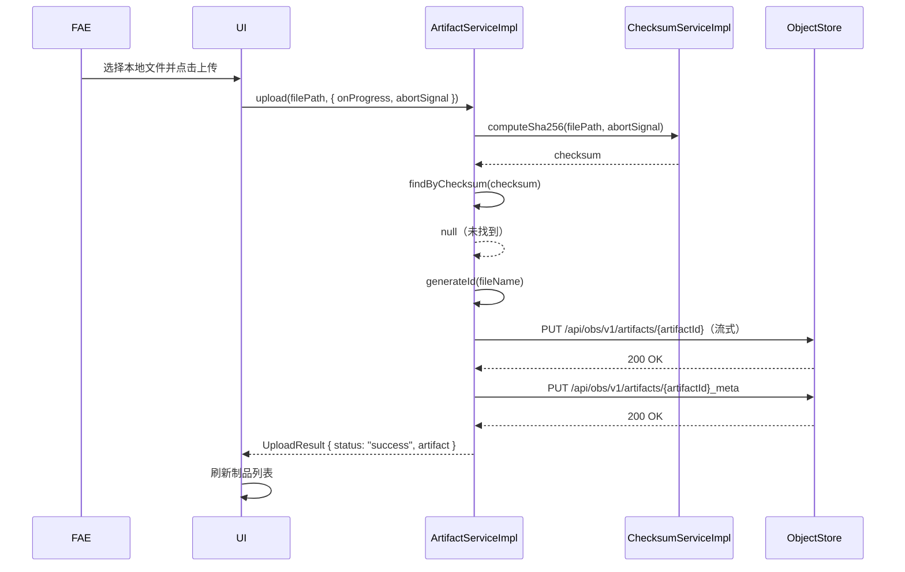
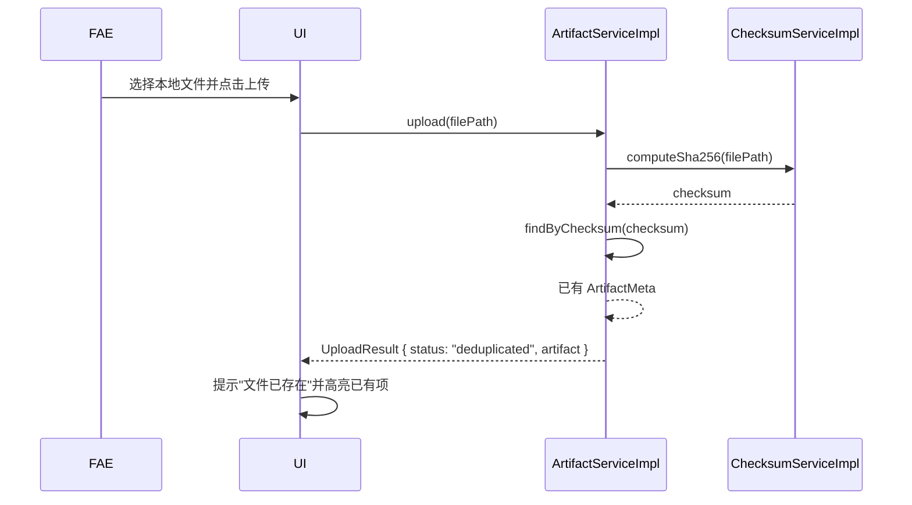
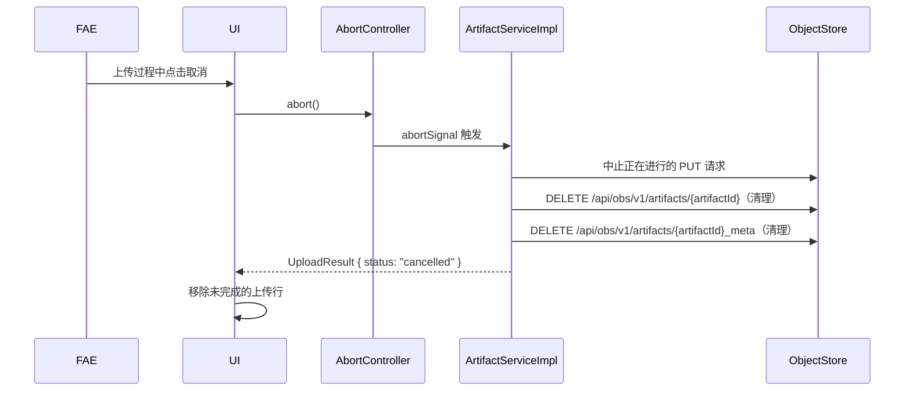
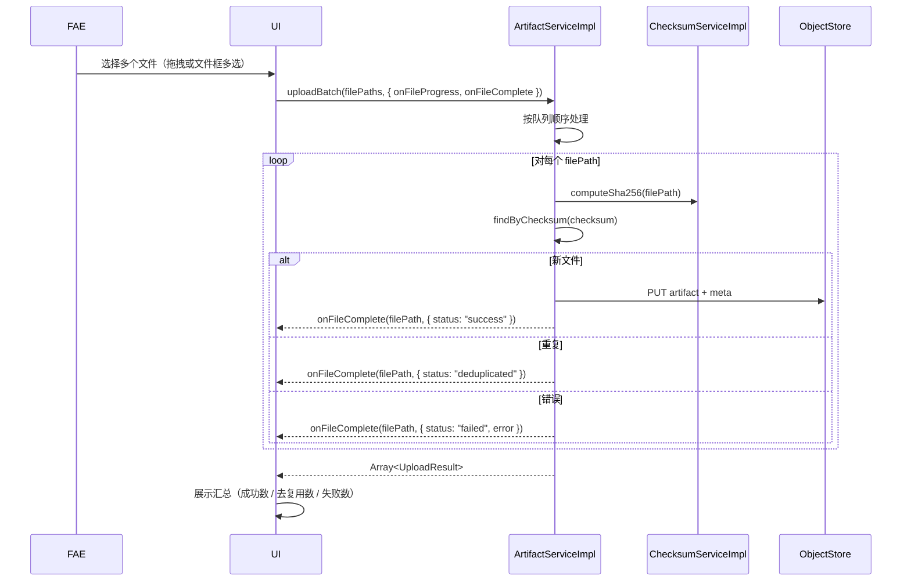
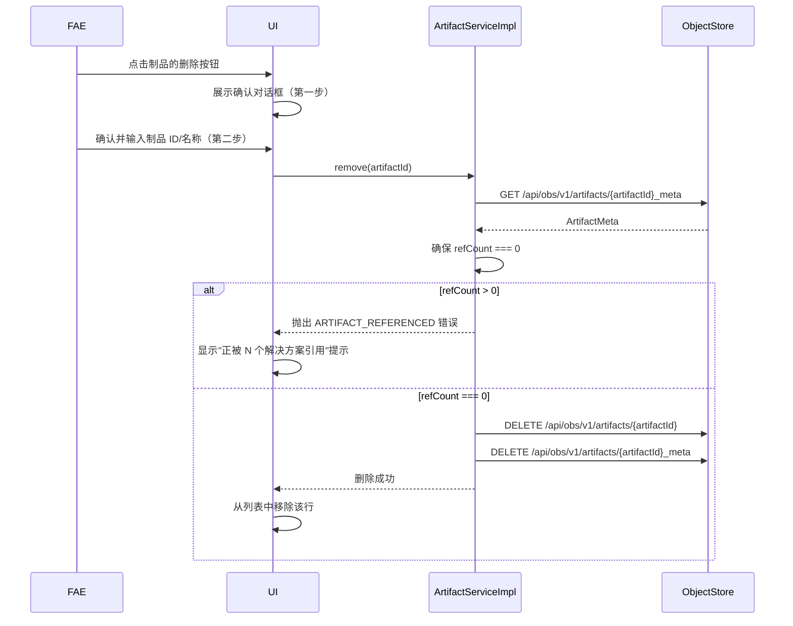
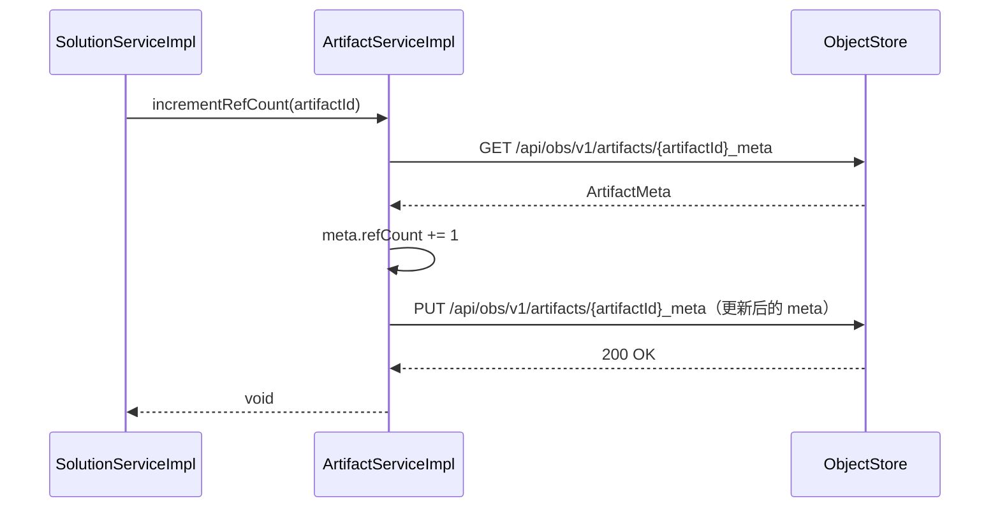
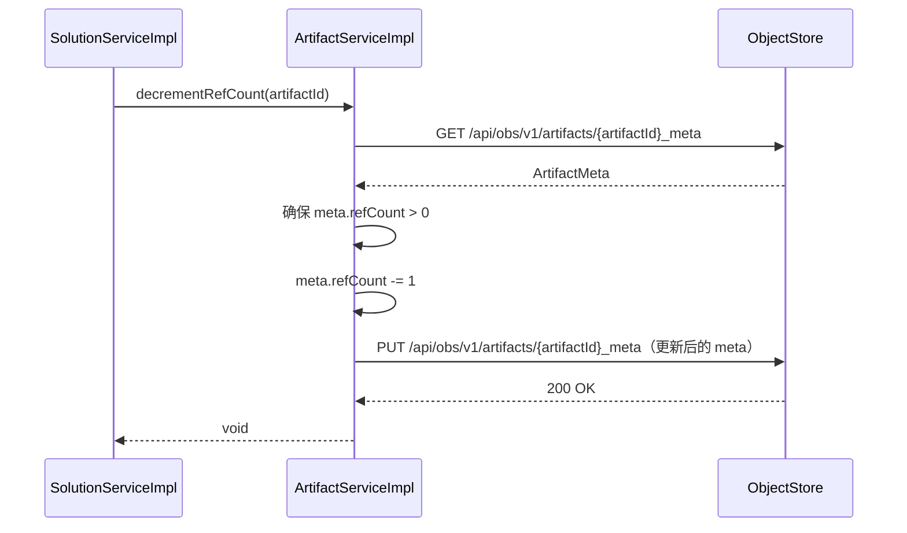
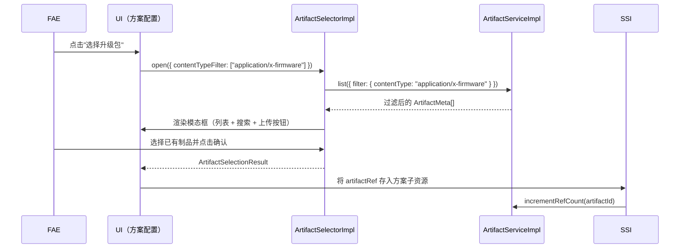
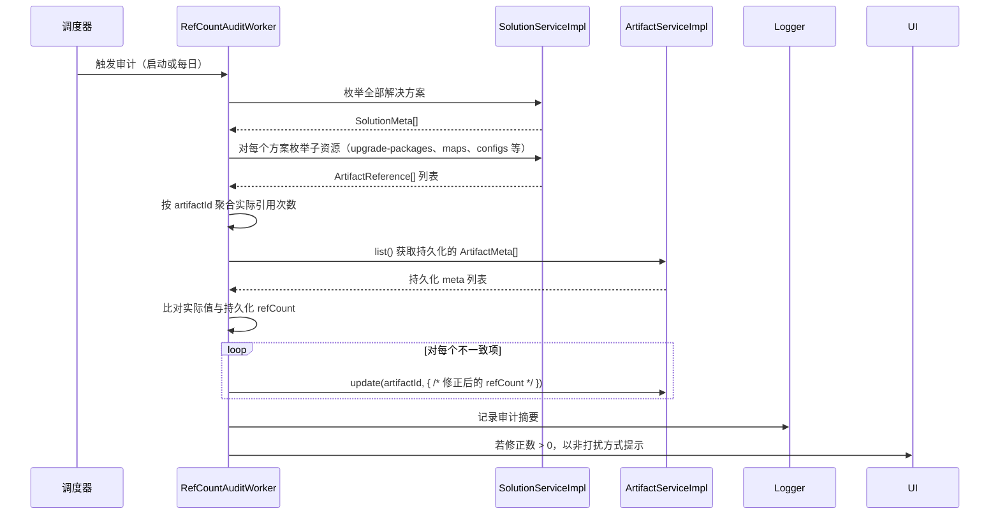

# 制品管理模块 — 软件设计文档

> 本文档承接《制品管理模块需求规格说明书》，对需求中涉及的技术实现进行设计细化。

---

## 1. 概述

本文档描述制品管理模块的内部接口设计、核心服务类结构、与对象存储层的交互方式，以及 UI 组件设计方案。该模块将固件包、地图文件、日志压缩包等不可变大文件作为全局共享资源进行管理，独立于解决方案管理模块运行。

---

## 2. 设计约束

- 所有持久化操作均通过 `playground/object_store` RESTful API 完成，禁止绕过对象存储直接操作文件系统。
- 模块内部使用 TypeScript + ES6 模块语法。
- 所有接口定义仅为设计阶段草案，实现时可根据实际情况调整参数和返回值。

---

## 3. 内部接口设计

### 3.1 制品服务接口（ArtifactService）

负责全局制品的完整生命周期管理与引用计数维护。

```typescript
interface ArtifactMeta {
  id: string;
  fileName: string;
  size: number;
  checksum: string;
  contentType: string;
  createdAt: string;
  refCount: number;
  tags: string[];
  metadata: Record<string, unknown>;
}

interface ArtifactReference {
  artifactId: string;
  purpose: string;
  addedAt: string;
}

interface UploadProgress {
  bytesSent: number;
  totalBytes: number;
  percentage: number;
}

interface UploadResult {
  status: "success" | "deduplicated" | "failed" | "cancelled";
  artifact?: ArtifactMeta;
  error?: string;
}

interface ArtifactService {
  // 单文件上传，支持进度与取消
  upload(
    filePath: string,
    options?: {
      tags?: string[];
      metadata?: Record<string, unknown>;
      customId?: string;
      onProgress?: (progress: UploadProgress) => void;
      abortSignal?: AbortSignal;
    }
  ): Promise<UploadResult>;

  // 批量上传，支持单文件进度跟踪
  uploadBatch(
    filePaths: string[],
    options?: {
      tags?: string[];
      metadata?: Record<string, unknown>;
      onFileProgress?: (filePath: string, progress: UploadProgress) => void;
      onFileComplete?: (filePath: string, result: UploadResult) => void;
      abortSignal?: AbortSignal;
    }
  ): Promise<UploadResult[]>;

  // 列举制品，支持过滤、排序与分页
  list(options?: {
    filter?: {
      fileName?: string;      // 子串匹配
      contentType?: string;   // 精确匹配
      checksum?: string;      // 精确匹配
      tags?: string[];        // 任意标签精确匹配
    };
    sort?: {
      field: "createdAt" | "refCount" | "fileName" | "size";
      order: "asc" | "desc";
    };
    pagination?: {
      offset: number;
      limit: number;
    };
  }): Promise<{ items: ArtifactMeta[]; total: number }>;

  get(artifactId: string): Promise<ArtifactMeta | null>;

  // 仅更新可变字段（tags、metadata）
  update(
    artifactId: string,
    patch: { tags?: string[]; metadata?: Record<string, unknown> }
  ): Promise<ArtifactMeta>;

  // 仅允许删除 refCount === 0 的制品
  remove(artifactId: string): Promise<void>;

  // 将制品文件下载到本地路径
  download(artifactId: string, destinationPath: string): Promise<string>;

  // 引用计数管理
  incrementRefCount(artifactId: string): Promise<void>;
  decrementRefCount(artifactId: string): Promise<void>;

  // 后台一致性扫描
  runRefCountAudit(): Promise<{ corrected: number; inconsistencies: number }>;
}
```

### 3.2 制品选择器接口（ArtifactSelector）

可复用的 UI 组件/程序化接口，供其他模块选择已有制品或当场上传新制品。

```typescript
interface ArtifactSelectorOptions {
  contentTypeFilter?: string[];   // 如 ["application/x-firmware"]
  title?: string;                 // 对话框标题
  allowUpload?: boolean;          // 是否显示"上传新制品"按钮
}

interface ArtifactSelectionResult {
  artifactId: string;
  fileName: string;
  size: number;
  checksum: string;
}

interface ArtifactSelector {
  open(options?: ArtifactSelectorOptions): Promise<ArtifactSelectionResult | null>;
}
```

### 3.3 校验和服务接口（ChecksumService）

封装校验和计算，支持流式处理与进度汇报。统一采用 SHA-256 算法。

```typescript
interface ChecksumService {
  computeSha256(
    filePath: string,
    options?: {
      onProgress?: (bytesProcessed: number, totalBytes: number) => void;
      abortSignal?: AbortSignal;
    }
  ): Promise<string>;
}
```

### 3.4 对象存储客户端（ObjectStoreClient）

所有与对象存储的交互通过统一封装的客户端进行，支持可配置的超时与重试。

```typescript
interface ObjectStoreClientConfig {
  baseUrl: string;
  timeout?: number;      // 请求超时（毫秒），默认 30000
  retries?: number;      // 重试次数，默认 3
}

interface ObjectStoreClient {
  put(path: string, body: ReadableStream | Buffer | string, contentType?: string, headers?: Record<string, string>): Promise<Response>;
  get(path: string): Promise<Response>;
  delete(path: string): Promise<Response>;
  list(path: string): Promise<string[]>;
}
```

> `ArtifactServiceImpl` 依赖同一 `ObjectStoreClient` 实例，以复用超时、重试等公共配置。

---

## 4. 对象存储路径映射

### 4.1 路径模板

| 操作 | HTTP 方法 | 对象存储路径 | Content-Type |
|------|----------|-------------|--------------|
| 上传制品文件 | PUT | `/api/obs/v1/artifacts/{artifactId}` | 按实际文件类型推断 |
| 上传/更新制品元数据 | PUT | `/api/obs/v1/artifacts/{artifactId}_meta` | `application/json` |
| 读取制品元数据 | GET | `/api/obs/v1/artifacts/{artifactId}_meta` | — |
| 下载制品文件 | GET | `/api/obs/v1/artifacts/{artifactId}` | — |
| 删除制品文件 | DELETE | `/api/obs/v1/artifacts/{artifactId}` | — |
| 删除制品元数据 | DELETE | `/api/obs/v1/artifacts/{artifactId}_meta` | — |
| 列举全部制品 | GET | `/api/obs/v1/artifacts` | — |

### 4.2 目录布局

```
v1/
└── artifacts/
    ├── {artifact-id-1}.bin               # 制品文件
    ├── {artifact-id-1}_meta.json         # 制品元数据
    ├── {artifact-id-2}.zip
    ├── {artifact-id-2}_meta.json
    └── ...
```

制品元数据作为独立对象资源存储，命名约定为 `{artifactId}_meta`。对象存储根据 `application/json` 的 Content-Type 自动追加 `.json` 扩展名。

---

## 5. 核心类设计草案

### 5.1 ArtifactServiceImpl

```
class ArtifactServiceImpl implements ArtifactService {
  - objectStoreBaseUrl: string
  - checksumService: ChecksumService
  - uploadAbortControllers: Map<string, AbortController>

  + upload(filePath: string, options?): Promise<UploadResult>
  + uploadBatch(filePaths: string[], options?): Promise<UploadResult[]>
  + list(options?): Promise<{ items: ArtifactMeta[]; total: number }>
  + get(artifactId: string): Promise<ArtifactMeta | null>
  + update(artifactId: string, patch): Promise<ArtifactMeta>
  + remove(artifactId: string): Promise<void>
  + download(artifactId: string, destinationPath: string): Promise<string>
  + incrementRefCount(artifactId: string): Promise<void>
  + decrementRefCount(artifactId: string): Promise<void>
  + runRefCountAudit(): Promise<{ corrected: number; inconsistencies: number }>

  - computeChecksum(filePath: string, abortSignal?): Promise<string>
  - findByChecksum(checksum: string): Promise<ArtifactMeta | null>
  - generateId(fileName: string): string
  - readMeta(artifactId: string): Promise<ArtifactMeta>
  - writeMeta(artifactId: string, meta: ArtifactMeta): Promise<void>
  - deleteArtifactAndMeta(artifactId: string): Promise<void>
  - ensureNoReferences(artifactId: string, meta: ArtifactMeta): Promise<void>
}
```

### 5.2 ChecksumServiceImpl

```
class ChecksumServiceImpl implements ChecksumService {
  + computeSha256(filePath: string, options?): Promise<string>
  - createReadStream(filePath: string): ReadableStream
  - updateHash(chunk: Buffer): void
}
```

使用 Node.js `crypto.createHash("sha256")` 配合可读文件流，以固定分块（如 64 KB）处理数据，确保无论文件大小内存占用保持恒定。

### 5.3 ArtifactSelectorImpl

```
class ArtifactSelectorImpl implements ArtifactSelector {
  - artifactService: ArtifactService
  + open(options?): Promise<ArtifactSelectionResult | null>
  - renderDialog(options?): Promise<ArtifactSelectionResult | null>
  - handleUploadInDialog(filePaths: string[]): Promise<void>
  - applyFilters(items: ArtifactMeta[], options?): ArtifactMeta[]
}
```

以 Carbon Design System 模态框或侧面板形式渲染，与 `ArtifactService` 通信以列举制品并处理内联上传。

### 5.4 RefCountAuditWorker

```
class RefCountAuditWorker {
  - artifactService: ArtifactService
  - solutionService: SolutionService
  - isRunning: boolean

  + scheduleAudit(): void
  + runAudit(): Promise<{ corrected: number; inconsistencies: number }>
  - scanAllReferences(): Promise<Map<string, number>>
  - compareAndFix(expected: Map<string, number>): Promise<number>
}
```

在应用启动时及按配置周期（默认每天一次）异步执行。使用低优先级任务队列，避免阻塞用户操作。

---

## 6. 关键时序设计

### 6.1 上传制品（新文件）



### 6.2 上传制品（重复校验和 — 去重）



### 6.3 取消上传



### 6.4 批量上传



### 6.5 删除制品



### 6.6 引用计数递增（由解决方案模块调用）



### 6.7 引用计数递减（由解决方案模块调用）



### 6.8 从解决方案配置中调用制品选择器



### 6.9 后台引用计数审计



---

## 7. UI 组件设计

### 7.1 制品管理页面

- **布局**：全页数据表格视图（Carbon `DataTable`）。
- **工具栏**：搜索输入（按 `fileName`）、类型筛选下拉框、排序下拉框、主"上传"按钮。
- **表格列**：`fileName`、`size`（人类可读）、`contentType`、`refCount`、`createdAt`、`tags`、操作按钮（查看/下载/删除）。
- **未被引用标记**：`refCount === 0` 的行渲染"未被引用"标签（如 Carbon `Tag` 灰色主题）。
- **批量上传**：拖拽上传区（`FileUploaderDropContainer`）支持多选。上传项以下方堆叠进度列表展示。

### 7.2 制品详情面板

- **触发**：点击行或"查看"操作打开侧面板（`SidePanel`）或模态框。
- **内容**：以只读表单布局展示全部 `ArtifactMeta` 字段。`tags` 渲染为 `Tag` 组件；`metadata` 渲染为键值列表。
- **操作**："下载"按钮（保存到用户选择的本地路径）。"编辑"按钮切换 `tags` 和 `metadata` 的内联编辑。"删除"按钮（受 `refCount === 0` 与两步确认保护）。

### 7.3 制品选择器对话框

- **布局**：模态框（`Modal`）内嵌紧凑数据表格。
- **头部**：搜索输入与可选的类型筛选标签。
- **主体**：可滚动的制品列表，每行展示 `fileName`、`size`、`refCount`。
- **底部**："上传新制品"次要按钮（打开内联上传区或导航至制品管理页）。"确认选择"主按钮（未选择时禁用）。"取消"按钮。

---

## 8. 异常处理策略

| 异常场景 | 处理方式 |
|---------|---------|
| 对象存储不可达 | 重试 3 次（指数退避），最终向用户提示网络错误 |
| 上传时校验和重复 | 返回已有 `ArtifactMeta`；UI 提示去重 toast |
| 制品 ID 格式非法 | 任何存储操作前立即拒绝，返回 `INVALID_ARTIFACT_ID` |
| 文件超过 2 GB 软限制 | 在校验和计算前拒绝，返回 `FILE_TOO_LARGE` |
| 删除 `refCount > 0` 的制品 | 拒绝删除，返回 `ARTIFACT_REFERENCED`；显示引用该制品的解决方案数量 |
| 引用不存在的 `artifactId` | 拒绝并返回 `ARTIFACT_NOT_FOUND`；阻断方案配置保存 |
| 上传取消 | 中止正在进行的 HTTP 请求；从对象存储中删除任何已部分写入的对象及元数据 |
| 并发 refCount 修改竞态 | 使用基于 ETag 的乐观锁或对象存储支持的原子比较-交换 |
| 检测到负 refCount | 钳制到 0，记录严重错误日志，触发后台审计，向用户提示 `REFCOUNT_NEGATIVE` |
| 批量上传部分失败 | 继续处理队列中剩余项；最后汇总成功/去重/失败数量 |
| 校验和计算被取消 | 中止流读取；向上传播 `UPLOAD_CANCELLED` 结果 |

---

## 9. 并发与原子性设计

### 9.1 引用计数原子性

采用简单的乐观锁实现，不引入分布式锁或事务机制：

1. **读取**：`GET` 当前制品元数据，记录响应中的 `ETag`。
2. **修改**：在内存中递增/递减 `refCount`。
3. **写回**：使用 `If-Match: <ETag>` 条件请求 `PUT` 更新后的元数据。
4. **冲突处理**：若返回 HTTP 412（Precondition Failed），说明期间已被其他操作修改，则重新读取并再次尝试，最多重试 5 次。超过重试次数后抛出异常。

该策略封装在 `ArtifactServiceImpl` 内部，`incrementRefCount` / `decrementRefCount` 的调用方无需感知底层机制。

### 9.2 上传取消清理

上传分为三个阶段：

1. **准备阶段**：校验和计算。
2. **传输阶段**：流式 PUT 到对象存储。
3. **提交阶段**：写入元数据对象。

取消可能发生在任意阶段。若取消发生在传输阶段或之后，服务必须对制品文件及其元数据发起补偿性 DELETE，确保不留孤儿对象。

### 9.3 批量上传隔离

批量中的每个文件独立处理。单个文件失败（如网络错误、磁盘读取错误）不得中断整个批次。`uploadBatch` 方法维护内部队列并顺序处理条目，避免压垮对象存储并保持内存占用有界。

---

## 10. 性能设计

| 需求 | 设计方法 |
|------|---------|
| NF-ART-001：1 GB 文件 SHA-256 < 5 秒 | 流式哈希，64 KB 分块；禁止将整个文件加载到内存 |
| NF-ART-002：流式上传 | 使用 Node.js `fs.createReadStream()` 直接管道接入 HTTP 请求体；禁止在内存中缓冲完整文件 |
| NF-ART-003：列举 5000 个制品 < 3 秒 | 在内存中缓存制品元数据列表并设置短 TTL；增删改时增量更新；若对象存储支持分页则使用服务端分页 |
| NF-ART-004：原子性 refCount | ETag 乐观锁重试循环（见 9.1） |
| NF-ART-005：取消后无残留 | 取消时执行补偿性 DELETE（见 9.2） |
| NF-ART-006：后台审计 | 低优先级 `setTimeout` / `setInterval` 任务；非阻塞；每次只处理一个解决方案以限流 |

---

## 11. 已确定的设计决策

| 设计项 | 决策 | 说明 |
|--------|------|------|
| 1. 对象存储条件写 | 基于 ETag 的乐观锁（简单实现） | 采用读-改-写 + `If-Match` 条件请求，冲突时最多重试 5 次。不引入分布式锁或事务机制（见 9.1）。 |
| 2. 校验和算法 | SHA-256 | 统一使用 SHA-256，兼顾安全性与通用性。不评估 xxHash 或 BLAKE3（见 3.3、5.2）。 |
| 3. 对象存储客户端 | 统一 `ObjectStoreClient`，可配置超时 | 封装共享 HTTP 客户端（见 3.4），默认超时 30 秒，默认重试 3 次。 |
| 4. 本地设置持久化 | `localStorage` | 前端状态（如最近使用列表）使用浏览器 `localStorage` 持久化；跨会话保留。 |
| 5. 制品 ID 生成冲突 | 拒绝重复 ID | 用户提供的 `customId` 若已存在，直接拒绝并提示，不自动追加后缀。 |
| 6. 内存缓存策略 | 短 TTL 增量缓存 | 制品元数据列表在内存中缓存，TTL 设为 30 秒；创建/删除/更新时主动失效对应条目，以平衡 NF-ART-003 性能与数据新鲜度。 |
| 7. 批量上传并发度 | 顺序处理 | 为维护简单并控制内存占用，批量上传顺序处理单个文件；不启用并行上传。 |
| 8. 制品物理扩展名 | 由 Content-Type 推断 | 对象存储路径中不保留原始扩展名，依赖 Content-Type 进行类型推断与下载时的文件名还原。 |
| 9. 上传 API | 视运行环境而定 | Electron 环境下通过 `ipcRenderer` 将文件路径交给后端 Node 进程处理；Web 环境下使用标准 Blob/Stream 上传。 |
| 10. 审计调度机制 | `setInterval` | 后台引用计数审计使用简单的 `setInterval` 调度，默认每天执行一次；低优先级、非阻塞。 |
