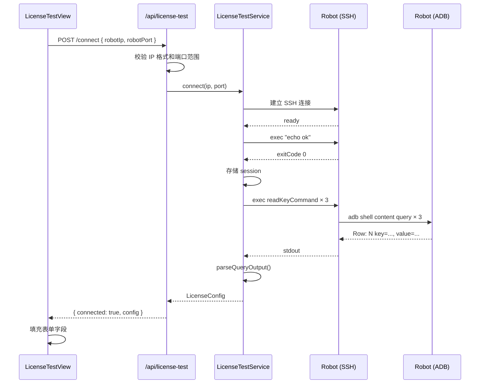
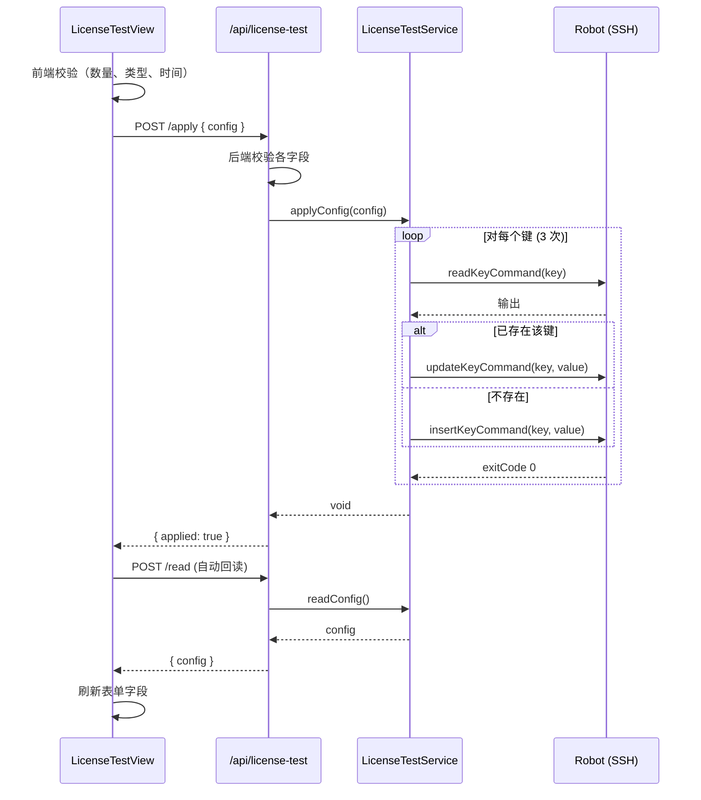
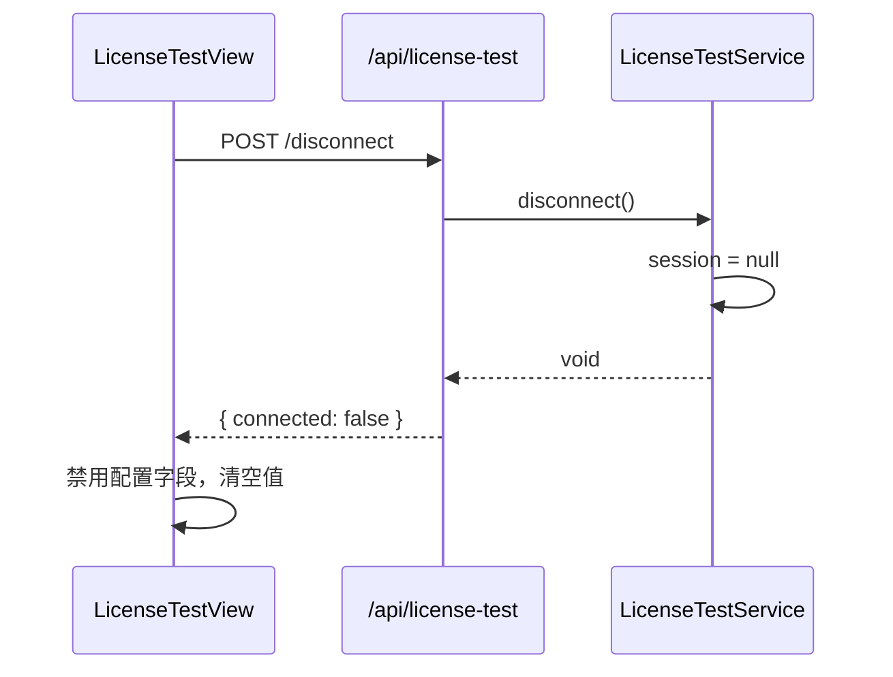

# 许可证测试界面模块 — 软件设计文档

> 本文档承接《许可证测试界面模块需求规格说明书》，对需求中涉及的技术实现进行设计细化。

---

## 1. 概述

本文档描述许可证测试界面的内部接口设计、核心服务类结构、与 SSH/ADB 层的交互方式，以及 UI 组件设计方案。该模块为临时调试界面，后端启动时替换 RobotOps Studio 原有全部 UI。

---

## 2. 设计约束

- 后端使用同步 REST API，不使用现有 TaskFlow 引擎。
- 每次操作建立独立 SSH 连接，完成后关闭。后端仅内存记录目标机器人标识。
- 前端使用单个 `LicenseTestView` 组件，无全局状态管理。
- Mock 模式由 `config.runtime.mock` 控制，后端自动切换实现。
- 所有接口定义仅为设计阶段草案，实现时可根据实际情况调整参数和返回值。

---

## 3. 内部接口设计

### 3.1 后端类型定义

```typescript
export const LICENSE_KEY_LICENSES = "clear-janitor-licenses";
export const LICENSE_KEY_TYPE = "clear-janitor-license-type";
export const LICENSE_KEY_AUTH_START = "clear-janitor-license-authorization-start-time";

export type LicenseType = "None" | "Trial" | "Formal";

export interface LicenseConfig {
  "clear-janitor-licenses": string;
  "clear-janitor-license-type": LicenseType;
  "clear-janitor-license-authorization-start-time": string;
}

export interface LicenseTestSession {
  robotIp: string;
  robotPort: number;
  connectedAt: number;
}

export interface ConnectRequest { robotIp: string; robotPort?: number; }
export interface ConnectResponse { connected: true; robotIp: string; robotPort: number; config: LicenseConfig; }
export interface SessionResponse { connected: boolean; robotIp?: string; robotPort?: number; }
export interface ReadResponse { config: LicenseConfig; }
export interface ApplyRequest { config: LicenseConfig; }
export interface ApplyResponse { applied: true; }
```

### 3.2 服务接口（ILicenseTestService）

```typescript
interface ILicenseTestService {
  connect(ip: string, port: number): Promise<LicenseConfig>;
  disconnect(): Promise<void>;
  getSession(): Promise<LicenseTestSession | null>;
  readConfig(): Promise<LicenseConfig>;
  applyConfig(config: LicenseConfig): Promise<void>;
}
```

### 3.3 路由工厂

```typescript
function createLicenseTestRoutes(service: ILicenseTestService): Hono;
```

返回 Hono 子路由，包含以下端点：
- `POST /connect`：解析 body 中的 `robotIp` 和 `robotPort`，校验 IP 格式和端口范围，调用 `service.connect()`，返回 `ConnectResponse`。
- `POST /disconnect`：调用 `service.disconnect()`，返回 `{ connected: false }`。
- `GET /session`：调用 `service.getSession()`，返回 `SessionResponse`。
- `POST /read`：调用 `service.readConfig()`，返回 `ReadResponse`。
- `POST /apply`：解析 body 中的 `config`，校验各字段，调用 `service.applyConfig()`，返回 `ApplyResponse`。

### 3.4 ADB 命令辅助函数

```typescript
const CONTENT_URI = "content://com.syriusrobotics.platform.launcher.mockkv/kv";

function readKeyCommand(key: string): string {
  return `adb shell content query --uri ${CONTENT_URI}/${key}`;
}

function insertKeyCommand(key: string, value: string): string {
  return `adb shell content insert --uri ${CONTENT_URI} --bind key:s:${key} --bind value:s:'${escapeShellValue(value)}'`;
}

function updateKeyCommand(key: string, value: string): string {
  return `adb shell content update --uri ${CONTENT_URI} --bind value:s:'${escapeShellValue(value)}' --where "key='${escapeSqlValue(key)}'"`;
}
```

转义策略：
- `escapeShellValue`：将单引号替换为 `'\\''`，安全嵌入 shell 命令值。
- `escapeSqlValue`：将单引号替换为 `''`，用于 `where` 子句。

---

## 4. 核心类设计草案

### 4.1 LicenseTestService（真实实现）

```
┌──────────────────────────────────────────────────────┐
│ LicenseTestService : ILicenseTestService              │
├──────────────────────────────────────────────────────┤
│ - session: LicenseTestSession | null                  │
│ - log: Logger                                        │
├──────────────────────────────────────────────────────┤
│ + connect(ip, port): Promise<LicenseConfig>           │
│ + disconnect(): Promise<void>                        │
│ + getSession(): Promise<LicenseTestSession | null>   │
│ + readConfig(): Promise<LicenseConfig>               │
│ + applyConfig(config): Promise<void>                 │
│ - requireSession(): LicenseTestSession               │
│ - executeSsh(host, port, cmd, ct, rt): Promise<SshResult> │
└──────────────────────────────────────────────────────┘
```

- `executeSsh`：使用 `ssh2` `Client`，设置连接超时（10 s）和命令超时（30 s），通过 `Promise` 封装异步流程。连接成功后在 `ready` 事件中执行命令，捕获 stdout/stderr；`close` 事件时调用 `conn.end()` 并 resolve。
- `connect`：执行 `echo ok` 验证 SSH，成功后将 session 写入内存，调用 `readConfig()` 返回配置。
- `readConfig`：对三个键分别执行 `readKeyCommand`，解析 `Row: N key=..., value=...` 输出行中的 `value=` 部分。
- `applyConfig`：对每个键先执行 read 命令，根据输出判断是否有已存在的行（upsert 策略），有则执行 update，无则执行 insert。命令退出码非零时抛错。
- 安全控制：从 `config.ts` 读取 `SSH_USERNAME` 和 `SSH_PASSWORD`，不记录凭据。

### 4.2 MockLicenseTestService（Mock 实现）

```
┌──────────────────────────────────────────────────────┐
│ MockLicenseTestService : ILicenseTestService          │
├──────────────────────────────────────────────────────┤
│ - session: LicenseTestSession | null                  │
│ - config: LicenseConfig                              │
│ - log: Logger                                        │
├──────────────────────────────────────────────────────┤
│ + connect(ip, port): Promise<LicenseConfig>           │
│   → 延迟 500 ms，存储 session，返回 mock config       │
│ + disconnect(): Promise<void>                        │
│   → 清除 session                                     │
│ + getSession(): Promise<LicenseTestSession | null>   │
│ + readConfig(): Promise<LicenseConfig>               │
│   → 返回内存中的 config                               │
│ + applyConfig(config): Promise<void>                 │
│   → 校验类型和数量，更新内存 config                    │
└──────────────────────────────────────────────────────┘
```

默认 mock 值：
- `clear-janitor-licenses`: `"100"`
- `clear-janitor-license-type`: `"Trial"`
- `clear-janitor-license-authorization-start-time`: 连接时的当前 ISO 时间

---

## 5. 关键时序设计

### 5.1 连接流程



### 5.2 应用流程



### 5.3 断开流程



---

## 6. UI 组件设计

### 6.1 模块结构

```
src/frontend/src/
├── types/licenseTest.ts
├── api/licenseTestApi.ts
└── components/license/LicenseTestView.tsx
```

### 6.2 LicenseTestView 组件

使用以下 Carbon Design System 组件：
- `Header`、`HeaderName`、`HeaderGlobalBar`、`HeaderGlobalAction` — 顶部导航
- `Theme` — 明/暗主题切换
- `TextInput` — 机器人 IP 输入
- `NumberInput` — 端口和许可证数量输入
- `Dropdown` — 许可证类型选择
- `DatePicker`、`DatePickerInput` — 日期选择
- `Button` — 连接/断开/读取/应用操作
- `Tile` — 卡片容器
- `Loading` — 连接和操作中加载指示器
- `ToastNotification` — 操作成功/失败通知（通过 `useToast` hook）

### 6.3 状态管理

组件使用本地 React state：

```typescript
type ConnectionStatus = "disconnected" | "connecting" | "connected" | "busy";
```

- `status` — 当前连接状态
- `robotIp` / `robotPort` — 连接输入
- `config` — 许可证配置值
- `lastOutput` — 调试输出

### 6.4 布局结构

```
┌─────────────────────────────────────────────────────┐
│  RobotOps │ License Test           [Theme Toggle]    │
├─────────────────────────────────────────────────────┤
│  ┌─ Robot Connection ─────────────────────────────┐ │
│  │  IP [        ] Port [22] [Connect/Disconnect]  │ │
│  │  Status: Connected to 192.168.1.1:22           │ │
│  └────────────────────────────────────────────────┘ │
│                                                     │
│  ┌─ License Configuration ────────────────────────┐ │
│  │  Licenses Pool Quota [     100     ]           │ │
│  │  License Type        [ Trial  ▾  ]            │ │
│  │  Auth Start Time     [2024-01-15] [08:30]     │ │
│  │  ISO 8601: 2024-01-15T08:30:00Z               │ │
│  │                                                │ │
│  │  [Read License Config] [Apply License Config]  │ │
│  └────────────────────────────────────────────────┘ │
│                                                     │
│  ┌─ Last Command Output ──────────────────────────┐ │
│  │  Row: 0 key=clear-janitor-licenses, value=100  │ │
│  └────────────────────────────────────────────────┘ │
└─────────────────────────────────────────────────────┘
```

---

## 7. 异常处理策略

| 错误场景 | 类型 | HTTP 状态码 | 前端处理 |
|----------|------|-------------|----------|
| SSH 不可达 | `RobotConnectionError` | 502 | toast + debug 区域 |
| adb 不在 PATH | `RobotCommandError` | 502 | toast + debug 区域 |
| Content Provider 缺失 | `RobotCommandError` | 502 | toast + debug 区域 |
| 连接超时 | `RobotTimeoutError` | 504 | toast |
| 无活动会话 | `NoSessionError` | 400 | toast |
| IP 无效 | — | 400 | 内联校验错误文本 |
| 端口无效 | — | 400 | 内联校验错误文本 |
| 许可证类型无效 | `InvalidArgumentError` | 400 | toast / 内联错误 |
| 许可证数量无效 | `InvalidArgumentError` | 400 | toast / 内联错误 |

所有错误均通过 Pino 记录，附带 `robotIp` 和 `robotPort` 上下文信息。

---

## 8. 安全设计

- SSH 凭据（`developer`/`developer`）定义于 `src/backend/src/config.ts`，仅后端使用。
- 不将凭据暴露给前端 API 响应或日志。
- Shell 命令值中单引号转义，防止命令注入。
- SQL-like `where` 子句中单引号转义。
- 前端和后端均进行输入校验。

---

## 9. 性能设计

- 每次操作建立独立 SSH 连接，适用于低频调试场景（非高频轮询）。
- 无持久化存储，无后台定时任务。
- Connect 超时 10 s，命令超时 30 s。
- UI 在 busy 状态时禁用操作按钮，防止重复提交。

---

## 10. 已建立的设计决策

| 编号 | 决策 | 理由 |
|------|------|------|
| D-LIC-01 | 使用同步 REST API 而非 TaskFlow 引擎 | 许可证操作是简单请求/响应，无需 DAG/持久化复杂性 |
| D-LIC-02 | 使用 `ssh2` 直接调用而非复用 `SshCommandTask` | 需要模拟 upsert 逻辑，`SshCommandTask` 为通用命令执行，不适配此场景 |
| D-LIC-03 | 前端不持久化配置值 | 所有值来源于机器人，不在前端或后端持久化 |
| D-LIC-04 | 单文件组件 | 功能规模小，无需拆分多个组件 |
| D-LIC-05 | Mock 服务独立类而非继承真实服务 | 接口差异大（真实服务需 SSH，Mock 仅内存操作） |
| D-LIC-06 | 始终替换原有 UI | 用户确认决策：许可证测试界面始终作为唯一界面 |
| D-LIC-07 | Apply 后自动回读 | 确保 UI 展示的是机器人实际存储的值，而非乐观更新的值 |
