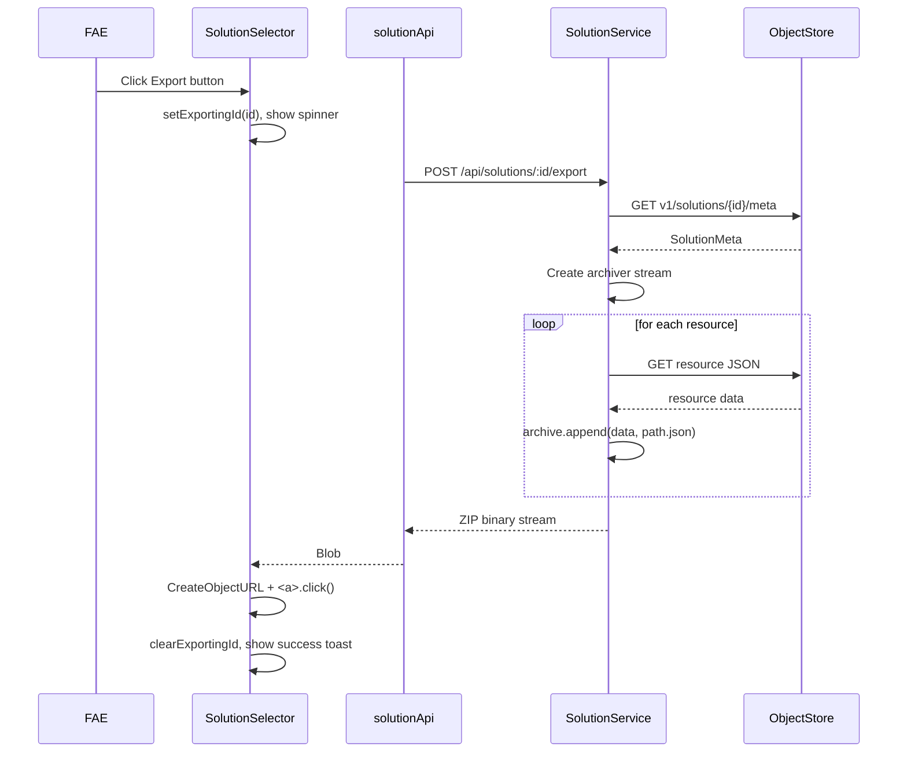
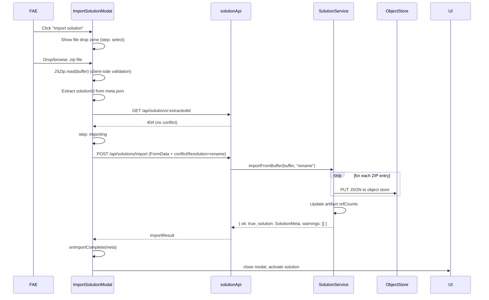
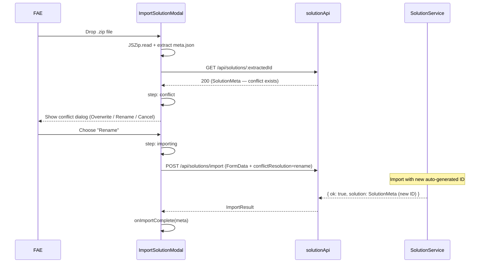

# Solution Import/Export — Software Design

> **Parent Design**: Solution Management (`documents/design/solution_management_design.md`)
> **Status**: Draft — for review

---

## 1. Overview

This document describes the technical design for the Solution Import/Export feature, detailing API changes, component design, data flow, and implementation strategy.

The existing `SolutionService.exportSolution()` and `SolutionService.importSolution()` operate on server-local file paths (`data/` directory). For a browser-based client, HTTP streaming download and multipart file upload must replace the file-path-based approach.

---

## 2. Design Decisions

| # | Decision | Rationale |
|---|---|---|
| D1 | Export returns ZIP as HTTP streamed download (`application/zip`, `Content-Disposition: attachment`) | Browser-native download without server disk I/O |
| D2 | Import accepts `multipart/form-data` file upload | Standard browser file upload; avoid server-side path assumptions |
| D3 | Keep existing `exportSolution`/`importSolution` service methods but add new route handlers that bridge HTTP ↔ service | Reuse existing archiveDirectory/import logic; only the transport layer changes |
| D4 | Existing private `archiveDirectory()` method refactored to public `archiveToStream(archive, rootPath)` | Same logic, simplified signature, callable from routes |
| D5 | ZIP validation uses client-side `jszip` with server-side defense-in-depth | Avoid extra round-trip for validation; server still re-validates |
| D6 | Conflict resolution handled by new `import` route with `conflictResolution` body field | Backend owns the ID collision logic |
| D7 | `ArtifactService` injected into `SolutionService` constructor | `importFromBuffer` needs to update artifact refCounts internally |
| D8 | Frontend uses raw `fetch()` for blob download and `FormData` upload, bypassing `client.ts` helpers | `client.ts` hardcodes `Content-Type: application/json` which is incompatible with multipart uploads and blob downloads |
| D9 | Retry with exponential backoff at the route handler level | FR-IO-002 requires up to 3 retries; retry wrappers around service calls |
| D10 | `AbortSignal` accepted by export endpoint to cancel streaming | FR-EXP-004 requires cancel support; signal passed to archiver for cleanup |
| D11 | Initial implementation uses indeterminate progress (Carbon `InlineLoading` / spinner); percentage-based progress deferred to follow-up | Avoids SSE/progress-endpoint complexity; still satisfies FR-EXP-002 / FR-IMP-005 basic requirement |

---

## 3. API Design

### 3.1 Export: `POST /api/solutions/:id/export` (revised)

**Change**: Returns ZIP stream instead of `{ filePath }`.

**Request**:
```
POST /api/solutions/:id/export
```
No request body required.

**Response**:
- **200 OK** — `Content-Type: application/zip`, `Content-Disposition: attachment; filename="{slug}-v{version}-{timestamp}.zip"`
- Body: ZIP stream
- **404** — Solution not found
- **500** — Export failed (stream error)

**Backend implementation** (uses Hono streaming response + AbortSignal for true streaming):

```typescript
// In solutionRoutes.ts
router.post("/:id/export", async (c) => {
  const id = c.req.param("id");
  const signal = c.req.raw.signal; // AbortSignal from incoming request

  try {
    const meta = await solutionService.get(id);
    const slug = slugify(meta.name);
    const timestamp = new Date().toISOString().replace(/[:.]/g, "-");
    const fileName = `${slug}-v${meta.version}-${timestamp}.zip`;

    const archiver = (await import("archiver")).default;
    const archive = archiver("zip", { zlib: { level: 9 } });

    // Wire AbortSignal: destroy archive stream on abort
    signal.addEventListener("abort", () => {
      archive.abort();
      log.warn({ solutionId: id }, "Export aborted by client");
    });

    // Start archiving in background; pipe to a PassThrough for streaming
    const { PassThrough } = await import("node:stream");
    const passThrough = new PassThrough();
    archive.pipe(passThrough);

    solutionService.archiveToStream(archive, `v1/solutions/${id}`)
      .catch((err) => {
        if (!signal.aborted) {
          archive.emit("error", err);
        }
      });

    archive.finalize();

    return new Response(passThrough.readable as unknown as ReadableStream, {
      status: 200,
      headers: {
        "Content-Type": "application/zip",
        "Content-Disposition": `attachment; filename="${encodeURIComponent(fileName)}"`,
      },
    });
  } catch (err) {
    if (err instanceof AppError) {
      return c.json({ error: err.code, message: err.message }, err.statusCode);
    }
    log.error({ solutionId: id, err }, "Export failed");
    return c.json({ error: "EXPORT_FAILED", message: "Export failed." }, 500);
  }
});
```

**Key points**:
- Uses `PassThrough` stream piped to Hono `Response` for true streaming — archive is never buffered entirely in memory, satisfying NF-SOL-002 for 1 GB+ archives.
- `AbortSignal` from `c.req.raw.signal` is wired to `archive.abort()` for cancel support (FR-EXP-004).
- Filename is URL-encoded in `Content-Disposition` header to handle special characters.

### 3.2 Import: `POST /api/solutions/import` (revised)

**Change**: Accepts `multipart/form-data` instead of `{ zipPath, targetPath }`.

**Request**:
```
POST /api/solutions/import
Content-Type: multipart/form-data
```
- Field `file`: ZIP file (required)
- Field `conflictResolution`: `"overwrite"` | `"rename"` | `"cancel"` (optional, default `"rename"`)

**Response**:
- **200 OK** — `{ ok: true, solution: SolutionMeta, warnings?: string[] }`
- **400** — Invalid archive, no file, or unsupported file type
- **409** — ID collision (when `conflictResolution` is `"cancel"`)
- **500** — Import failed

**Backend implementation**:
```typescript
router.post("/import", async (c) => {
  const body = await c.req.parseBody();
  const file = body["file"] as File | undefined;
  const conflictResolution = (body["conflictResolution"] as string) || "rename";

  if (!file) {
    return c.json({ error: "INVALID_INPUT", message: "No file provided." }, 400);
  }

  if (!file.name?.endsWith(".zip")) {
    return c.json({ error: "UNSUPPORTED_FILE_TYPE", message: "Only .zip files are supported." }, 400);
  }

  try {
    const buffer = Buffer.from(await file.arrayBuffer());
    const result = await solutionService.importFromBuffer(
      buffer,
      conflictResolution as "overwrite" | "rename" | "cancel"
    );
    return c.json(result, result.ok ? 200 : 409);
  } catch (err) {
    // error handling
  }
});
```

### 3.3 Import Pre-Validation: `POST /api/solutions/import/validate`

**New endpoint** for frontend to pre-validate before committing to import.

**Request**: Same as import (multipart file).

**Response**:
- **200 OK** — `{ valid: true, solutionId: string, solutionName: string, conflicts: boolean, existingSolution?: { id: string, name: string } }`
- **400** — Invalid archive

This allows the frontend to show the conflict resolution dialog BEFORE sending the file again for actual import. Alternatively, validation can happen client-side by reading ZIP entries with a JS library.

### 3.4 Alternative: Client-Side Validation

To avoid a separate network call, the frontend can use `JSZip` or similar to:
1. Read the ZIP structure in the browser.
2. Check for `meta.json`.
3. Parse `meta.json` to extract the solution ID.
4. Query `GET /api/solutions/:id` to check for conflicts.
5. Show conflict dialog locally.
6. Then upload once with the chosen resolution.

**Decision**: Use client-side validation (D8) with the `jszip` library to avoid an extra round-trip. The import endpoint still performs server-side validation as defense-in-depth.

---

## 4. Service Layer Changes

### 4.1 SolutionService — Constructor Change

`SolutionService` currently accepts only `ObjectStore`. The `importFromBuffer` method needs `ArtifactService` for artifact reference counting. The constructor must be updated:

```typescript
// Before:
constructor(obs: ObjectStore)

// After:
constructor(obs: ObjectStore, artifactService: ArtifactService)
```

The `artifactService` instance is available in the backend bootstrap (`src/backend/src/index.ts`) where both services are created. The route factory is updated to pass it:

```typescript
// In index.ts
const artifactService = new ArtifactService(objectStore);
const solutionService = new SolutionService(objectStore, artifactService);
```

### 4.2 SolutionService — New Methods

```typescript
interface SolutionService {
  // Existing methods preserved unchanged
  // ...
  exportSolution(id: string, destinationPath?: string): Promise<{ filePath: string }>;
  // Note: exportSolution() is retained for backward compatibility but NOT used by the new route.

  // NEW: Public wrapper around existing private archiveDirectory()
  // The private archiveDirectory(archive, rootPath, currentPath) is refactored —
  // archiveToStream provides a simplified 2-arg public signature that internally
  // calls archiveDirectory(archive, rootPath, rootPath) to start recursion.
  archiveToStream(archive: Archiver, rootPath: string): Promise<void>;

  // NEW: Import from buffer with conflict resolution
  importFromBuffer(
    zipBuffer: Buffer,
    conflictResolution: "overwrite" | "rename" | "cancel"
  ): Promise<{ ok: boolean; solution: SolutionMeta; warnings: string[] }>;

  // NEW: Validate ZIP buffer structure (optional, for server-side defense-in-depth)
  validateZipBuffer(zipBuffer: Buffer): Promise<{
    valid: boolean;
    solutionId?: string;
    solutionName?: string;
    error?: string;
  }>;
}
```

### 4.3 importFromBuffer Implementation

```typescript
async importFromBuffer(
  zipBuffer: Buffer,
  conflictResolution: "overwrite" | "rename" | "cancel"
): Promise<{ ok: boolean; solution: SolutionMeta; warnings: string[] }> {
  const { default: AdmZip } = await import("adm-zip");
  const zip = new AdmZip(zipBuffer);
  const entries = zip.getEntries();

  // 1. Find meta.json entry and discover the ZIP root directory name
  //    Export always produces paths like "v1/solutions/{id}/meta.json",
  //    but the ZIP root may be a flat directory named after the solution.
  const metaEntry = entries.find(e =>
    e.entryName.match(/(^|\/)meta\.json$/)
  );
  if (!metaEntry) throw new ImportInvalidArchiveError();

  const meta = JSON.parse(metaEntry.getData().toString("utf-8"));
  let solutionId: string = meta.id;

  // Discover the ZIP root prefix (common ancestor of all JSON entries)
  // e.g. if entries are "customer-a-site-3f2a/meta.json", "customer-a-site-3f2a/robots/...",
  // the root is "customer-a-site-3f2a/"
  const jsonEntries = entries.filter(e => !e.isDirectory && e.entryName.endsWith(".json"));
  const rootPrefix = findCommonPrefix(jsonEntries.map(e => e.entryName));
  // rootPrefix = "v1/solutions/customer-a-site-3f2a/" or "customer-a-site-3f2a/" etc.

  // 2. Check for ID collision in ObjectStore
  const exists = await this.obs.exists(`v1/solutions/${solutionId}/meta`);
  if (exists) {
    switch (conflictResolution) {
      case "cancel":
        throw new ImportIdCollisionError(solutionId);
      case "overwrite":
        await this.remove(solutionId); // cascading delete + refCount cleanup
        break;
      case "rename":
        solutionId = generateId(meta.name);
        break;
    }
  }

  // 3. Write entries to ObjectStore with correct path mapping
  const warnings: string[] = [];
  const artifactRefs: Array<{ artifactId: string }> = [];

  for (const entry of jsonEntries) {
    const content = JSON.parse(entry.getData().toString("utf-8"));

    // Map ZIP entry path → ObjectStore path:
    // Strip the ZIP root prefix, then prepend v1/solutions/{solutionId}/
    const relativePath = entry.entryName
      .replace(/\.json$/, "")
      .slice(rootPrefix.length); // remove root prefix
    const objectPath = `v1/solutions/${solutionId}/${relativePath}`;

    // Collect artifact references
    if (content.artifactId && content.purpose) {
      artifactRefs.push({ artifactId: content.artifactId });
    }

    await this.obs.putJson(objectPath, content);
  }

  // 4. Write final meta (handles renamed imports and timestamp reset)
  const finalMeta: SolutionMeta = {
    ...meta,
    id: solutionId,
    name: meta.name,               // preserve original name
    createdAt: new Date().toISOString(),
    updatedAt: new Date().toISOString(),
    version: "1.0.0",
  };
  await this.obs.putJson(`v1/solutions/${solutionId}/meta`, finalMeta);

  // 5. Handle artifact references via injected ArtifactService
  for (const ref of artifactRefs) {
    try {
      await this.artifactService.incrementRefCount(ref.artifactId);
    } catch {
      warnings.push(
        `Artifact '${ref.artifactId}' not found; reference left unresolved.`
      );
    }
  }

  return { ok: true, solution: finalMeta, warnings };
}

// Utility: find common path prefix from a list of paths
function findCommonPrefix(paths: string[]): string {
  if (paths.length === 0) return "";
  const parts = paths[0].split("/");
  let prefixLen = 0;
  for (let i = 0; i < parts.length - 1; i++) {
    const segment = parts.slice(0, i + 1).join("/") + "/";
    if (paths.every(p => p.startsWith(segment))) {
      prefixLen = segment.length;
    } else {
      break;
    }
  }
  return paths[0].slice(0, prefixLen);
}
```

**Key fixes from v1**:
- `findCommonPrefix()` discovers the actual ZIP root directory name from all JSON entries, instead of assuming `meta.id` is the root. This handles ZIPs with arbitrary root directory names.
- `this.artifactService` is available via the updated constructor (see §4.1).
- `this.remove(solutionId)` for overwrite reuses the existing cascading delete logic which already handles `refCount` decrement for the existing solution's artifacts.

### 4.4 Retry Logic

Per FR-IO-002, both export and import routes wrap their service calls with exponential backoff retry (max 3 attempts, base 200ms, cap 5s). The retry wrapper lives in a shared utility:

```typescript
// src/backend/src/utils/retry.ts
export async function withRetry<T>(
  fn: () => Promise<T>,
  options: { maxRetries?: number; baseMs?: number; maxMs?: number } = {}
): Promise<T> {
  const { maxRetries = 3, baseMs = 200, maxMs = 5000 } = options;
  let lastErr: unknown;

  for (let attempt = 0; attempt <= maxRetries; attempt++) {
    try {
      return await fn();
    } catch (err) {
      lastErr = err;
      if (attempt === maxRetries) break;
      const delay = Math.min(baseMs * 2 ** attempt, maxMs);
      await new Promise(r => setTimeout(r, delay));
    }
  }
  throw lastErr;
}
```

**Usage in export route**:
```typescript
router.post("/:id/export", async (c) => {
  // ... AbortSignal wiring ...
  try {
    await withRetry(() => solutionService.archiveToStream(archive, path));
  } catch (err) {
    // error handling
  }
});
```

**Usage in import route**:
```typescript
router.post("/import", async (c) => {
  // ... file extraction ...
  try {
    const result = await withRetry(() =>
      solutionService.importFromBuffer(buffer, conflictResolution)
    );
    return c.json(result);
  } catch (err) {
    // error handling + rollback
  }
});
```

**Retry scope**: Retry applies to the entire service call. For streaming export, a mid-stream failure cannot be retried (data is already partially sent); retry only applies to pre-stream setup errors. For import, retry covers the full ObjectStore write transaction — if any write fails, the entire import is retried up to 3 times, with cleanup between attempts.

---

## 5. Frontend Design

### 5.1 Component Structure

```
src/frontend/src/components/solution/
├── SolutionSelector.tsx          # MODIFIED: Import button, export feedback
├── ImportSolutionModal.tsx       # NEW: Import wizard modal
└── ExportProgressToast.tsx       # NEW: Export progress notification
```

### 5.2 SolutionSelector Changes

**Current** (line 103-108):
```typescript
const handleExport = async (id: string) => {
  try {
    await solutionApi.exportSolution(id);
  } catch (err) {
    console.error("Failed to export solution:", err);
  }
};
```

**New**:
```typescript
const [exportingId, setExportingId] = useState<string | null>(null);
const [showImport, setShowImport] = useState(false);

const handleExport = async (id: string) => {
  setExportingId(id);
  try {
    const blob = await solutionApi.exportSolutionBlob(id);
    const url = URL.createObjectURL(blob);
    const a = document.createElement("a");
    a.href = url;
    a.download = `${solutions.find(s => s.id === id)?.name ?? id}.zip`;
    a.click();
    URL.revokeObjectURL(url);
    showToast("success", "Export complete", "Solution exported successfully.");
  } catch (err) {
    showToast("error", "Export failed", "Failed to export solution.");
  } finally {
    setExportingId(null);
  }
};
```

**Import button** added next to "Create solution":
```tsx
import { DocumentImport } from "@carbon/react/icons";

<Button renderIcon={DocumentImport} onClick={() => setShowImport(true)}>
  Import solution
</Button>

{showImport && (
  <ImportSolutionModal
    onClose={() => setShowImport(false)}
    onImportComplete={(meta) => {
      setShowImport(false);
      onActivate(meta.id);
      onRefresh();
    }}
  />
)}
```

### 5.3 ImportSolutionModal Component

```typescript
interface ImportSolutionModalProps {
  onClose: () => void;
  onImportComplete: (meta: SolutionMeta) => void;
}

// State machine:
// "select"     — file selection (drop zone or browse)
// "validating" — checking ZIP structure
// "conflict"   — showing conflict resolution options
// "importing"  — in progress
// "complete"   — success (auto-close)
// "error"      — error display
type ImportStep = "select" | "validating" | "conflict" | "importing" | "error";
```

**File selection stage**:
- Carbon `FileUploaderDropContainer` or custom drop zone
- Accept: `.zip`
- On file selected: read with JSZip, validate structure, extract solutionId
- Check `GET /api/solutions/{extractedId}` for conflicts
- If conflict → go to "conflict" stage
- If no conflict → go to "importing" stage

**Conflict resolution stage**:
- Display existing solution name and ID
- Three option buttons:
  - "Rename (recommended)" — auto-generate new ID
  - "Overwrite" — danger style, with warning text
  - "Cancel" — close modal

**Importing stage**:
- `POST /api/solutions/import` with `FormData` (file + conflictResolution)
- `ProgressBar` showing indeterminate progress during upload
- On success: call `onImportComplete(meta)`
- On failure: show error message, allow retry or close

### 5.4 API Client Changes

The `client.ts` helper (`src/frontend/src/api/client.ts:1-61`) hardcodes `Content-Type: application/json` and always calls `response.json()`. Both are incompatible with:
- **Export**: Needs `response.blob()` to get the ZIP binary for browser download.
- **Import**: Needs `multipart/form-data` encoding for `FormData` file upload (browser auto-sets `Content-Type` with boundary).

Therefore, `exportSolutionBlob` and `importSolutionFile` use raw `fetch()` directly:

```typescript
// solutionApi.ts — new methods
export const solutionApi = {
  // ... existing methods preserved

  // NEW: Export — returns Blob for browser download
  // NOTE: Uses raw fetch() because client.ts hardcodes Content-Type: application/json
  // and response.json(), incompatible with blob responses.
  async exportSolutionBlob(id: string, signal?: AbortSignal): Promise<Blob> {
    const response = await fetch(`/api/solutions/${id}/export`, {
      method: "POST",
      signal,
    });
    if (!response.ok) {
      const err = await response.json().catch(() => ({ message: `HTTP ${response.status}` }));
      throw new Error(err.message);
    }
    return response.blob();
  },

  // NEW: Import — sends file via FormData
  // NOTE: Uses raw fetch() because client.ts hardcodes Content-Type: application/json,
  // which would override the browser's multipart/form-data boundary.
  async importSolutionFile(
    file: File,
    conflictResolution: "overwrite" | "rename" | "cancel",
    signal?: AbortSignal
  ): Promise<{ ok: boolean; solution: SolutionMeta; warnings?: string[] }> {
    const formData = new FormData();
    formData.append("file", file);
    formData.append("conflictResolution", conflictResolution);
    const response = await fetch("/api/solutions/import", {
      method: "POST",
      body: formData,
      signal,
    });
    if (!response.ok) {
      const err = await response.json().catch(() => ({ message: `HTTP ${response.status}` }));
      throw new Error(err.message);
    }
    return response.json();
  },
};
```

Both methods accept an optional `AbortSignal` for cancel support. The frontend passes an `AbortController.signal` when the user clicks Cancel.

### 5.5 Type Additions

```typescript
// types/solution.ts — new types

export interface ImportResult {
  ok: boolean;
  solution: SolutionMeta;
  warnings?: string[];
}

export interface ImportConflictInfo {
  existingSolution: {
    id: string;
    name: string;
  };
  archiveSolution: {
    id: string;
    name: string;
  };
}

export type ConflictResolution = "overwrite" | "rename" | "cancel";
```

---

## 6. Sequence Diagrams

### 6.1 Export Flow



### 6.2 Import Flow (no conflict)



### 6.3 Import Flow (with conflict — rename)



---

## 7. Error Handling Design

| Scenario | Detection | Backend Response | Frontend Handling |
|---|---|---|---|
| No file in request | `!file` check in route | 400 `INVALID_INPUT` | Show error in modal |
| Non-ZIP file | Extension check + content sniff | 400 `UNSUPPORTED_FILE_TYPE` | Show error in modal |
| Corrupt ZIP | `AdmZip` constructor throws | 400 `IMPORT_INVALID_ARCHIVE` | Show error in modal |
| Invalid structure (no meta.json) | validateZipBuffer check | 400 `IMPORT_INVALID_ARCHIVE` | Show error in modal |
| ID collision + cancel | `conflictResolution === "cancel"` | 409 `IMPORT_ID_COLLISION` | Show error in modal, allow retry |
| Write failure during import | ObjectStore putJson throws | Rollback (delete partial dir), 500 | Show error toast |
| Artifact ref not found | ArtifactService.get returns null | Record warning, continue import | Show warning in success toast |
| Export stream error | Archiver error event | 500 with error details | Show error toast |
| Export — solution not found | ObjectStore getJson returns null | 404 `SOLUTION_NOT_FOUND` | Show error toast |

---

## 8. Progress Tracking

### 8.1 Initial Implementation (Indeterminate)

Per D11, the initial implementation uses indeterminate progress indicators:

- **Export**: The Export button on the solution card is replaced with a `Loading` spinner (Carbon `InlineLoading` with `status="active"`) while `exportingId` is set. No percentage progress. The wireframe `05_export_progress.png` shows a percentage bar — this is aspirational for the follow-up iteration; the initial implementation uses a spinner.
- **Import**: The import modal shows an `InlineLoading` indicator with the current step label ("Uploading file...", "Importing resources...", "Finalizing...") during the API call. No percentage progress.

### 8.2 Follow-Up Enhancement (Percentage-Based)

For large imports, a progress endpoint can be added:

```
GET /api/solutions/import/progress?key={importKey}
→ { step: "importing", total: 500, completed: 230 }
```

The `importKey` is a UUID generated when the import starts. The frontend polls this endpoint (every 500ms) to update a Carbon `ProgressBar` with real percentage and "X of Y resources" counter.

**Decision**: Deferred to follow-up iteration. The initial indeterminate approach satisfies the basic requirement of showing "something is happening" and is consistent with the existing clone operation in `SolutionSelector`.

---

## 9. File Size Limits

| Limit | Value | Enforced By |
|---|---|---|
| Max upload size | 2 GB | Backend Hono server config (`maxRequestBodySize`) |
| Client-side warning | 500 MB | Frontend (warn user about potential slow import) |

The Hono server must be configured to accept large multipart uploads:
```typescript
// In backend index.ts
serve({
  fetch: app.fetch,
  port,
  hostname,
}, (info) => {
  // ...
});
```

Hono's `serve` from `@hono/node-server` supports body size configuration via the `Request` init. For large files, use `c.req.parseBody()` with appropriate limits or stream the body.

---

## 10. Package Dependencies

**New frontend dependency**: `jszip` — for client-side ZIP validation and metadata extraction.

```bash
npm install jszip  # (in src/frontend/)
```

**Existing backend dependencies** (no new ones needed):
- `archiver` — ZIP creation (already used)
- `adm-zip` — ZIP reading (already used)

---

## 11. Object Store Path Mapping (Unchanged)

The import/export feature does not modify the object store layout. Export reads from `v1/solutions/{id}/`; import writes to `v1/solutions/{resolvedId}/`.

| Operation | Object Store Path | Notes |
|---|---|---|
| Export | `v1/solutions/{id}/` (recursive read) | All JSON files serialized to ZIP entries |
| Import | `v1/solutions/{resolvedId}/` (recursive write) | resolvedId = originalId or auto-generated if renamed |
| Import (overwrite) | First DELETE `v1/solutions/{id}/`, then write | Artifact refCount decremented before delete |
