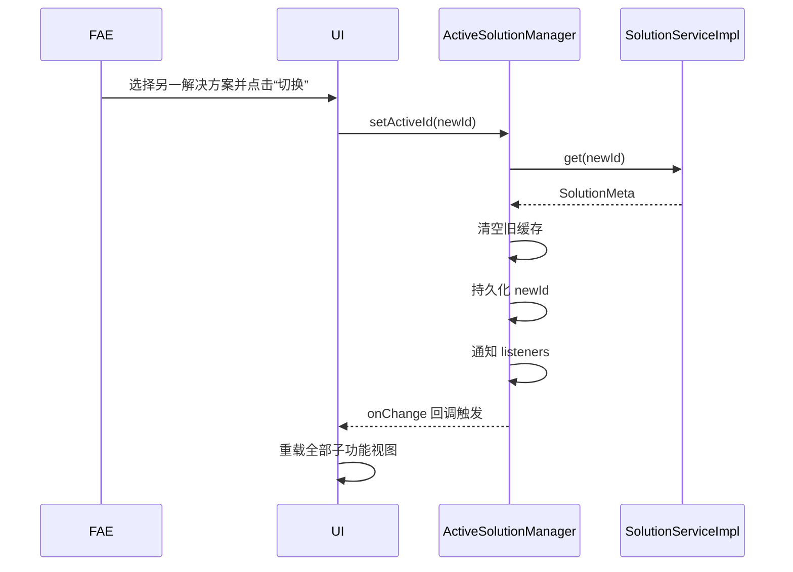
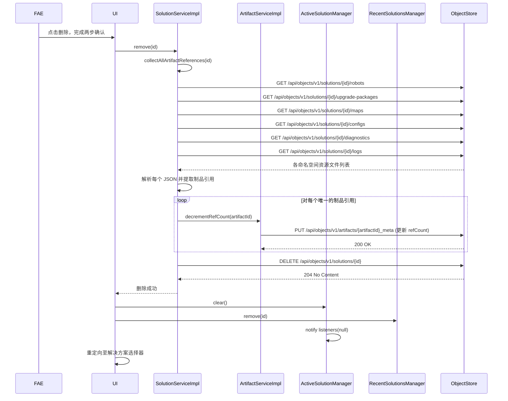
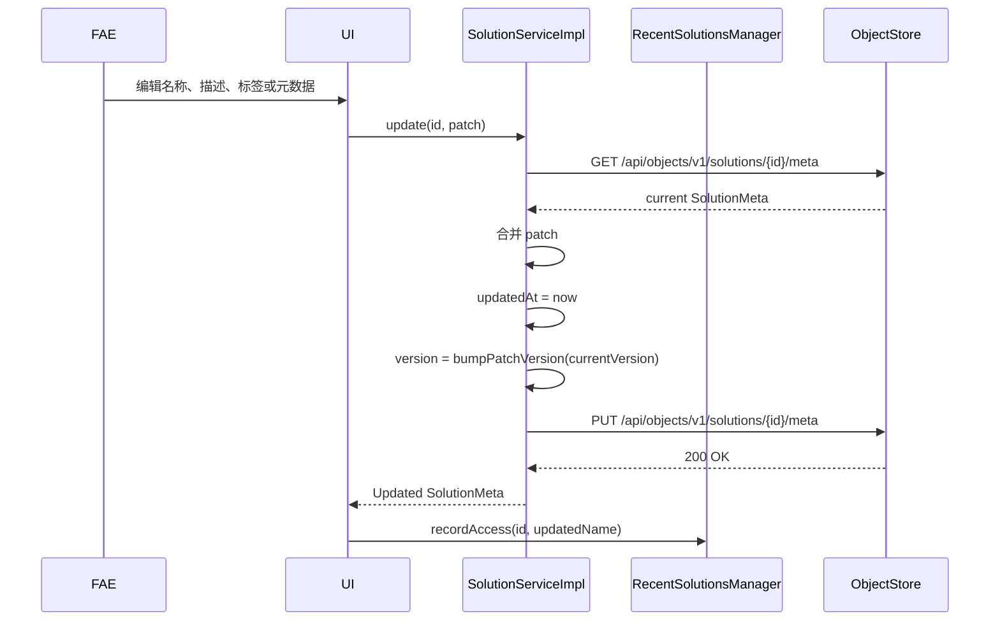
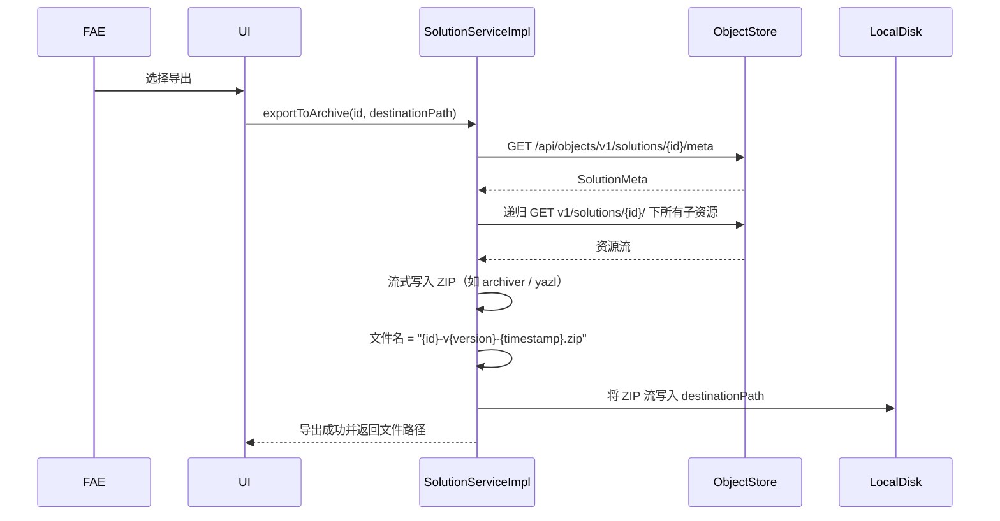
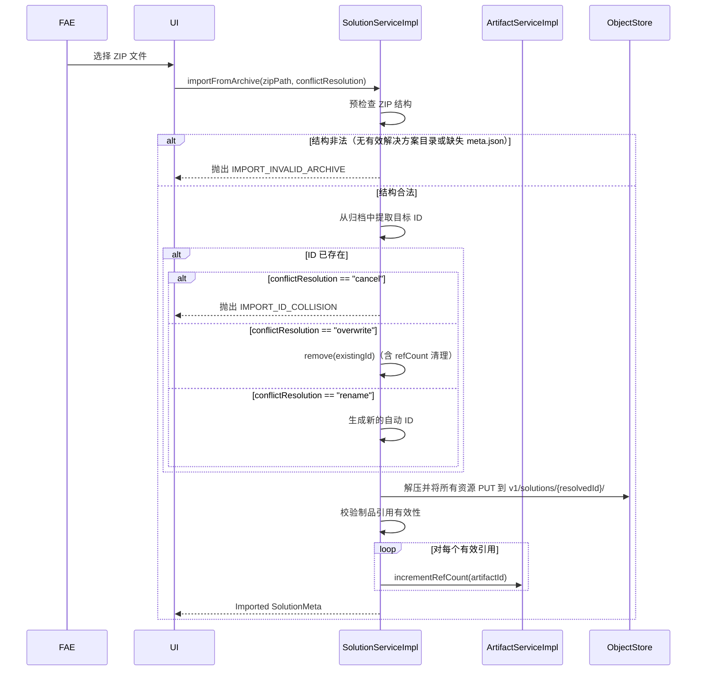
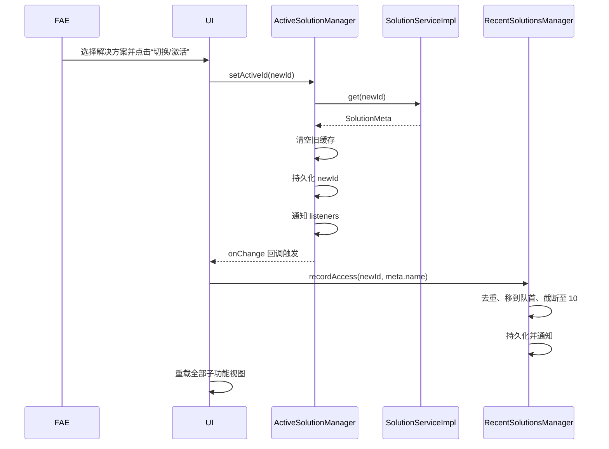
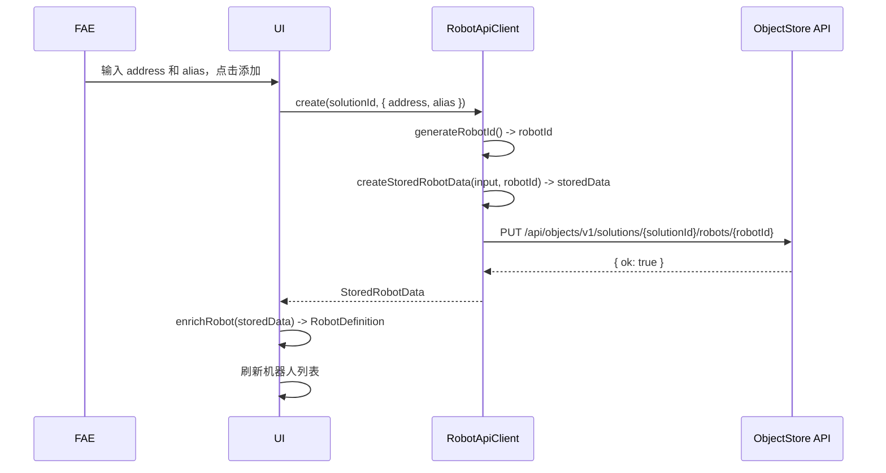
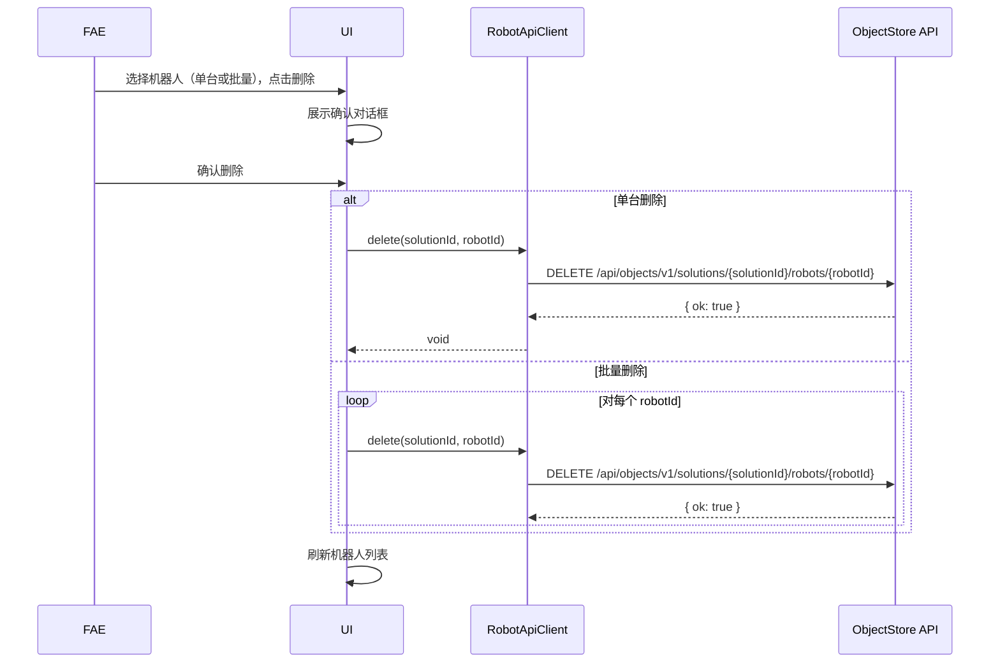
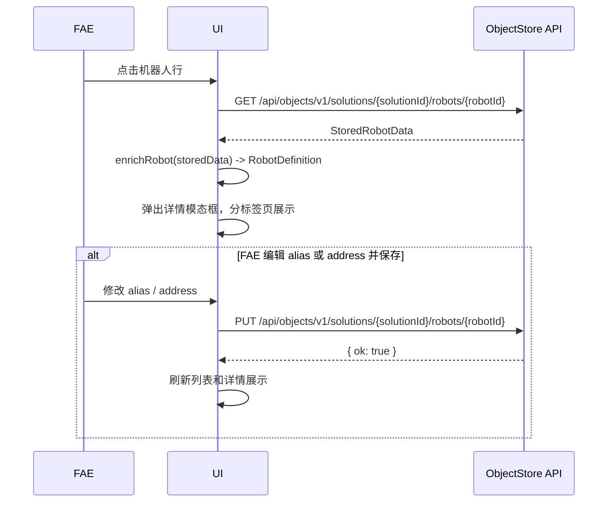

# 解决方案管理模块 — 软件设计文档

> 本文档承接《解决方案管理模块需求规格说明书》，对需求中涉及的技术实现进行设计细化。

---

## 1. 概述

本文档描述解决方案管理模块的内部接口设计、核心服务类结构、与对象存储层的交互方式，以及当前激活解决方案状态管理的设计方案。

---

## 2. 设计约束

- 后端仅提供通用对象存储 RESTful API（`/api/objects/...`）和制品管理 API（`/api/artifacts/...`），不提供业务专用的解决方案/机器人服务。
- 解决方案和机器人的业务逻辑（数据结构、校验、模拟数据生成等）全部由前端实现。
- 前端通过通用对象存储 API 直接读写数据，存储内容由前端决定。
- 模块内部使用 TypeScript + ES6 模块语法。
- 所有接口定义仅为设计阶段草案，实现时可根据实际情况调整参数和返回值。

---

## 3. 内部接口设计

### 3.1 解决方案 API 客户端（solutionApi）

前端通过通用对象存储 API 实现解决方案的生命周期管理。

```typescript
interface SolutionMeta {
  id: string;
  name: string;
  description: string;
  createdAt: string;
  updatedAt: string;
  version: string;
  tags: string[];
  metadata: Record<string, unknown>;
}

interface CreateSolutionInput {
  id?: string;          // optional; auto-generated when omitted
  name: string;
  description?: string;
  tags?: string[];
  metadata?: Record<string, unknown>;
}

interface SolutionListResult {
  items: SolutionMeta[];
  corruptedIds: string[]; // IDs with missing or unreadable meta
}

interface SolutionApiClient {
  create(input: CreateSolutionInput): Promise<SolutionMeta>;
  list(): Promise<SolutionListResult>;
  get(id: string): Promise<SolutionMeta | null>;
  // Mutable fields: name, description, tags, metadata
  // Auto-updates updatedAt and bumps patch version
  update(id: string, patch: Partial<Omit<SolutionMeta, "id" | "createdAt" | "version">>): Promise<SolutionMeta>;
  remove(id: string): Promise<void>;
  clone(sourceId: string, newName: string): Promise<SolutionMeta>;
  exportSolution(id: string, destinationPath?: string): Promise<{ filePath: string }>;
  importSolution(zipPath: string, targetPath: string): Promise<{ ok: boolean }>;
}
```

### 3.2 当前激活解决方案管理器（ActiveSolutionManager）

负责维护应用会话中的单一激活上下文，并提供状态变更订阅机制。

```typescript
interface ActiveSolutionManager {
  getActiveId(): string | null;
  setActiveId(id: string): Promise<void>;
  clear(): void;
  onChange(callback: (id: string | null) => void): () => void;
}
```

### 3.3 最近使用解决方案管理器（RecentSolutionsManager）

维护一个持久化的、有序的最近访问解决方案列表（上限 10 条），用于快捷导航。

```typescript
interface RecentSolutionEntry {
  id: string;
  name: string;
  accessedAt: string; // ISO 8601 date-time
}

interface RecentSolutionsManager {
  getList(): RecentSolutionEntry[];
  recordAccess(id: string, name: string): Promise<void>;
  remove(id: string): Promise<void>;
  clear(): Promise<void>;
  onChange(callback: (entries: RecentSolutionEntry[]) => void): () => void;
}
```

### 3.4 制品服务接口（ArtifactService）

负责全局制品的生命周期管理和引用计数维护。

```typescript
interface ArtifactMeta {
  id: string;
  fileName: string;
  size: number;
  checksum: string;
  contentType: string;
  createdAt: string;
  refCount: number;
  metadata: Record<string, unknown>;
}

interface ArtifactReference {
  artifactId: string;
  purpose: string;
}

interface ArtifactService {
  upload(filePath: string, metadata?: Record<string, unknown>): Promise<ArtifactMeta>;
  list(): Promise<ArtifactMeta[]>;
  get(artifactId: string): Promise<ArtifactMeta | null>;
  remove(artifactId: string): Promise<void>;
  incrementRefCount(artifactId: string): Promise<void>;
  decrementRefCount(artifactId: string): Promise<void>;
}
```

### 3.5 对象存储 HTTP API

后端提供通用对象存储 RESTful API，前端直接使用此 API 读写所有业务数据。

```typescript
interface ObjectStoreResource {
  name: string;
  type: "file" | "directory";
  contentType?: string;
  size?: number;
}

interface ObjectStoreHttpClient {
  // List directory contents
  list(path: string): Promise<ObjectStoreResource[]>;
  // Get object as JSON
  get<T>(path: string): Promise<T | null>;
  // Put object as JSON
  put(path: string, data: unknown): Promise<{ ok: boolean }>;
  // Delete object or directory
  delete(path: string): Promise<{ ok: boolean }>;
  // Clone a directory recursively
  clone(sourcePath: string, targetPath: string): Promise<{ ok: boolean }>;
  // Export directory to ZIP archive
  export(sourcePath: string, destinationPath?: string): Promise<{ filePath: string }>;
  // Import ZIP archive to target path
  import(zipPath: string, targetPath: string): Promise<{ ok: boolean }>;
}
```

**HTTP Endpoints**:

| Method | Path | Description |
|--------|------|-------------|
| GET | `/api/objects/list/{path}` | List directory contents |
| GET | `/api/objects/{path}` | Get object as JSON |
| PUT | `/api/objects/{path}` | Put object as JSON |
| DELETE | `/api/objects/{path}` | Delete object/directory |
| POST | `/api/objects/clone` | Clone directory (`{ sourcePath, targetPath }`) |
| POST | `/api/objects/export` | Export to ZIP (`{ sourcePath, destinationPath }`) |
| POST | `/api/objects/import` | Import from ZIP (`{ zipPath, targetPath }`) |

### 3.6 机器人 API 客户端（robotApi）

前端通过通用对象存储 API 实现机器人的生命周期管理。机器人存储数据仅包含持久化字段，动态信息由前端生成。

```typescript
interface StoredRobotData {
  id: string;
  address: string;
  addressType: "ip" | "mdns";
  alias: string;
  createdAt: string;
  updatedAt: string;
}

interface RobotDefinition extends StoredRobotData {
  model: string;
  robotSN: string;
  thingsId: string;
  vendorId: string;
  productId: string;
  mainboardSN: string;
  mainboardId: string;
  mainSOMSN: string;
  megaCosmOSVersion: string;
  movebaseVersion: string;
  ggrVersion: string;
  mcuFirmwareVersions: Record<string, string>;
  actuatorFirmwareVersions: Record<string, string>;
  sensorFirmwareVersions: Record<string, string>;
  mainControlHardwareVersion: string;
  mcuHardwareVersions: Record<string, string>;
  actuatorHardwareVersions: Record<string, string>;
  sensorHardwareVersions: Record<string, string>;
  hardwareDeviceTree: HardwareDeviceNode[];
}

interface CreateRobotInput {
  address: string;
  alias?: string;
}

interface RobotApiClient {
  list(solutionId: string): Promise<StoredRobotData[]>;
  get(solutionId: string, robotId: string): Promise<StoredRobotData | null>;
  create(solutionId: string, input: CreateRobotInput): Promise<StoredRobotData>;
  update(solutionId: string, robotId: string, patch: Partial<Pick<StoredRobotData, "alias" | "address">>): Promise<StoredRobotData>;
  delete(solutionId: string, robotId: string): Promise<void>;
}

// Frontend utility functions
function enrichRobot(stored: StoredRobotData): RobotDefinition;
function generateMockRobotInfo(address: string, alias: string): Omit<RobotDefinition, keyof StoredRobotData>;
function generateRobotId(): string;
```

> **Design decision**: Only `alias` and `address` are editable/persisted. All other fields in `RobotDefinition` are dynamically generated by the frontend via `generateMockRobotInfo()` (current stage) and will be replaced by real robot communication protocol calls in the future.

---

## 4. 对象存储路径映射

### 4.1 路径模板

| 操作 | HTTP 方法 | 对象存储路径 | Content-Type |
|------|----------|-------------|--------------|
| 创建/更新 meta | PUT | `/api/objects/v1/solutions/{id}/meta` | `application/json` |
| 读取 meta | GET | `/api/objects/v1/solutions/{id}/meta` | — |
| 列举全部解决方案 | GET | `/api/objects/list/v1/solutions` | — |
| 删除解决方案 | DELETE | `/api/objects/v1/solutions/{id}` | — |
| 子资源操作 | PUT/GET/DELETE | `/api/objects/v1/solutions/{id}/{namespace}/{resourceId}` | 按资源类型 |
| 克隆解决方案 | POST | `/api/objects/clone` | `application/json` |
| 导出解决方案 | POST | `/api/objects/export` | `application/json` |
| 导入解决方案 | POST | `/api/objects/import` | `application/json` |
| 上传制品文件 | PUT | `/api/artifacts/...` | 按实际文件类型推断 |
| 读取/删除制品 | GET/DELETE | `/api/artifacts/...` | — |

### 4.2 机器人子资源路径模板

| 操作 | HTTP 方法 | 对象存储路径 | Content-Type |
|------|----------|-------------|--------------|
| 创建/更新机器人存储数据 | PUT | `/api/objects/v1/solutions/{solutionId}/robots/{robotId}` | `application/json` |
| 读取机器人存储数据 | GET | `/api/objects/v1/solutions/{solutionId}/robots/{robotId}` | — |
| 列举解决方案下全部机器人 | GET | `/api/objects/list/v1/solutions/{solutionId}/robots` | — |
| 删除机器人 | DELETE | `/api/objects/v1/solutions/{solutionId}/robots/{robotId}` | — |

### 4.3 目录骨架初始化流程

创建解决方案时，系统必须通过写入 `.keep` 占位文件（或使用对象存储的空目录创建 API）预先创建以下子命名空间目录：

1. `PUT /api/objects/v1/solutions/{id}/meta` — write metadata
2. `PUT /api/objects/v1/solutions/{id}/robots/_keep` — placeholder for empty string
3. `PUT /api/objects/v1/solutions/{id}/upgrade-packages/_keep`
4. `PUT /api/objects/v1/solutions/{id}/maps/_keep`
5. `PUT /api/objects/v1/solutions/{id}/configs/_keep`
6. `PUT /api/objects/v1/solutions/{id}/diagnostics/_keep`
7. `PUT /api/objects/v1/solutions/{id}/logs/_keep`

对象存储会自动创建中间目录。预先创建所有命名空间可确保列表 API 始终返回可预测的结构，并消除懒初始化带来的竞态条件。

全局制品目录 `v1/artifacts/` 为独立顶级命名空间，不隶属于任何解决方案，无需在创建解决方案时预创建。

---

## 5. 核心类设计草案

### 5.1 SolutionApiClient (Frontend)

```
class SolutionApiClient {
  - objectStoreApi: ObjectStoreHttpClient
  + create(input: CreateSolutionInput): Promise<SolutionMeta>
  + list(): Promise<SolutionListResult>
  + get(id: string): Promise<SolutionMeta | null>
  + update(id: string, patch): Promise<SolutionMeta>
  + remove(id: string): Promise<void>
  + clone(sourceId: string, newName: string): Promise<SolutionMeta>
  + exportSolution(id: string, destinationPath?: string): Promise<{ filePath: string }>
  + importSolution(zipPath: string, targetPath: string): Promise<{ ok: boolean }>
  - slugify(text: string): string
  - generateId(name: string): string
  - bumpPatchVersion(currentVersion: string): string
  - createDirectorySkeleton(id: string): Promise<void>
}
```

### 5.2 ActiveSolutionManagerImpl

```
class ActiveSolutionManagerImpl implements ActiveSolutionManager {
  - activeId: string | null
  - listeners: Set<(id: string | null) => void>
  - storageKey: string
  + getActiveId(): string | null
  + setActiveId(id: string): Promise<void>
  + clear(): void
  + onChange(callback): () => void
  - persist(): void        // 使用 localStorage 持久化 activeId
  - restore(): void        // 从 localStorage 恢复 activeId
  - notify(): void
}
```

### 5.3 ArtifactServiceImpl

```
class ArtifactServiceImpl implements ArtifactService {
  - objectStoreBaseUrl: string
  + upload(filePath: string, metadata?): Promise<ArtifactMeta>
  + list(): Promise<ArtifactMeta[]>
  + get(artifactId: string): Promise<ArtifactMeta | null>
  + remove(artifactId: string): Promise<void>
  + incrementRefCount(artifactId: string): Promise<void>
  + decrementRefCount(artifactId: string): Promise<void>
  - computeChecksum(filePath: string): Promise<string>
  - findByChecksum(checksum: string): Promise<ArtifactMeta | null>
  - writeMeta(artifactId: string, meta: ArtifactMeta): Promise<void>
  - readMeta(artifactId: string): Promise<ArtifactMeta>
}
```

### 5.4 RecentSolutionsManagerImpl

```
class RecentSolutionsManagerImpl implements RecentSolutionsManager {
  - entries: RecentSolutionEntry[]
  - listeners: Set<(entries: RecentSolutionEntry[]) => void>
  - storageKey: string
  - maxEntries: number = 10
  + getList(): RecentSolutionEntry[]
  + recordAccess(id: string, name: string): Promise<void>
  + remove(id: string): Promise<void>
  + clear(): Promise<void>
  + onChange(callback): () => void
  - persist(): void        // 使用 localStorage 持久化 entries
  - restore(): void        // 从 localStorage 恢复 entries
  - notify(): void
}
```

### 5.5 RobotApiClient (Frontend)

```
class RobotApiClient {
  - objectStoreApi: ObjectStoreHttpClient
  + list(solutionId: string): Promise<StoredRobotData[]>
  + get(solutionId: string, robotId: string): Promise<StoredRobotData | null>
  + create(solutionId: string, input: CreateRobotInput): Promise<StoredRobotData>
  + update(solutionId: string, robotId: string, patch): Promise<StoredRobotData>
  + delete(solutionId: string, robotId: string): Promise<void>
}

// Frontend utilities (in types/robot.ts)
function enrichRobot(stored: StoredRobotData): RobotDefinition
function generateMockRobotInfo(address: string, alias: string): Omit<RobotDefinition, keyof StoredRobotData>
function generateRobotId(): string
function createStoredRobotData(input: CreateRobotInput, id: string): StoredRobotData
```

> **Note**: `generateMockRobotInfo` generates deterministic random data based on the robot's address. Only `StoredRobotData` is persisted to the object store. The `enrichRobot` function merges stored data with dynamically generated info to produce a complete `RobotDefinition` for display.

---

## 6. 关键时序设计

### 6.1 创建解决方案


### 6.2 切换当前激活解决方案



### 6.3 删除当前激活解决方案



### 6.4 更新解决方案（自动版本递增）



### 6.5 克隆解决方案（原子性）


### 6.6 导出解决方案



### 6.7 导入解决方案



### 6.8 设置激活解决方案并更新最近使用列表



### 6.9 添加单台机器人



### 6.10 删除/批量删除机器人



### 6.11 查看/编辑机器人详情



---

## 7. 异常处理策略

| 错误码 | 触发条件 | 处理方式 |
|--------|---------|---------|
| `SOLUTION_NOT_FOUND` | 对不存在的 ID 执行读取/更新/删除 | 返回 404 等效值；UI 提示"解决方案 '{id}' 不存在。" |
| `SOLUTION_ALREADY_EXISTS` | 使用重复 ID 创建 | 任何存储写入前拒绝；UI 提示"ID 为 '{id}' 的解决方案已存在。" |
| `INVALID_SOLUTION_ID` | ID 违反安全名称正则 | 在验证层拒绝；UI 提示"解决方案 ID 包含非法字符。" |
| `NO_ACTIVE_SOLUTION` | 未设置激活上下文时调用子资源 API | 返回 400；UI 提示用户先选择或创建解决方案。 |
| `SOLUTION_CORRUPTED` | `meta.json` 缺失或不可读 | list 时纳入 `corruptedIds`，get 时抛错；UI 渲染损坏警告标记。 |
| `IMPORT_INVALID_ARCHIVE` | ZIP 不包含有效的解决方案结构 | 预检查阶段拒绝，不写入对象存储；提示"所选文件不是有效的解决方案归档。" |
| `IMPORT_ID_COLLISION` | 导入目标 ID 已存在且用户选择取消 | 中止导入；提示"因 ID 冲突，导入已取消。" |
| `DELETE_ACTIVE_SOLUTION` | 删除当前激活的解决方案 | 额外警告并需要确认；删除后调用 `ActiveSolutionManager.clear()` 并重定向。 |
| `ARTIFACT_NOT_FOUND` | 引用或操作不存在的制品 | 阻断创建引用的操作；提示"制品 '{artifactId}' 不存在。" |
| `ARTIFACT_REFERENCED` | 尝试删除 `refCount > 0` 的制品 | 拒绝删除并提示引用数。由 ArtifactService 处理。 |
| `ARTIFACT_DUPLICATE_CHECKSUM` | 上传的制品校验和与已有文件相同 | 返回已有 `ArtifactMeta`；UI 提示去重。由 ArtifactService 处理。 |
| `INVALID_ARTIFACT_ID` | 制品 ID 违反安全名称正则 | 存储操作前拒绝。由 ArtifactService 处理。 |
| `ROBOT_NOT_FOUND` | 对不存在的 robotId 执行读取/更新/删除 | 返回 404；UI 提示"机器人 '{robotId}' 不存在。" |
| `INVALID_ROBOT_ID` | 机器人 ID 违反安全名称正则 | 在验证层拒绝；UI 提示"机器人 ID 包含非法字符。" |
| `INVALID_ROBOT_ADDRESS` | 地址为空或超过 256 字符 | 在验证层拒绝；UI 提示"机器人地址不能为空且不能超过 256 个字符。" |
| `ROBOT_ADDRESS_EXISTS` | 同一解决方案下已存在相同地址 | 拒绝创建；UI 提示"该地址已存在于当前解决方案中。" |
| 对象存储无响应 | 网络/服务故障 | 指数退避重试 3 次；最终向用户提示网络错误。 |
| 删除过程部分子资源失败 | 递归删除时部分路径失败 | 记录详细错误日志；向用户报告未删除成功的路径列表。 |
| 克隆中途失败 | 复制过程中失败 | 删除已创建的目标目录，防止产生残缺解决方案。 |
| 引用计数负值 | 内部计算异常导致负值 | 钳制到 0，记录严重错误日志，触发后台审计。由 ArtifactService 处理。 |

---

## 8. 子资源归属契约

### 8.1 寻址规则

所有子资源 API 必须接受 `solutionId` 参数（显式传入或从当前激活解决方案隐式获取）。对象存储路径始终遵循：

```
v1/solutions/{solutionId}/{feature-namespace}/{resourceId}
```

### 8.2 功能命名空间注册表

| 功能 | 命名空间 | 存储格式 | 归属 |
|------|---------|---------|------|
| 机器人管理 | `robots` | `application/json` | 解决方案 |
| BSP / OS 升级包 | `upgrade-packages` | `application/json`（引用文件，指向全局制品） | 解决方案 |
| 地图下发 | `maps` | `application/json`（引用文件，指向全局制品） | 解决方案 |
| 程序配置 | `configs` | `application/json` | 解决方案 |
| 诊断会话 | `diagnostics` | `application/json` | 解决方案 |
| 操作日志 | `logs` | `application/json` | 解决方案 |
| 制品 | `artifacts` | 根据实际文件类型推断 | **全局**（不从属于任何解决方案） |

### 8.3 生命周期耦合

- **创建**：子资源只能在父解决方案存在时创建。全局制品独立创建，不依赖于任何解决方案。
- **读取**：子资源在当前激活解决方案的上下文中被读取。全局制品可在任意上下文中读取。
- **更新**：子资源更新**不会**修改父解决方案的 `updatedAt` 或版本号（除非子模块显式设计为触发更新）。全局制品元数据中的 `refCount` 由引用/解除引用操作自动维护。
- **删除**：删除子资源不会影响父解决方案。若子资源包含对全局制品的引用，删除时递减对应制品的 `refCount`。
- **级联**：删除父解决方案会递归删除该解决方案下的所有子资源（引用文件），并自动递减相关全局制品的 `refCount`，但**不会**删除全局制品本身。

---

## 9. UI 组件设计

### 9.1 解决方案选择器（着陆页）

- **布局**：未设置激活解决方案时展示的全页面网格或列表视图。
- **内容**：卡片或行展示 `name`、截断的 `description`、`updatedAt`、`tags`（Carbon `Tag`）及操作按钮（打开、导出、克隆、删除）。
- **空状态**：列表为空时提示创建或导入解决方案。
- **损坏标记**：`meta.json` 不可读的解决方案渲染警告指示器（如 Carbon `Tag` 红色主题 + 警告图标）。

### 9.2 全局标题栏 / 标题条

- **激活方案展示**：醒目显示当前激活解决方案的 `name`。
- **切换按钮**："切换解决方案"按钮打开选择器模态框或导航至着陆页。
- **最近使用下拉**：由 `RecentSolutionsManager` 驱动的快捷访问下拉菜单，最多展示 10 条。点击条目直接触发激活流程（FR-SOL-009）。

### 9.3 解决方案详情 / 编辑模态框

- **表单字段**：可编辑的 `name`、`description`、`tags`（多标签输入）、`metadata`（键值编辑器）。
- **只读字段**：`id`、`createdAt`、`version`。
- **版本展示**：显示当前 `version`，用户可理解每次保存会自动递增。

### 9.4 创建解决方案模态框

- **字段**：`name`（必填）、`description`、`tags`、`metadata`。
- **自动激活**：创建成功后自动设为当前激活解决方案（UI-SOL-005）。

### 9.5 删除确认

- **模态对话框**：警告破坏性操作，提示所有子资源将被永久删除。
- **激活方案处理**：若删除的是当前激活方案，额外显示警告；确认后清空激活上下文并重定向至选择器。

### 9.6 导出 / 克隆进度

- **进度指示器**：Carbon `ProgressBar` 或内联加载状态，显示"正在打包文件..."或"正在复制资源..."。
- **取消**：耗时操作提供取消按钮，中止 ZIP 流或复制队列并清理已产生的临时数据。

### 9.7 Robots Sub-Interface

- **Layout**: Main content area displays data table (Carbon `DataTable`) or grid view after clicking "Robots" in left sidebar.
- **Breadcrumb**: Navigation breadcrumb showing "Solutions > {Solution Name} > Robots".
- **Table columns**: `alias` (inline-editable), `address`, `model`, `robotSN`, `thingsId`, `megaCosmOSVersion`, action column (View Details, Delete).
- **Grid view**: Card layout showing robot alias, address, model, SN, OS version.
- **Toolbar**: Search input (filter by alias/address/model/SN substring), "Add Robot" button, view mode toggle (grid/list).
- **Batch selection**: Checkbox per row; "Batch Delete" danger button appears in toolbar when items selected.
- **Notifications**: Success/error notifications auto-dismiss after 5 seconds.
- **Empty state**: Illustration and "Add your first robot" button.

### 9.8 Add Robot Modal

- **Single add form**: `address` input (supports IP or mDNS hostname), `alias` input (pre-filled with auto-generated default like "Robot-1", "Robot-2").
- **No batch add tab**: Batch add has been removed from the UI; users add robots one at a time.
- **Confirm button**: "Add", closes modal and refreshes list on success.

### 9.9 Robot Detail Modal

- **Trigger**: Click table row or "Details" button.
- **Layout**: Carbon `Modal` (size="lg") with embedded `Tabs`.
- **Tabs**:
  - **Basic Info**: `alias` (editable), `address` (editable), `model` (read-only), `robotSN` (read-only), `thingsId` (read-only), `vendorId` (read-only), `productId` (read-only), `mainboardSN` (read-only), `mainboardId` (read-only), `mainSOMSN` (read-only).
  - **Other Info**: `hardwareDeviceTree` as `DataTable` (columns: name, firmwareVersion, hardwareVersion, serialNumber, hardwareId, online).
  - **Software Versions**: `megaCosmOSVersion`, `movebaseVersion`, `ggrVersion` as read-only form fields; MCU / actuator / sensor firmware versions as key-value lists.
  - **Hardware Versions**: `mainControlHardwareVersion`, MCU / actuator / sensor hardware versions as key-value lists.
- **Actions**: Bottom "Save" primary button (saves alias/address changes only), "Close" secondary button.

---

## 10. 非功能需求与性能设计

| 需求 | 设计方法 |
|------|---------|
| NF-SOL-001：列举 1000 个解决方案 < 2 秒 | 在内存中缓存解决方案元数据列表并设置短 TTL；增删改时增量更新；并行批量读取 `meta.json`（如每次 20 个），避免连接池耗尽。 |
| NF-SOL-002：1 GB 归档流式导出 | 使用流式 ZIP 库（如 `archiver` 或 `yazl`），将对象存储的读取流直接管道接入归档写入流；禁止将整个归档加载到内存。 |
| NF-SOL-003：对象存储临时不可用 | 所有对象存储 HTTP 调用包裹在具备自动重试的弹性客户端中：最多 3 次，指数退避（基数 200 ms，上限 5 秒）。重试耗尽后向用户提示网络错误。 |
| NF-SOL-004：长时间 I/O 操作可取消 | `exportToArchive`、`importFromArchive`、`clone` 均接受 `AbortSignal`。取消时关闭流，并对已部分写入的目标资源执行补偿性 DELETE。 |
| NF-ROB-001：机器人列表加载 < 1 秒 | 对象存储 `list` 操作直接读取 `robots` 目录；并行读取每个机器人定义 JSON；前端使用 React 状态管理避免不必要的重渲染。 |
| NF-ROB-002：别名内联编辑 < 300 ms | 前端直接调用 `PUT` API 更新单字段；使用乐观更新策略，先更新本地状态再同步服务器响应。 |
| NF-ROB-003：批量添加实时反馈 | 后端 `createBatch` 逐条处理并流式返回进度（或使用 Server-Sent Events）；前端展示进度条和成功/失败计数。 |

### 10.1 版本号递增逻辑

`bumpPatchVersion` 辅助函数解析语义化版本字符串 `MAJOR.MINOR.PATCH`，仅递增 `PATCH` 位：

```typescript
function bumpPatchVersion(version: string): string {
  const [major, minor, patch] = version.split(".").map(Number);
  return `${major}.${minor}.${patch + 1}`;
}
```

未来可能支持通过显式用户操作触发 minor/major 递增；当前所有解决方案元数据更新均触发 patch 级自动递增。

### 10.2 导入预检查

在往对象存储写入任何数据之前，导入流程执行轻量级 ZIP 预检查：

1. 打开 ZIP 并读取中央目录（不进行完整解压）。
2. 验证顶层存在且仅存在一个匹配解决方案 ID 正则的目录，或预期路径下存在 `meta.json`。
3. 解析 `meta.json` 以确认其符合 SolutionMeta Schema。
4. 仅当校验通过后，才开始解压并写入对象存储。

### 10.3 Robot Info Mock Strategy (Current Stage)

`generateMockRobotInfo` implementation principles:

- Uses a deterministic seed based on `address` to generate random data, ensuring the same address always produces the same info.
- Mock fields cover all fields in `RobotDefinition` except those in `StoredRobotData` (id, address, addressType, alias, createdAt, updatedAt).
- Mock data follows reasonable business rules (e.g., version format `x.y.z`, SN as alphanumeric combinations).
- The `enrichRobot` function merges `StoredRobotData` from the object store with dynamically generated mock info to produce a complete `RobotDefinition` for display.
- When replacing with real protocol calls in the future, only the `generateMockRobotInfo` implementation needs to change; the interface contract and storage schema remain the same.
- Only `alias` and `address` are editable; all dynamically generated fields are read-only in the UI.

---

## 11. 已确定的设计决策

| Design Item | Decision | Notes |
|--------|------|------|
| 1. ZIP streaming | `archiver` | Backend object store routes use Node.js streaming ZIP library to pipe object store read streams directly to local disk write streams. |
| 2. Object Store HTTP API | Generic RESTful API at `/api/objects/` | Backend provides only generic CRUD (GET/PUT/DELETE/LIST) plus specialized clone/export/import routes. Business logic lives in frontend. |
| 3. Clone atomicity | Simple implementation (cleanup on failure) | Delete target directory on failure; no temporary directory + rename mechanism. |
| 4. Local settings persistence | `localStorage` | Active solution ID, recent solutions list, and UI preferences are persisted in browser `localStorage`. |
| 5. Artifact ref count atomicity | Simple implementation (optimistic lock) | ETag-based read-modify-write with up to 5 retries; no distributed locks or transactions. Managed by backend ArtifactService. |
| 6. Checksum algorithm | SHA-256 | Used for artifact deduplication and integrity verification. |
| 7. Robot info generation | Frontend-generated (current stage: mock) | Robot dynamic info (model, SN, versions, etc.) is generated by frontend `generateMockRobotInfo()`. Only `StoredRobotData` is persisted. Future: replace with real protocol calls. |
| 8. Robot editability | Only `alias` and `address` | Only alias and address are user-editable and persisted. All other fields are dynamically generated and read-only. |
| 9. Solution/Robot business logic | Frontend-only | No specialized backend services for solutions or robots. All business logic (validation, data transformation, mock generation) runs in the frontend via generic object store API. |
