# 解决方案管理模块 — 软件设计文档

> 本文档承接《解决方案管理模块需求规格说明书》，对需求中涉及的技术实现进行设计细化。

---

## 1. 概述

本文档描述解决方案管理模块的内部接口设计、核心服务类结构、与对象存储层的交互方式，以及当前激活解决方案状态管理的设计方案。

---

## 2. 设计约束

- 所有持久化操作均通过 `playground/object_store` RESTful API 完成，禁止绕过对象存储直接操作文件系统。
- 模块内部使用 TypeScript + ES6 模块语法。
- 所有接口定义仅为设计阶段草案，实现时可根据实际情况调整参数和返回值。

---

## 3. 内部接口设计

### 3.1 解决方案服务接口（SolutionService）

负责解决方案的完整生命周期管理，对外提供语义化操作，内部映射为对象存储路径。

```typescript
interface SolutionMeta {
  id: string;
  name: string;
  description: string;
  createdAt: string;
  updatedAt: string;
  version: string;
  tags: string[];
  metadata: Record<string, unknown>;
}

interface CreateSolutionInput {
  id?: string;          // 可选；省略时自动生成
  name: string;
  description?: string;
  tags?: string[];
  metadata?: Record<string, unknown>;
}

interface SolutionListOptions {
  filter?: {
    name?: string;        // 子串匹配
    tags?: string[];      // 任意标签精确匹配
  };
  sort?: {
    field: "updatedAt" | "name" | "createdAt";
    order: "asc" | "desc";
  };
}

interface SolutionListResult {
  items: SolutionMeta[];
  corruptedIds: string[]; // meta.json 缺失或不可读的 ID 列表
}

interface SolutionService {
  create(input: CreateSolutionInput): Promise<SolutionMeta>;
  list(options?: SolutionListOptions): Promise<SolutionListResult>;
  get(id: string): Promise<SolutionMeta | null>;
  // 可变字段：name、description、tags、metadata
  // 服务层自动更新 updatedAt，并递增 patch 版本号（如 1.0.0 -> 1.0.1）
  update(id: string, patch: Partial<Omit<SolutionMeta, "id" | "createdAt" | "version">>): Promise<SolutionMeta>;
  remove(id: string): Promise<void>;
  clone(sourceId: string, newName: string): Promise<SolutionMeta>;
  exportToArchive(id: string, destinationPath: string): Promise<string>;
  importFromArchive(zipPath: string, conflictResolution: "overwrite" | "rename" | "cancel"): Promise<SolutionMeta>;
}
```

### 3.2 当前激活解决方案管理器（ActiveSolutionManager）

负责维护应用会话中的单一激活上下文，并提供状态变更订阅机制。

```typescript
interface ActiveSolutionManager {
  getActiveId(): string | null;
  setActiveId(id: string): Promise<void>;
  clear(): void;
  onChange(callback: (id: string | null) => void): () => void;
}
```

### 3.3 最近使用解决方案管理器（RecentSolutionsManager）

维护一个持久化的、有序的最近访问解决方案列表（上限 10 条），用于快捷导航。

```typescript
interface RecentSolutionEntry {
  id: string;
  name: string;
  accessedAt: string; // ISO 8601 date-time
}

interface RecentSolutionsManager {
  getList(): RecentSolutionEntry[];
  recordAccess(id: string, name: string): Promise<void>;
  remove(id: string): Promise<void>;
  clear(): Promise<void>;
  onChange(callback: (entries: RecentSolutionEntry[]) => void): () => void;
}
```

### 3.4 制品服务接口（ArtifactService）

负责全局制品的生命周期管理和引用计数维护。

```typescript
interface ArtifactMeta {
  id: string;
  fileName: string;
  size: number;
  checksum: string;
  contentType: string;
  createdAt: string;
  refCount: number;
  metadata: Record<string, unknown>;
}

interface ArtifactReference {
  artifactId: string;
  purpose: string;
}

interface ArtifactService {
  upload(filePath: string, metadata?: Record<string, unknown>): Promise<ArtifactMeta>;
  list(): Promise<ArtifactMeta[]>;
  get(artifactId: string): Promise<ArtifactMeta | null>;
  remove(artifactId: string): Promise<void>;
  incrementRefCount(artifactId: string): Promise<void>;
  decrementRefCount(artifactId: string): Promise<void>;
}
```

### 3.5 对象存储客户端（ObjectStoreClient）

所有与对象存储的交互通过统一封装的客户端进行，支持可配置的超时与重试。

```typescript
interface ObjectStoreClientConfig {
  baseUrl: string;
  timeout?: number;      // 请求超时（毫秒），默认 30000
  retries?: number;      // 重试次数，默认 3
}

interface ObjectStoreClient {
  put(path: string, body: ReadableStream | Buffer | string, contentType?: string, headers?: Record<string, string>): Promise<Response>;
  get(path: string): Promise<Response>;
  delete(path: string): Promise<Response>;
  list(path: string): Promise<string[]>;
}
```

> `SolutionServiceImpl` 与 `ArtifactServiceImpl` 均依赖同一 `ObjectStoreClient` 实例，以复用超时、重试等公共配置。

### 3.6 机器人服务接口（RobotService）

负责当前激活解决方案下的机器人生命周期管理，所有操作内部映射为对象存储路径。

```typescript
interface HardwareDeviceNode {
  name: string;
  firmwareVersion: string;
  hardwareVersion: string;
  serialNumber: string;
  hardwareId: string;
  parentName?: string;
  online: boolean;
}

interface RobotDefinition {
  id: string;
  address: string;
  addressType: "ip" | "mdns";
  alias: string;
  model: string;
  robotSN: string;
  thingsId: string;
  vendorId: string;
  productId: string;
  mainboardSN: string;
  mainboardId: string;
  mainSOMId: string;
  megaCosmOSVersion: string;
  movebaseVersion: string;
  ggrVersion: string;
  mcuFirmwareVersions: Record<string, string>;
  actuatorFirmwareVersions: Record<string, string>;
  sensorFirmwareVersions: Record<string, string>;
  mainControlHardwareVersion: string;
  mcuHardwareVersions: Record<string, string>;
  actuatorHardwareVersions: Record<string, string>;
  sensorHardwareVersions: Record<string, string>;
  hardwareDeviceTree: HardwareDeviceNode[];
  createdAt: string;
  updatedAt: string;
}

interface CreateRobotInput {
  address: string;
  alias?: string;
}

interface RobotListOptions {
  filter?: {
    alias?: string;
    address?: string;
    model?: string;
    robotSN?: string;
  };
  sort?: {
    field: "alias" | "address" | "model" | "robotSN" | "createdAt";
    order: "asc" | "desc";
  };
}

interface RobotService {
  // 所有方法依赖当前激活 solutionId，由服务内部从 ActiveSolutionManager 获取
  create(input: CreateRobotInput): Promise<RobotDefinition>;
  createBatch(inputs: CreateRobotInput[]): Promise<{ succeeded: RobotDefinition[]; failed: { input: CreateRobotInput; reason: string }[] }>;
  list(options?: RobotListOptions): Promise<RobotDefinition[]>;
  get(robotId: string): Promise<RobotDefinition | null>;
  update(robotId: string, patch: Partial<Omit<RobotDefinition, "id" | "createdAt">>): Promise<RobotDefinition>;
  remove(robotId: string): Promise<void>;
  removeBatch(robotIds: string[]): Promise<{ succeeded: string[]; failed: { robotId: string; reason: string }[] }>;
}
```

---

## 4. 对象存储路径映射

### 4.1 路径模板

| 操作 | HTTP 方法 | 对象存储路径 | Content-Type |
|------|----------|-------------|--------------|
| 创建/更新 meta | PUT | `/api/obs/v1/solutions/{id}/meta` | `application/json` |
| 读取 meta | GET | `/api/obs/v1/solutions/{id}/meta` | — |
| 列举全部解决方案 | GET | `/api/obs/v1/solutions` | — |
| 删除解决方案 | DELETE | `/api/obs/v1/solutions/{id}` | — |
| 子资源操作 | PUT/GET/DELETE | `/api/obs/v1/solutions/{id}/{namespace}/{resourceId}` | 按资源类型 |
| 上传制品文件 | PUT | `/api/obs/v1/artifacts/{artifactId}` | 按实际文件类型推断 |
| 上传/更新制品元数据 | PUT | `/api/obs/v1/artifacts/{artifactId}_meta` | `application/json` |
| 读取制品元数据 | GET | `/api/obs/v1/artifacts/{artifactId}_meta` | — |
| 列举全部制品 | GET | `/api/obs/v1/artifacts` | — |
| 删除制品 | DELETE | `/api/obs/v1/artifacts/{artifactId}` | — |

### 4.2 机器人子资源路径模板

| 操作 | HTTP 方法 | 对象存储路径 | Content-Type |
|------|----------|-------------|--------------|
| 创建/更新机器人定义 | PUT | `/api/obs/v1/solutions/{solutionId}/robots/{robotId}` | `application/json` |
| 读取机器人定义 | GET | `/api/obs/v1/solutions/{solutionId}/robots/{robotId}` | — |
| 列举解决方案下全部机器人 | GET | `/api/obs/v1/solutions/{solutionId}/robots` | — |
| 删除机器人 | DELETE | `/api/obs/v1/solutions/{solutionId}/robots/{robotId}` | — |

### 4.3 目录骨架初始化流程

创建解决方案时，系统必须通过写入 `.keep` 占位文件（或使用对象存储的空目录创建 API）预先创建以下子命名空间目录：

1. `PUT /api/obs/v1/solutions/{id}/meta` — 写入元数据
2. `PUT /api/obs/v1/solutions/{id}/robots/.keep`
3. `PUT /api/obs/v1/solutions/{id}/upgrade-packages/.keep`
4. `PUT /api/obs/v1/solutions/{id}/maps/.keep`
5. `PUT /api/obs/v1/solutions/{id}/configs/.keep`
6. `PUT /api/obs/v1/solutions/{id}/diagnostics/.keep`
7. `PUT /api/obs/v1/solutions/{id}/logs/.keep`

对象存储会自动创建中间目录。预先创建所有命名空间可确保列表 API 始终返回可预测的结构，并消除懒初始化带来的竞态条件。

全局制品目录 `v1/artifacts/` 为独立顶级命名空间，不隶属于任何解决方案，无需在创建解决方案时预创建。

---

## 5. 核心类设计草案

### 5.1 SolutionServiceImpl

```
class SolutionServiceImpl implements SolutionService {
  - objectStoreBaseUrl: string
  - artifactService: ArtifactService
  + create(input: CreateSolutionInput): Promise<SolutionMeta>
  + list(options?: SolutionListOptions): Promise<SolutionListResult>
  + get(id: string): Promise<SolutionMeta | null>
  + update(id: string, patch): Promise<SolutionMeta>
  + remove(id: string): Promise<void>
  + clone(sourceId: string, newName: string): Promise<SolutionMeta>
  + exportToArchive(id: string, destinationPath: string): Promise<string>
  + importFromArchive(zipPath: string, conflictResolution): Promise<SolutionMeta>
  - generateId(name: string): string
  - readMeta(id: string): Promise<SolutionMeta>
  - writeMeta(id: string, meta: SolutionMeta): Promise<void>
  - createDirectorySkeleton(id: string): Promise<void>
  - bumpPatchVersion(currentVersion: string): string
  - collectAllArtifactReferences(id: string): Promise<ArtifactReference[]>
  - deleteDirectoryRecursively(id: string): Promise<void>
}
```

### 5.2 ActiveSolutionManagerImpl

```
class ActiveSolutionManagerImpl implements ActiveSolutionManager {
  - activeId: string | null
  - listeners: Set<(id: string | null) => void>
  - storageKey: string
  + getActiveId(): string | null
  + setActiveId(id: string): Promise<void>
  + clear(): void
  + onChange(callback): () => void
  - persist(): void        // 使用 localStorage 持久化 activeId
  - restore(): void        // 从 localStorage 恢复 activeId
  - notify(): void
}
```

### 5.3 ArtifactServiceImpl

```
class ArtifactServiceImpl implements ArtifactService {
  - objectStoreBaseUrl: string
  + upload(filePath: string, metadata?): Promise<ArtifactMeta>
  + list(): Promise<ArtifactMeta[]>
  + get(artifactId: string): Promise<ArtifactMeta | null>
  + remove(artifactId: string): Promise<void>
  + incrementRefCount(artifactId: string): Promise<void>
  + decrementRefCount(artifactId: string): Promise<void>
  - computeChecksum(filePath: string): Promise<string>
  - findByChecksum(checksum: string): Promise<ArtifactMeta | null>
  - writeMeta(artifactId: string, meta: ArtifactMeta): Promise<void>
  - readMeta(artifactId: string): Promise<ArtifactMeta>
}
```

### 5.4 RecentSolutionsManagerImpl

```
class RecentSolutionsManagerImpl implements RecentSolutionsManager {
  - entries: RecentSolutionEntry[]
  - listeners: Set<(entries: RecentSolutionEntry[]) => void>
  - storageKey: string
  - maxEntries: number = 10
  + getList(): RecentSolutionEntry[]
  + recordAccess(id: string, name: string): Promise<void>
  + remove(id: string): Promise<void>
  + clear(): Promise<void>
  + onChange(callback): () => void
  - persist(): void        // 使用 localStorage 持久化 entries
  - restore(): void        // 从 localStorage 恢复 entries
  - notify(): void
}
```

### 5.5 RobotServiceImpl

```
class RobotServiceImpl implements RobotService {
  - obs: ObjectStoreClient
  - activeSolutionManager: ActiveSolutionManager
  + create(input: CreateRobotInput): Promise<RobotDefinition>
  + createBatch(inputs: CreateRobotInput[]): Promise<{ succeeded: RobotDefinition[]; failed: { input: CreateRobotInput; reason: string }[] }>
  + list(options?: RobotListOptions): Promise<RobotDefinition[]>
  + get(robotId: string): Promise<RobotDefinition | null>
  + update(robotId: string, patch): Promise<RobotDefinition>
  + remove(robotId: string): Promise<void>
  + removeBatch(robotIds: string[]): Promise<{ succeeded: string[]; failed: { robotId: string; reason: string }[] }>
  - generateRobotId(): string
  - generateMockRobotInfo(address: string, alias: string): RobotDefinition
  - readRobotDef(solutionId: string, robotId: string): Promise<RobotDefinition | null>
  - writeRobotDef(solutionId: string, robot: RobotDefinition): Promise<void>
  - ensureActiveSolution(): string
}
```

> **说明**：`generateMockRobotInfo` 为当前阶段的模拟实现，用于生成一致的随机机器人信息。后续将替换为真实的机器人通信协议调用。

---

## 6. 关键时序设计

### 6.1 创建解决方案

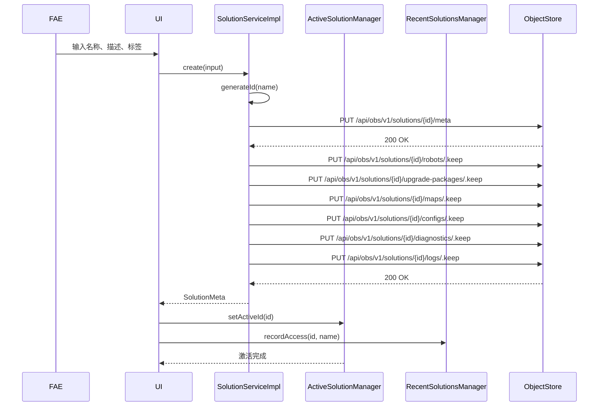

### 6.2 切换当前激活解决方案

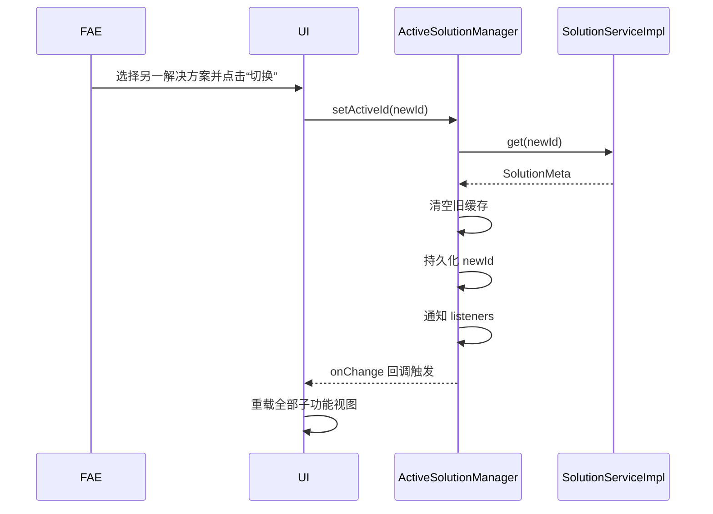

### 6.3 删除当前激活解决方案

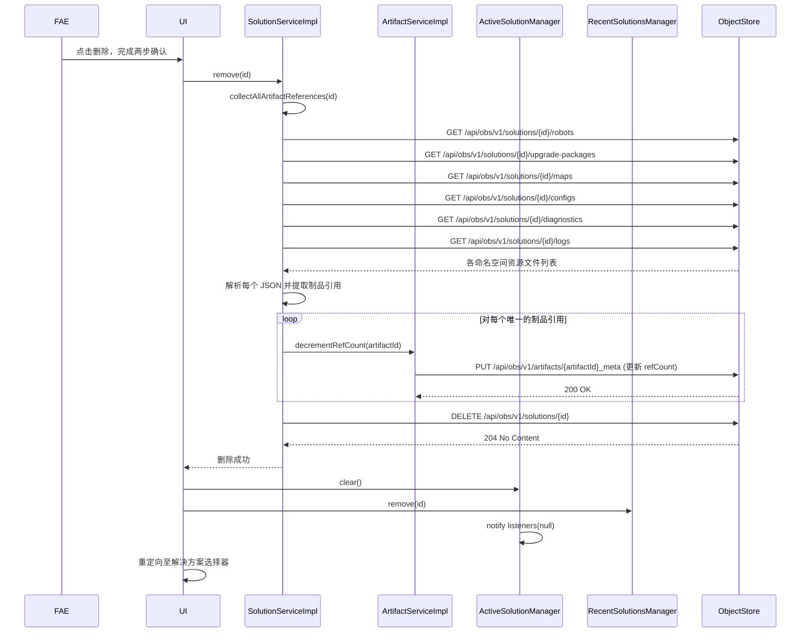

### 6.4 更新解决方案（自动版本递增）

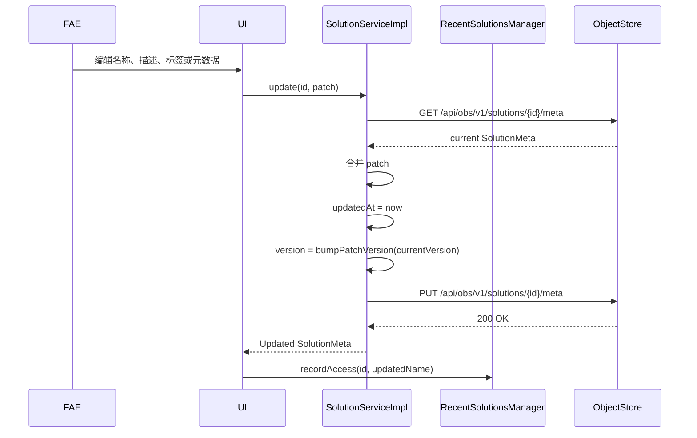

### 6.5 克隆解决方案（原子性）

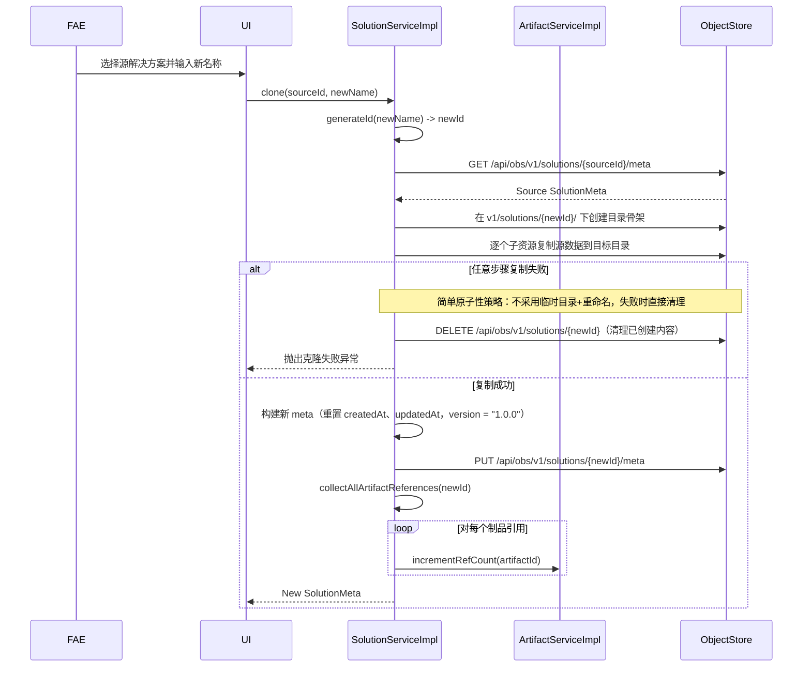

### 6.6 导出解决方案


### 6.7 导入解决方案

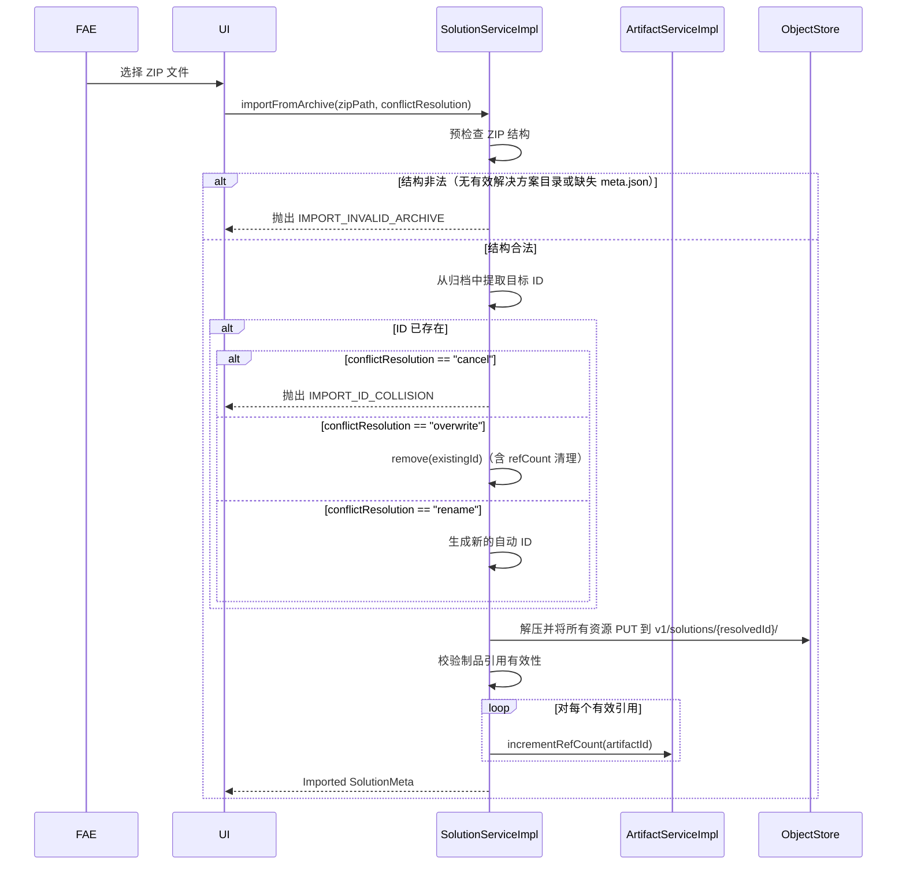

### 6.8 设置激活解决方案并更新最近使用列表

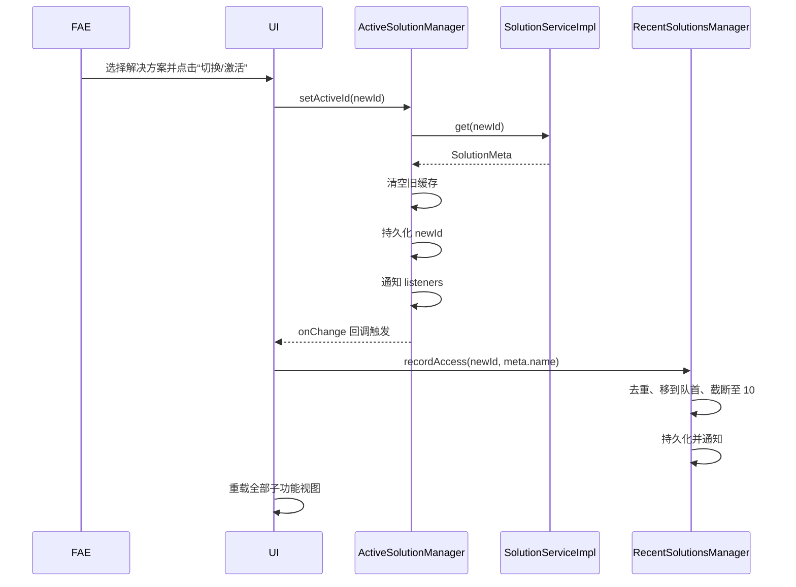

### 6.9 添加单台机器人

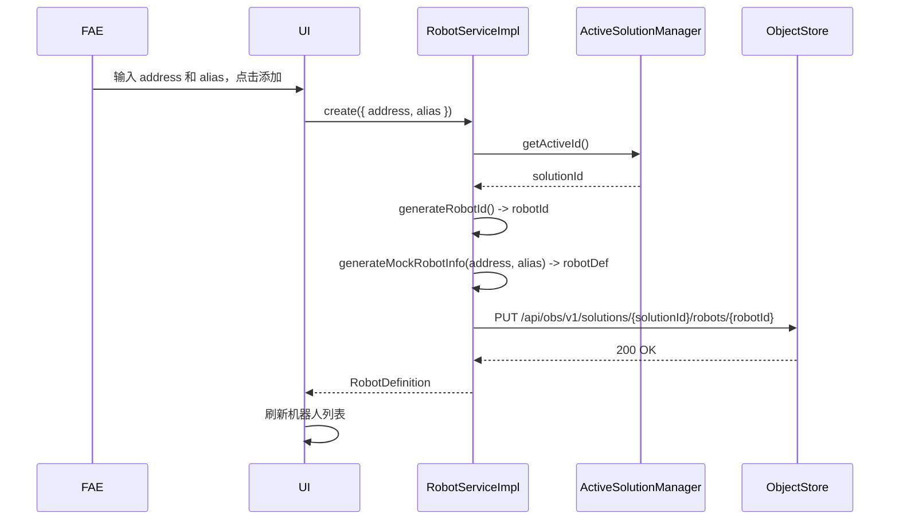

### 6.10 批量添加机器人

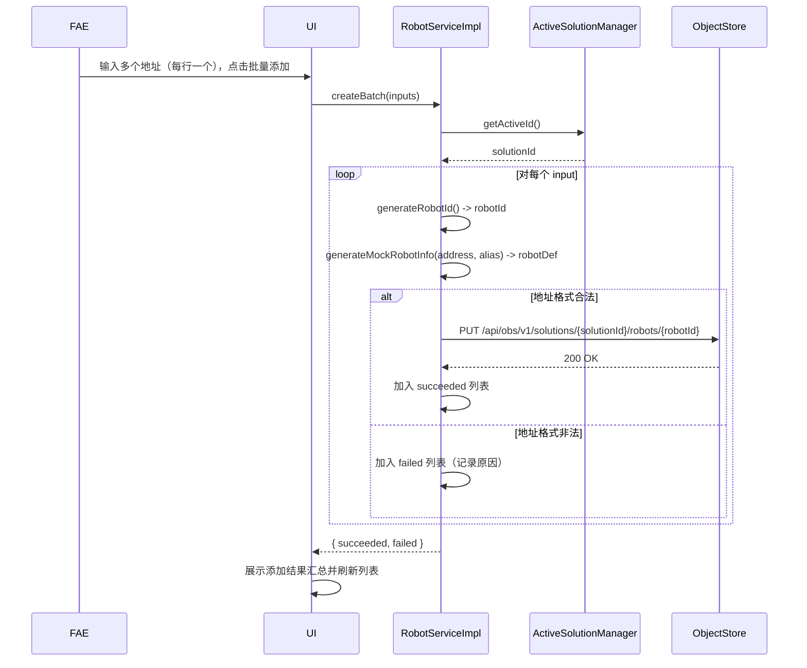

### 6.11 删除/批量删除机器人

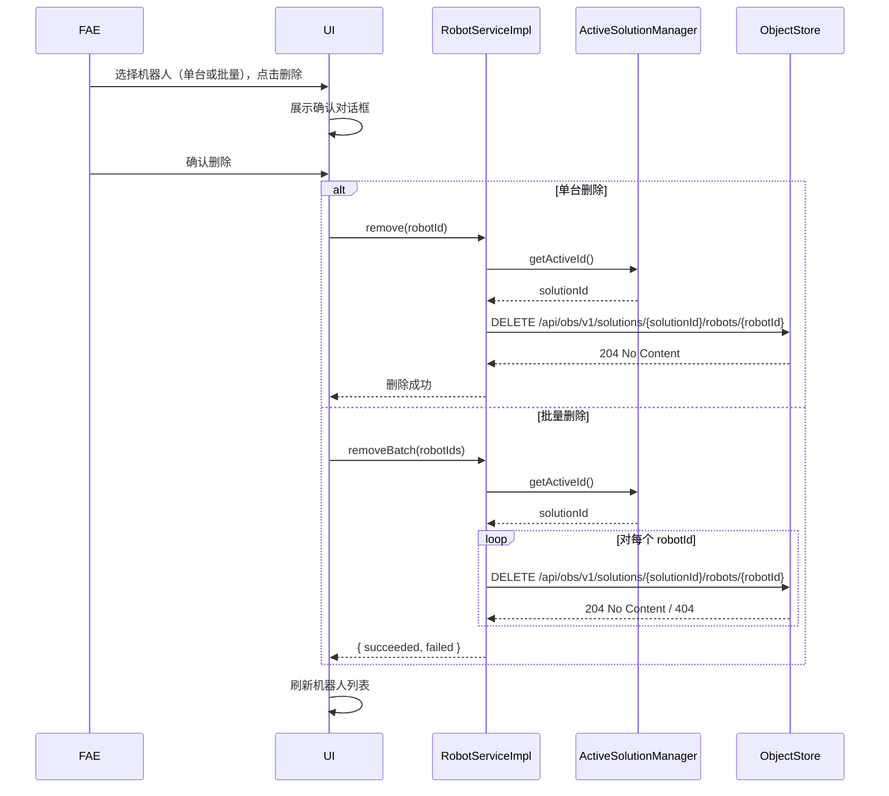

### 6.12 查看/编辑机器人详情

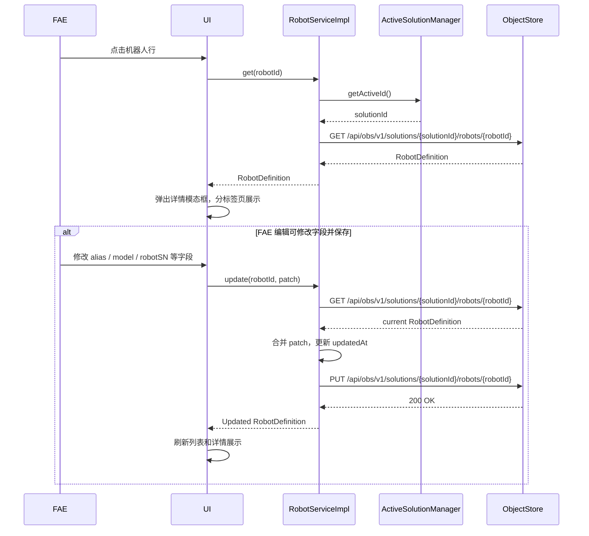

---

## 7. 异常处理策略

| 错误码 | 触发条件 | 处理方式 |
|--------|---------|---------|
| `SOLUTION_NOT_FOUND` | 对不存在的 ID 执行读取/更新/删除 | 返回 404 等效值；UI 提示"解决方案 '{id}' 不存在。" |
| `SOLUTION_ALREADY_EXISTS` | 使用重复 ID 创建 | 任何存储写入前拒绝；UI 提示"ID 为 '{id}' 的解决方案已存在。" |
| `INVALID_SOLUTION_ID` | ID 违反安全名称正则 | 在验证层拒绝；UI 提示"解决方案 ID 包含非法字符。" |
| `NO_ACTIVE_SOLUTION` | 未设置激活上下文时调用子资源 API | 返回 400；UI 提示用户先选择或创建解决方案。 |
| `SOLUTION_CORRUPTED` | `meta.json` 缺失或不可读 | list 时纳入 `corruptedIds`，get 时抛错；UI 渲染损坏警告标记。 |
| `IMPORT_INVALID_ARCHIVE` | ZIP 不包含有效的解决方案结构 | 预检查阶段拒绝，不写入对象存储；提示"所选文件不是有效的解决方案归档。" |
| `IMPORT_ID_COLLISION` | 导入目标 ID 已存在且用户选择取消 | 中止导入；提示"因 ID 冲突，导入已取消。" |
| `DELETE_ACTIVE_SOLUTION` | 删除当前激活的解决方案 | 额外警告并需要确认；删除后调用 `ActiveSolutionManager.clear()` 并重定向。 |
| `ARTIFACT_NOT_FOUND` | 引用或操作不存在的制品 | 阻断创建引用的操作；提示"制品 '{artifactId}' 不存在。" |
| `ARTIFACT_REFERENCED` | 尝试删除 `refCount > 0` 的制品 | 拒绝删除并提示引用数。由 ArtifactService 处理。 |
| `ARTIFACT_DUPLICATE_CHECKSUM` | 上传的制品校验和与已有文件相同 | 返回已有 `ArtifactMeta`；UI 提示去重。由 ArtifactService 处理。 |
| `INVALID_ARTIFACT_ID` | 制品 ID 违反安全名称正则 | 存储操作前拒绝。由 ArtifactService 处理。 |
| `ROBOT_NOT_FOUND` | 对不存在的 robotId 执行读取/更新/删除 | 返回 404；UI 提示"机器人 '{robotId}' 不存在。" |
| `INVALID_ROBOT_ID` | 机器人 ID 违反安全名称正则 | 在验证层拒绝；UI 提示"机器人 ID 包含非法字符。" |
| `INVALID_ROBOT_ADDRESS` | 地址为空或超过 256 字符 | 在验证层拒绝；UI 提示"机器人地址不能为空且不能超过 256 个字符。" |
| `ROBOT_ADDRESS_EXISTS` | 同一解决方案下已存在相同地址 | 拒绝创建；UI 提示"该地址已存在于当前解决方案中。" |
| 对象存储无响应 | 网络/服务故障 | 指数退避重试 3 次；最终向用户提示网络错误。 |
| 删除过程部分子资源失败 | 递归删除时部分路径失败 | 记录详细错误日志；向用户报告未删除成功的路径列表。 |
| 克隆中途失败 | 复制过程中失败 | 删除已创建的目标目录，防止产生残缺解决方案。 |
| 引用计数负值 | 内部计算异常导致负值 | 钳制到 0，记录严重错误日志，触发后台审计。由 ArtifactService 处理。 |

---

## 8. 子资源归属契约

### 8.1 寻址规则

所有子资源 API 必须接受 `solutionId` 参数（显式传入或从当前激活解决方案隐式获取）。对象存储路径始终遵循：

```
v1/solutions/{solutionId}/{feature-namespace}/{resourceId}
```

### 8.2 功能命名空间注册表

| 功能 | 命名空间 | 存储格式 | 归属 |
|------|---------|---------|------|
| 机器人管理 | `robots` | `application/json` | 解决方案 |
| BSP / OS 升级包 | `upgrade-packages` | `application/json`（引用文件，指向全局制品） | 解决方案 |
| 地图下发 | `maps` | `application/json`（引用文件，指向全局制品） | 解决方案 |
| 程序配置 | `configs` | `application/json` | 解决方案 |
| 诊断会话 | `diagnostics` | `application/json` | 解决方案 |
| 操作日志 | `logs` | `application/json` | 解决方案 |
| 制品 | `artifacts` | 根据实际文件类型推断 | **全局**（不从属于任何解决方案） |

### 8.3 生命周期耦合

- **创建**：子资源只能在父解决方案存在时创建。全局制品独立创建，不依赖于任何解决方案。
- **读取**：子资源在当前激活解决方案的上下文中被读取。全局制品可在任意上下文中读取。
- **更新**：子资源更新**不会**修改父解决方案的 `updatedAt` 或版本号（除非子模块显式设计为触发更新）。全局制品元数据中的 `refCount` 由引用/解除引用操作自动维护。
- **删除**：删除子资源不会影响父解决方案。若子资源包含对全局制品的引用，删除时递减对应制品的 `refCount`。
- **级联**：删除父解决方案会递归删除该解决方案下的所有子资源（引用文件），并自动递减相关全局制品的 `refCount`，但**不会**删除全局制品本身。

---

## 9. UI 组件设计

### 9.1 解决方案选择器（着陆页）

- **布局**：未设置激活解决方案时展示的全页面网格或列表视图。
- **内容**：卡片或行展示 `name`、截断的 `description`、`updatedAt`、`tags`（Carbon `Tag`）及操作按钮（打开、导出、克隆、删除）。
- **空状态**：列表为空时提示创建或导入解决方案。
- **损坏标记**：`meta.json` 不可读的解决方案渲染警告指示器（如 Carbon `Tag` 红色主题 + 警告图标）。

### 9.2 全局标题栏 / 标题条

- **激活方案展示**：醒目显示当前激活解决方案的 `name`。
- **切换按钮**："切换解决方案"按钮打开选择器模态框或导航至着陆页。
- **最近使用下拉**：由 `RecentSolutionsManager` 驱动的快捷访问下拉菜单，最多展示 10 条。点击条目直接触发激活流程（FR-SOL-009）。

### 9.3 解决方案详情 / 编辑模态框

- **表单字段**：可编辑的 `name`、`description`、`tags`（多标签输入）、`metadata`（键值编辑器）。
- **只读字段**：`id`、`createdAt`、`version`。
- **版本展示**：显示当前 `version`，用户可理解每次保存会自动递增。

### 9.4 创建解决方案模态框

- **字段**：`name`（必填）、`description`、`tags`、`metadata`。
- **自动激活**：创建成功后自动设为当前激活解决方案（UI-SOL-005）。

### 9.5 删除确认

- **模态对话框**：警告破坏性操作，提示所有子资源将被永久删除。
- **激活方案处理**：若删除的是当前激活方案，额外显示警告；确认后清空激活上下文并重定向至选择器。

### 9.6 导出 / 克隆进度

- **进度指示器**：Carbon `ProgressBar` 或内联加载状态，显示"正在打包文件..."或"正在复制资源..."。
- **取消**：耗时操作提供取消按钮，中止 ZIP 流或复制队列并清理已产生的临时数据。

### 9.7 Robots 子界面

- **布局**：左侧导航栏点击 "Robots" 后，主内容区展示数据表格（Carbon `DataTable`）。
- **表格列**：`alias`（可内联编辑）、`address`、`model`、`robotSN`、`thingsId`、`megaCosmOSVersion`、操作列（查看详情、删除）。
- **工具栏**：搜索输入（按 alias/address/model/SN 子串过滤）、"Add Robot" 主按钮、"Batch Add" 次要按钮。
- **批量选择**：每行复选框，选中后工具栏动态显示 "Batch Delete" 危险按钮。
- **空状态**：无机器人时展示插图和 "Add your first robot" 按钮。

### 9.8 添加机器人模态框

- **单台添加标签页**：`address` 输入框（支持 IP 或 mDNS 域名）、`alias` 输入框（可选，默认等于 address）。
- **批量添加标签页**：文本域（`textarea`），每行一个 address，支持可选 alias（以逗号分隔，如 `192.168.1.101, AGV-01`）。
- **确认按钮**："Add" / "Batch Add"，点击后关闭模态框并刷新列表。

### 9.9 机器人详情模态框

- **触发**：点击表格行或 "View Details" 按钮。
- **布局**：Carbon `Modal`（size="lg"）内嵌 `Tabs`。
- **标签页**：
  - **Basic Info**：展示 `address`（只读）、`alias`（可编辑）、`model`、`robotSN`、`thingsId`、`vendorId`、`productId`、`mainboardSN`、`mainboardId`、`mainSOMId`。可编辑字段使用 `TextInput`。
  - **Other Info**：`hardwareDeviceTree` 以 `DataTable` 展示（列：name、firmwareVersion、hardwareVersion、serialNumber、hardwareId、online）。
  - **Software Versions**：`megaCosmOSVersion`、`movebaseVersion`、`ggrVersion` 以只读表单展示；MCU / 执行器 / 传感器固件版本以键值列表或表格展示。
  - **Hardware Versions**：`mainControlHardwareVersion`、MCU / 执行器 / 传感器硬件版本以键值列表或表格展示。
- **操作**：底部 "Save" 主按钮（保存可编辑字段）、"Close" 次要按钮。

---

## 10. 非功能需求与性能设计

| 需求 | 设计方法 |
|------|---------|
| NF-SOL-001：列举 1000 个解决方案 < 2 秒 | 在内存中缓存解决方案元数据列表并设置短 TTL；增删改时增量更新；并行批量读取 `meta.json`（如每次 20 个），避免连接池耗尽。 |
| NF-SOL-002：1 GB 归档流式导出 | 使用流式 ZIP 库（如 `archiver` 或 `yazl`），将对象存储的读取流直接管道接入归档写入流；禁止将整个归档加载到内存。 |
| NF-SOL-003：对象存储临时不可用 | 所有对象存储 HTTP 调用包裹在具备自动重试的弹性客户端中：最多 3 次，指数退避（基数 200 ms，上限 5 秒）。重试耗尽后向用户提示网络错误。 |
| NF-SOL-004：长时间 I/O 操作可取消 | `exportToArchive`、`importFromArchive`、`clone` 均接受 `AbortSignal`。取消时关闭流，并对已部分写入的目标资源执行补偿性 DELETE。 |
| NF-ROB-001：机器人列表加载 < 1 秒 | 对象存储 `list` 操作直接读取 `robots` 目录；并行读取每个机器人定义 JSON；前端使用 React 状态管理避免不必要的重渲染。 |
| NF-ROB-002：别名内联编辑 < 300 ms | 前端直接调用 `PUT` API 更新单字段；使用乐观更新策略，先更新本地状态再同步服务器响应。 |
| NF-ROB-003：批量添加实时反馈 | 后端 `createBatch` 逐条处理并流式返回进度（或使用 Server-Sent Events）；前端展示进度条和成功/失败计数。 |

### 10.1 版本号递增逻辑

`bumpPatchVersion` 辅助函数解析语义化版本字符串 `MAJOR.MINOR.PATCH`，仅递增 `PATCH` 位：

```typescript
function bumpPatchVersion(version: string): string {
  const [major, minor, patch] = version.split(".").map(Number);
  return `${major}.${minor}.${patch + 1}`;
}
```

未来可能支持通过显式用户操作触发 minor/major 递增；当前所有解决方案元数据更新均触发 patch 级自动递增。

### 10.2 导入预检查

在往对象存储写入任何数据之前，导入流程执行轻量级 ZIP 预检查：

1. 打开 ZIP 并读取中央目录（不进行完整解压）。
2. 验证顶层存在且仅存在一个匹配解决方案 ID 正则的目录，或预期路径下存在 `meta.json`。
3. 解析 `meta.json` 以确认其符合 SolutionMeta Schema。
4. 仅当校验通过后，才开始解压并写入对象存储。

### 10.3 机器人信息模拟策略（当前阶段）

`generateMockRobotInfo` 实现原则：

- 使用基于 `address` 的确定性种子生成随机数据，确保同一会话中同一地址返回相同信息。
- 模拟字段覆盖 RobotDefinition 中除 `id`、`address`、`alias`、`createdAt`、`updatedAt` 外的所有字段。
- 模拟数据应符合合理的业务规则（如版本号格式 `x.y.z`、SN 为字母数字组合）。
- 后续替换为真实协议调用时，仅需替换此方法的实现，不影响接口契约。

---

## 11. 已确定的设计决策

| 设计项 | 决策 | 说明 |
|--------|------|------|
| 1. ZIP 流式打包/解压 | `archiver` 或 `yazl` | 采用 Node.js 流式 ZIP 库，直接管道对象存储读取流到本地磁盘写入流，全程不加载整个归档到内存。 |
| 2. 对象存储客户端封装 | 统一 `ObjectStoreClient`，可配置超时 | 封装共享的 HTTP 客户端实例（见 3.5），支持配置连接超时与读取超时；默认超时 30 秒，默认重试 3 次。 |
| 3. 克隆操作原子性 | 简单实现（失败即清理） | 创建目标目录骨架后逐个子资源复制；若中途失败，直接 DELETE 已创建的目标解决方案目录，不保留残缺数据。不引入临时目录重命名机制。 |
| 4. 本地设置持久化 | `localStorage` | 激活方案 ID、最近使用列表等前端状态使用浏览器 `localStorage` 持久化；跨会话保留。 |
| 5. 制品引用计数原子性 | 简单实现（乐观锁） | 采用基于 ETag 的读-改-写乐观锁，失败时最多重试 5 次；不引入分布式锁或事务机制。 |
| 6. 校验和算法 | SHA-256 | 统一使用 SHA-256 作为制品去重与完整性校验算法，兼顾安全性与通用性。 |
| 7. 机器人信息获取 | 当前阶段模拟 | 使用基于地址的确定性随机数据模拟机器人信息；后续替换为真实协议调用，不影响接口契约。 |
| 8. 机器人服务上下文 | 隐式激活方案 | RobotService 所有方法内部从 ActiveSolutionManager 获取当前激活 solutionId，调用方无需显式传递。 |
