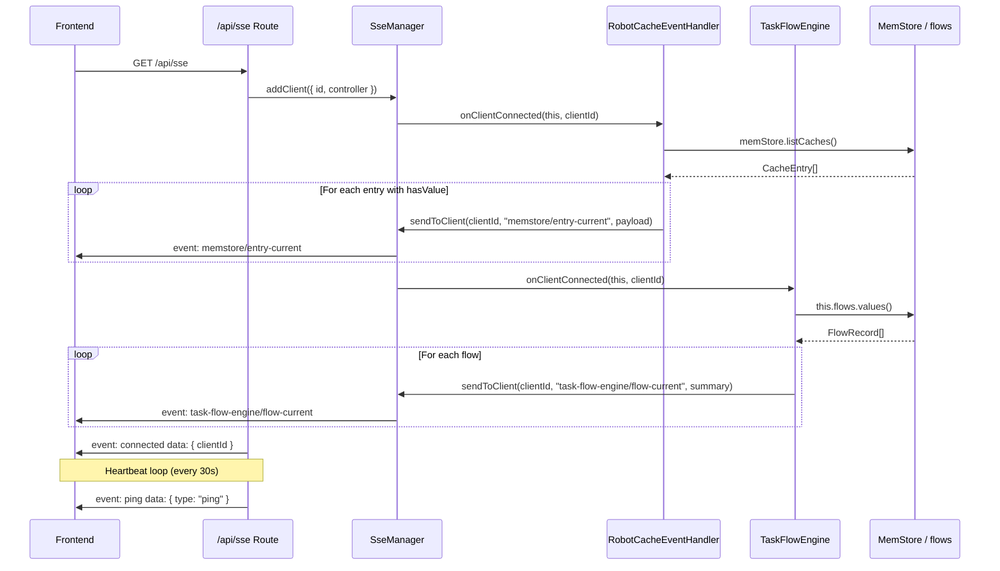
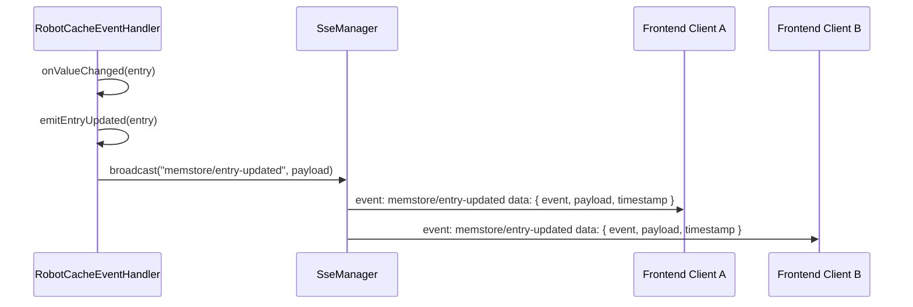
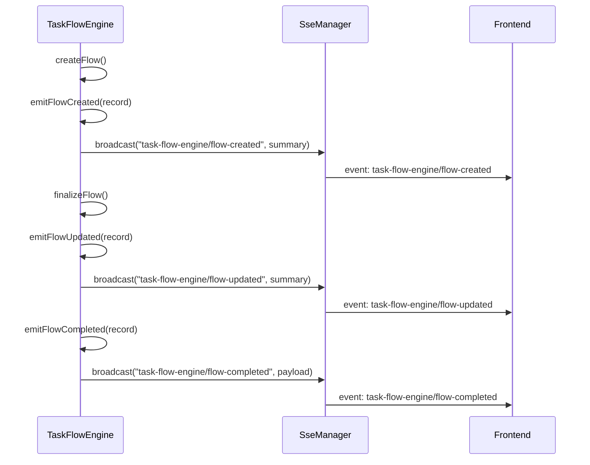
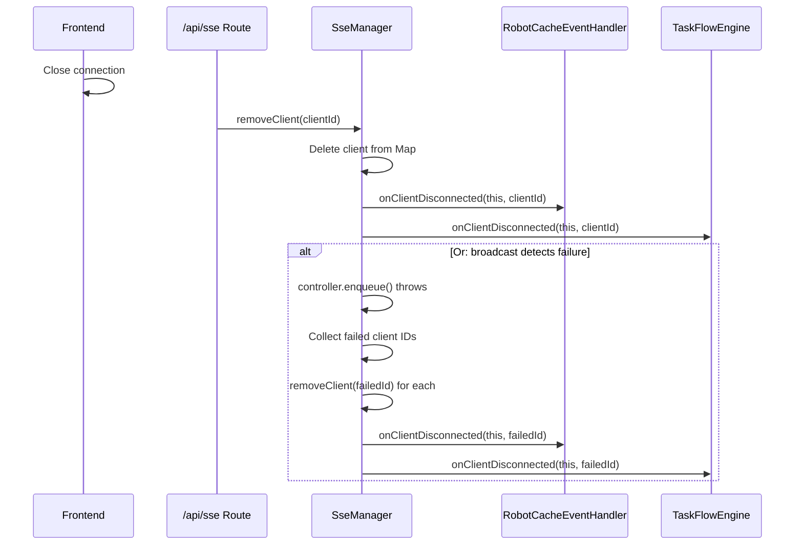
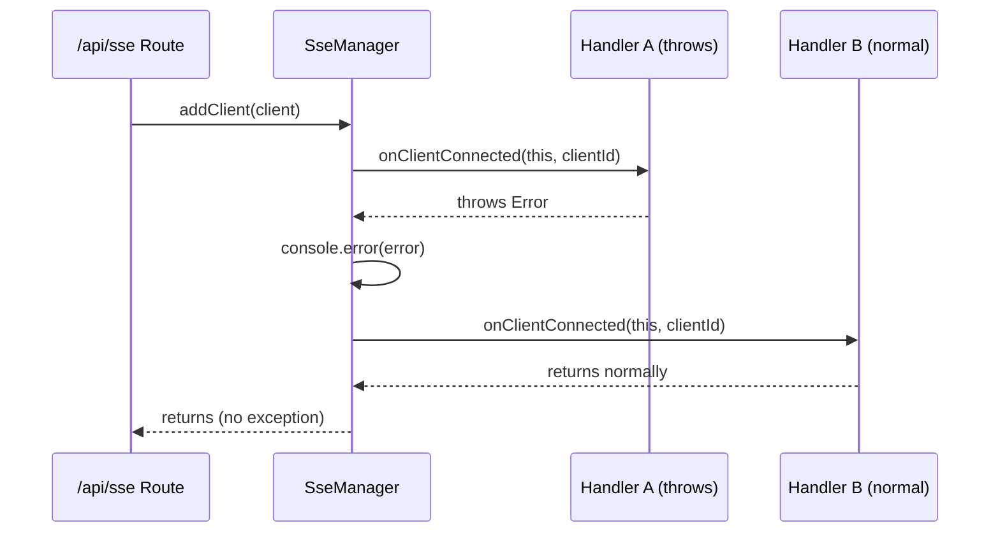

# SSE Manager Software Design Document

> This document refines the technical implementation of the SSE Manager based on the requirements defined in `documents/requirements/sse-manager.md`.

---

## 1. Overview

This document describes the internal architecture, core class design, integration patterns with existing modules (MemStore/RobotService and TaskFlowEngine), unified HTTP endpoint design, and key migration strategies for the SSE Manager.

The SSE Manager consolidates the two existing SSE managers (`MemStoreSseManager` and `taskFlowEngine/SseManager`) into a single module. It serves as the sole backend-to-frontend real-time notification channel.

---

## 2. Design Constraints

- All code must be written in TypeScript using ES6 module syntax.
- All logs and comments must be in English.
- No new external npm dependencies beyond the existing project stack (Hono).
- The existing two SSE Manager implementations are replaced, not extended.
- Modules receive the SSE Manager instance via constructor injection.
- The SSE Manager is transport-layer only; it does not understand business semantics.
- Business modules that need to push initial state on client connection do so by implementing `ISseManagerEventHandler` and registering with the SSE Manager.

---

## 3. Architecture Design

### 3.1 Unified Architecture

```
┌─────────────────────────────────────────────────────────────────────────────┐
│                              Frontend (React App)                            │
│                                                                              │
│  ┌──────────────────────────────────────────────────────────────────────┐   │
│  │  Single EventSource Connection: GET /api/sse                         │   │
│  └──────────────────────────────────────────────────────────────────────┘   │
└─────────────────────────────────────────────────────────────────────────────┘
                                       │
                                       ▼
┌─────────────────────────────────────────────────────────────────────────────┐
│                              Backend (Hono)                                  │
│                                                                              │
│  ┌────────────────────────────┐        ┌─────────────────────────────────┐  │
│  │  Unified SSE Endpoint      │        │  SseManager                     │  │
│  │  (routes/sseRoutes.ts)     │───────▶│  (services/sseManager.ts)       │  │
│  │                            │        │                                 │  │
│  │  - Accepts connections     │        │  - Client registry              │  │
│  │  - Heartbeat loop          │        │  - Handler registry             │  │
│  │  - Calls addClient()       │        │  - Envelope wrapping            │  │
│  │  - Calls removeClient()    │        │  - Protocol serialization       │  │
│  │                            │        │  - broadcast / sendToClient     │  │
│  │  (no business knowledge)   │        │  - Invoke handlers on           │  │
│  │                            │        │    connect / disconnect         │  │
│  └────────────────────────────┘        └──────────────┬────────────────────┘  │
│                                                       │ (registers handlers)   │
│                       ┌───────────────────────────────┼───────────────────┐   │
│                       ▼                               ▼                   ▼   │
│  ┌──────────────────────────┐  ┌──────────────────────────┐  ┌──────────────┐│
│  │  TaskFlowEngine          │  │  RobotCacheEventHandler  │  │ FutureModule ││
│  │  (services/)             │  │  (services/robotService) │  │              ││
│  │                          │  │                          │  │              ││
│  │  implements              │  │  implements              │  │ implements   ││
│  │    ISseManagerEventHandler│ │    CacheEventHandler &   │  │   ISseManagerEventHandler ││
│  │                          │  │    ISseManagerEventHandler│ │              ││
│  │  - emitFlowCreated()     │  │  - emitEntryUpdated()    │  │ - emitXxx()  ││
│  │  - emitFlowUpdated()     │  │  - emitEntryDeleted()    │  │              ││
│  │  - emitTaskUpdated()     │  │                          │  │              ││
│  │  - emitTaskResult()      │  │  - onClientConnected:    │  │              ││
│  │  - emitFlowCompleted()   │  │    push entry-current    │  │              ││
│  │  - emitFlowRemoved()     │  │    per cached entry      │  │              ││
│  │                          │  │                          │  │              ││
│  │  - onClientConnected:    │  │                          │  │              ││
│  │    push flow-current     │  │                          │  │              ││
│  │    per active flow       │  │                          │  │              ││
│  └──────────────────────────┘  └──────────────────────────┘  └──────────────┘│
│                                                                              │
└─────────────────────────────────────────────────────────────────────────────┘
```

### 3.2 File Structure

```
src/backend/src/
├── index.ts                              # Backend entry (modified: single SSE Manager instance, unified endpoint)
├── services/
│   ├── sseManager.ts                     # SSE Manager (NEW)
│   ├── taskFlowEngine/
│   │   ├── taskFlowEngine.ts             # MODIFIED: inject SseManager, implement ISseManagerEventHandler, add internal emit wrappers
│   │   └── index.ts                      # MODIFIED: remove old SseManager export, re-export from ../sseManager.ts
│   ├── robotService.ts                   # MODIFIED: RobotCacheEventHandler implements ISseManagerEventHandler
│   └── ...
├── memStore/
│   ├── sseManager.ts                     # DELETED (functionality merged into SseManager + handler interface)
│   └── index.ts                          # MODIFIED: remove MemStoreSseManager export
├── routes/
│   ├── sseRoutes.ts                      # NEW: unified /api/sse endpoint (no business knowledge)
│   ├── taskFlowRoutes.ts                 # MODIFIED: remove /events route
│   └── ...
└── ...
```

---

## 4. Core Class Design

### 4.1 SseManager

```typescript
export interface SseClient {
  id: string;
  controller: ReadableStreamDefaultController;
}

export interface ServerEvent<T = unknown> {
  event: string;
  payload: T;
  timestamp: string;
}

export interface ISseManagerEventHandler {
  onClientConnected(sseManager: SseManager, clientId: string): void;
  onClientDisconnected(sseManager: SseManager, clientId: string): void;
}

export class SseManager {
  private clients: Map<string, SseClient>;
  private handlers: ISseManagerEventHandler[];

  registerHandler(handler: ISseManagerEventHandler): void;
  unregisterHandler(handler: ISseManagerEventHandler): void;

  addClient(client: SseClient): void;
  removeClient(id: string): void;

  sendToClient<T>(clientId: string, event: string, payload: T): boolean;
  broadcast<T>(event: string, payload: T): void;

  getClientCount(): number;
}
```

**Responsibilities**:
- Maintain a `Map<string, SseClient>` registry of active connections.
- Maintain an ordered list of registered `ISseManagerEventHandler` instances.
- `registerHandler` / `unregisterHandler`: Add or remove a handler. `registerHandler` is idempotent (no-op if already registered).
- `addClient`: Register a new SSE client connection, then invoke `onClientConnected` on every registered handler in registration order. Each handler invocation is wrapped in try/catch; an exception is logged and does not block subsequent handlers.
- `removeClient`: Unregister a client by ID (no-op if not present), then invoke `onClientDisconnected` on every registered handler with the same exception isolation.
- `broadcast`: Iterate all clients, construct `ServerEvent` envelope, serialize to SSE protocol, and enqueue. On write failure, collect the client ID and invoke `removeClient` after the iteration completes (so `onClientDisconnected` fires for auto-removed clients).
- `sendToClient`: Send an envelope to a single client. Returns `true` on success, `false` if the client does not exist or the write failed. Auto-removes the client (triggering `onClientDisconnected`) on write failure.
- `getClientCount`: Expose current connection count for monitoring/health checks.

**Serialization Format**:
```
event: <event-name>
data: {"event":"<event-name>","payload":{...},"timestamp":"2026-06-04T12:00:00.000Z"}

```

### 4.2 ISseManagerEventHandler Interface

```typescript
interface ISseManagerEventHandler {
  onClientConnected(sseManager: SseManager, clientId: string): void;
  onClientDisconnected(sseManager: SseManager, clientId: string): void;
}
```

**Contract**:
- Both methods must be implemented (no optional methods); modules that do not need one of the callbacks implement an empty body.
- The `sseManager` parameter is provided so the handler can call `sendToClient(clientId, ...)` from within `onClientConnected` to push initial state.
- Handlers must not throw; if they do, the SSE Manager catches and logs the exception and continues with the next handler.
- Handlers are invoked synchronously in registration order. If a handler needs to perform asynchronous work, it should fire-and-forget (do not block the connect/disconnect path).

### 4.3 ServerEvent Envelope

```typescript
interface ServerEvent<T = unknown> {
  event: string;
  payload: T;
  timestamp: string;
}
```

The envelope is the **only** structure imposed by the SSE Manager. All modules fill the `payload` field with their own data.

---

## 5. Module Integration Design

### 5.1 TaskFlowEngine Integration

**Changes to `TaskFlowEngine`**:

1. Constructor receives `SseManager`.
2. `TaskFlowEngine` implements `ISseManagerEventHandler`.
3. In the constructor, `this.sseManager.registerHandler(this)` is called.
4. `onClientConnected` iterates the in-memory `flows` map and calls `sseManager.sendToClient(clientId, "task-flow-engine/flow-current", summary)` for each flow.
5. `onClientDisconnected` is implemented as a no-op (no per-client state).
6. Private emit wrappers remain for runtime broadcasting:

```typescript
onClientConnected(sseManager: SseManager, clientId: string): void {
  for (const record of this.flows.values()) {
    sseManager.sendToClient(clientId, "task-flow-engine/flow-current", this.summarize(record));
  }
}

onClientDisconnected(_sseManager: SseManager, _clientId: string): void {
  // No per-client state to clean up.
}

private emitFlowCreated(record: FlowRecord): void {
  this.sseManager.broadcast("task-flow-engine/flow-created", this.summarize(record));
}

private emitFlowUpdated(record: FlowRecord): void {
  this.sseManager.broadcast("task-flow-engine/flow-updated", this.summarize(record));
}

private emitFlowCompleted(record: FlowRecord): void {
  this.sseManager.broadcast("task-flow-engine/flow-completed", {
    flowId: record.id,
    state: record.state,
    results: record.results ?? null,
    finishedAt: record.finishedAt,
  });
}

private emitFlowRemoved(flowId: string): void {
  this.sseManager.broadcast("task-flow-engine/flow-removed", { flowId });
}

private emitTaskUpdated(flowId: string, taskName: string, state: TaskState): void {
  this.sseManager.broadcast("task-flow-engine/task-updated", { flowId, taskName, state });
}

private emitTaskResult(flowId: string, taskName: string, result: ValueMap): void {
  this.sseManager.broadcast("task-flow-engine/task-result", {
    flowId,
    taskName,
    state: "COMPLETED",
    result,
  });
}
```

### 5.2 RobotCacheEventHandler / RobotService Integration

**Changes to `RobotCacheEventHandler`**:

1. Constructor receives `SseManager` and `MemStore` (in addition to the existing `TaskFlowEngine` and `getRobotAddress` callback).
2. `RobotCacheEventHandler` implements both `CacheEventHandler` (from MemStore) and `ISseManagerEventHandler`.
3. `onClientConnected` iterates `memStore.listCaches()` and calls `sseManager.sendToClient(clientId, "memstore/entry-current", { key, value, properties })` for each entry that has a value.
4. `onClientDisconnected` is a no-op.
5. Private emit wrappers for cache-change events remain:

```typescript
onClientConnected(sseManager: SseManager, clientId: string): void {
  for (const entry of this.memStore.listCaches()) {
    if (entry.hasValue) {
      sseManager.sendToClient(clientId, "memstore/entry-current", {
        key: entry.key,
        value: entry.value,
        properties: entry.properties,
      });
    }
  }
}

onClientDisconnected(_sseManager: SseManager, _clientId: string): void {
  // No per-client state to clean up.
}

private emitEntryUpdated(entry: CacheEntry): void {
  this.sseManager.broadcast("memstore/entry-updated", {
    key: entry.key,
    value: entry.value,
    properties: entry.properties,
  });
}

private emitEntryDeleted(entry: CacheEntry): void {
  this.sseManager.broadcast("memstore/entry-deleted", {
    key: entry.key,
  });
}
```

**Changes to `RobotService`**:
- Constructor passes `memStore` to `RobotCacheEventHandler`.
- After constructing the handler, `RobotService` calls both `this.memStore.setHandler(handler)` (for cache events) and `this.sseManager.registerHandler(handler)` (for client lifecycle events).

### 5.3 Future Modules

Any future module requiring real-time frontend notification follows the same pattern:

1. Accept `SseManager` in constructor.
2. If the module needs initial-state push, implement `ISseManagerEventHandler` and call `sseManager.registerHandler(this)`.
3. Define internal `emitXxx()` wrapper methods.
4. Call `this.sseManager.broadcast("<module>/<event-type>", payload)` for runtime events.
5. Use `sseManager.sendToClient(clientId, ...)` from inside `onClientConnected` for initial state.

---

## 6. Unified HTTP Endpoint Design

### 6.1 Endpoint

```
GET /api/sse
```

**Response Headers**:
```
Content-Type: text/event-stream
Cache-Control: no-cache
Connection: keep-alive
```

### 6.2 Route Implementation

```typescript
import { Hono } from "hono";
import { randomUUID } from "node:crypto";
import type { SseManager } from "../services/sseManager.js";

export function createSseRoutes(sseManager: SseManager): Hono {
  const app = new Hono();

  app.get("/", (c) => {
    let clientId = "";
    const controller = new AbortController();
    const stream = new ReadableStream({
      start(ctrl) {
        clientId = randomUUID();
        // Triggers onClientConnected on all registered handlers,
        // which push their module-specific initial state via sendToClient.
        sseManager.addClient({ id: clientId, controller: ctrl });
        const encoder = new TextEncoder();
        ctrl.enqueue(encoder.encode(`event: connected\ndata: ${JSON.stringify({ clientId })}\n\n`));

        const pingInterval = setInterval(() => {
          try {
            ctrl.enqueue(encoder.encode(`event: ping\ndata: ${JSON.stringify({ type: "ping" })}\n\n`));
          } catch {
            clearInterval(pingInterval);
            controller.abort();
          }
        }, 30000);

        controller.signal.addEventListener("abort", () => {
          clearInterval(pingInterval);
        });
      },
      cancel() {
        // Triggers onClientDisconnected on all registered handlers.
        sseManager.removeClient(clientId);
        controller.abort();
      },
    });

    return new Response(stream, {
      headers: {
        "Content-Type": "text/event-stream",
        "Cache-Control": "no-cache",
        Connection: "keep-alive",
      },
    });
  });

  return app;
}
```

**Note**: The route layer has **zero** business knowledge. It does not import `MemStore`, `TaskFlowEngine`, or any business module. Initial state push is entirely the responsibility of business modules via the handler interface.

### 6.3 Deprecation of Legacy Endpoints

| Legacy Endpoint | Status | Action |
|-----------------|--------|--------|
| `GET /api/sse?key=` | Deprecated | Remove after frontend migration |
| `GET /api/flows/events` | Deprecated | Remove after frontend migration |

---

## 7. Event Namespace Registry

| Namespace | Emitter | Trigger Condition | Payload Shape |
|-----------|---------|-------------------|---------------|
| `connected` | Route layer | Client connects | `{ clientId: string }` |
| `ping` | Route layer | Heartbeat interval | `{ type: "ping" }` |
| `memstore/entry-current` | RobotCacheEventHandler | `onClientConnected` (initial push, per entry) | `{ key, value, properties }` |
| `memstore/entry-updated` | RobotCacheEventHandler | `updateCache()` called | `{ key, value, properties }` |
| `memstore/entry-deleted` | RobotCacheEventHandler | Cache deleted or TTL expired | `{ key }` |
| `task-flow-engine/flow-current` | TaskFlowEngine | `onClientConnected` (initial push, per flow) | `FlowSummary` |
| `task-flow-engine/flow-created` | TaskFlowEngine | Flow created | `FlowSummary` |
| `task-flow-engine/flow-updated` | TaskFlowEngine | Flow state changes | `FlowSummary` |
| `task-flow-engine/flow-completed` | TaskFlowEngine | Flow reaches terminal state | `{ flowId, state, results, finishedAt }` |
| `task-flow-engine/flow-removed` | TaskFlowEngine | Flow deleted or TTL cleaned up | `{ flowId }` |
| `task-flow-engine/task-updated` | TaskFlowEngine | Task starts or finishes | `{ flowId, taskName, state }` |
| `task-flow-engine/task-result` | TaskFlowEngine | Task finishes successfully | `{ flowId, taskName, state, result }` |

---

## 8. Key Flow Sequence Diagrams

### 8.1 Client Connection and Initial State Push



### 8.2 MemStore Cache Update Broadcast



### 8.3 TaskFlowEngine Flow Lifecycle Events



### 8.4 Client Disconnection Cleanup



### 8.5 Handler Exception Isolation



---

## 9. Migration Plan

### 9.1 Step 1: Create SseManager

- Create `src/backend/src/services/sseManager.ts` with `SseManager` class and `ISseManagerEventHandler` interface.
- Export `SseClient`, `ServerEvent`, `ISseManagerEventHandler`, and `SseManager`.

### 9.2 Step 2: Update TaskFlowEngine

- Modify `taskFlowEngine.ts` to import `SseManager` and `ISseManagerEventHandler`.
- Change constructor parameter type to `SseManager`.
- Make the class `implements ISseManagerEventHandler`.
- In the constructor, call `this.sseManager.registerHandler(this)`.
- Implement `onClientConnected` (push current flows) and `onClientDisconnected` (no-op).
- Add private `emitXxx` wrapper methods.

### 9.3 Step 3: Update RobotService

- Modify `robotService.ts` to import `SseManager` and `ISseManagerEventHandler`.
- Update `RobotCacheEventHandler` to accept `SseManager` and `MemStore` in its constructor.
- Make `RobotCacheEventHandler` implement both `CacheEventHandler` and `ISseManagerEventHandler`.
- In `RobotService` constructor, call both `memStore.setHandler(handler)` and `sseManager.registerHandler(handler)`.
- Add private `emitEntryUpdated` / `emitEntryDeleted` wrappers.

### 9.4 Step 4: Update Backend Entry

- In `index.ts`:
  - Replace `new SseManager()` (old TaskFlowEngine one) and `new MemStoreSseManager()` with a single `new SseManager()`.
  - Inject the same instance into both `TaskFlowEngine` and `RobotService`.
  - Add unified `/api/sse` route.
  - Remove old `/api/sse?key=` route.
  - Remove any inline `onClientConnect` callback code (now handled by registered handlers).

### 9.5 Step 5: Cleanup

- Delete `src/backend/src/memStore/sseManager.ts`.
- Remove `MemStoreSseManager` export from `src/backend/src/memStore/index.ts`.
- Remove `/events` route from `taskFlowRoutes.ts`.
- Update tests to use `SseManager` instead of the two legacy classes.

---

## 10. Error Handling Strategy

| Exception Scenario | Handling Approach |
|--------------------|-------------------|
| Client write failure during broadcast | Catch error, collect client ID, after iteration call `removeClient` (which triggers `onClientDisconnected` on handlers) |
| Client write failure during `sendToClient` | Same as above, plus return `false` to caller |
| Client disconnection during heartbeat | Route layer catches `enqueue` failure, calls `removeClient` |
| Invalid event name (empty / whitespace) in broadcast or sendToClient | Throws `Error("Event name must not be empty")` |
| Payload serialization failure | `broadcast()` catches `JSON.stringify` error, silently skips the event for all clients; `sendToClient()` returns `false` |
| `sendToClient` to unknown client ID | Returns `false`, no exception |
| Double `removeClient` call | Idempotent: no-op (no handler invocation) on second call |
| Double `addClient` with same ID | Overwrites previous client and re-invokes `onClientConnected` on handlers |
| Handler throws in `onClientConnected` or `onClientDisconnected` | Caught and logged via `console.error`; subsequent handlers still invoked; client connect/disconnect succeeds |
| Double `registerHandler` with same instance | Idempotent: ignored |
| `unregisterHandler` for non-registered handler | Idempotent: no-op |

---

## 11. Differences from Legacy Implementation

| Aspect | Legacy (Two Managers) | Current (SseManager) |
|--------|----------------------|---------------------|
| Number of managers | 2 (`MemStoreSseManager`, `SseManager`) | 1 (`SseManager`) |
| HTTP endpoints | `/api/sse?key=`, `/api/flows/events` | `/api/sse` |
| Frontend connections | 2 EventSources | 1 EventSource |
| Subscription model | Key-based callbacks (MemStore) + global client set (TaskFlow) | Global client map + handler interface |
| Initial state push | `subscribe()` callback (MemStore) | Business modules implement `ISseManagerEventHandler.onClientConnected` |
| Route ↔ business coupling | Route layer iterated `memStore.listCaches()` directly | Route layer has no business imports |
| Event format | Ad-hoc JSON (MemStore) vs SSE protocol with timestamp (TaskFlow) | Standardized `ServerEvent` envelope with timestamp |
| Event naming | No namespace (MemStore uses `type` field) | Structured namespace (`module/event-type`) |
| Module broadcast pattern | Direct `broadcast()` calls scattered in code | Encapsulated `emitXxx()` wrapper methods |
| Extensibility | Requires new endpoint or manager for new modules | New module just implements `ISseManagerEventHandler` and calls `registerHandler` |
