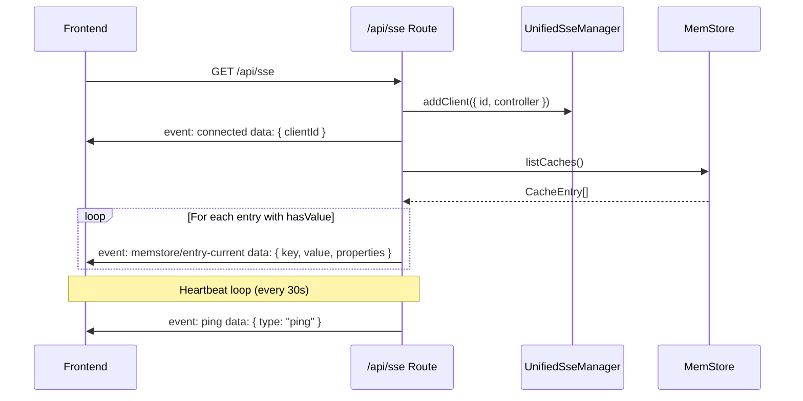
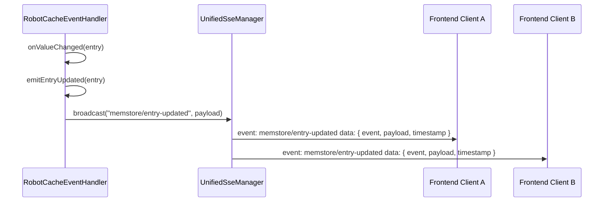
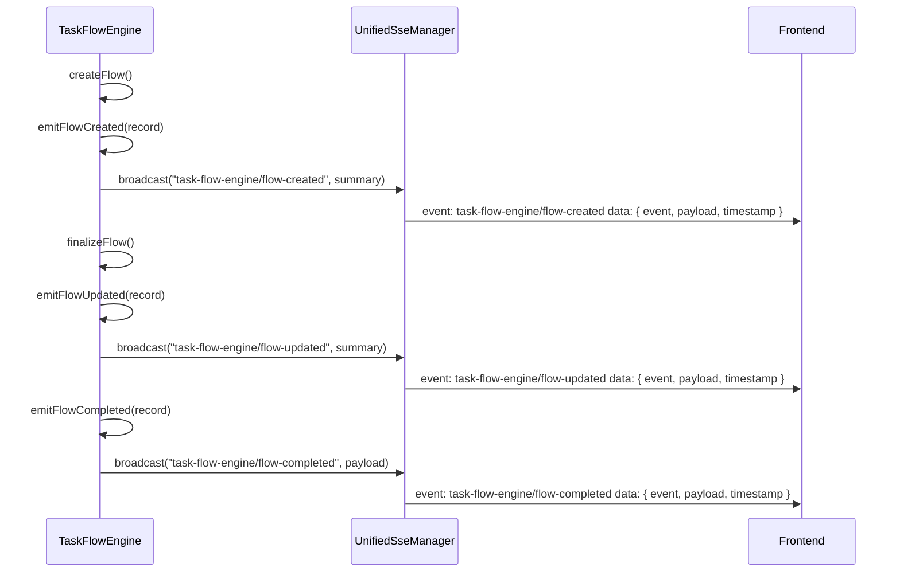
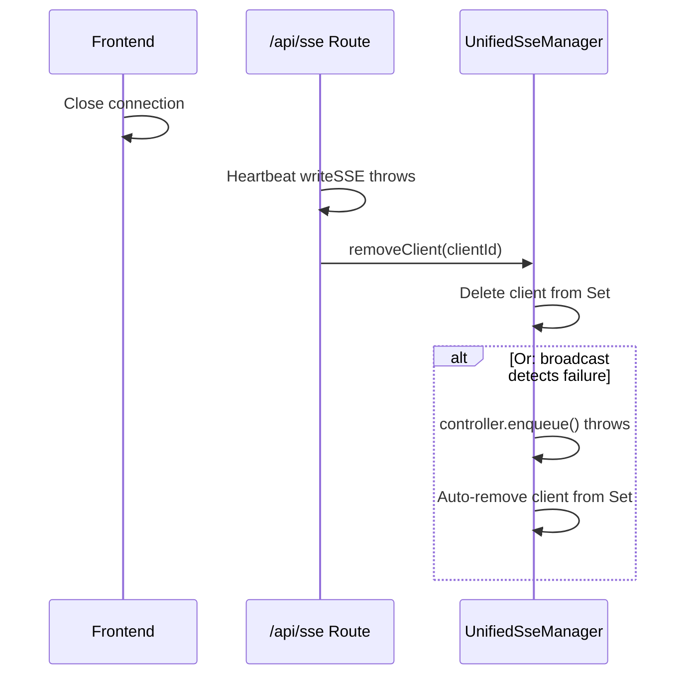

# Unified SSE Manager Software Design Document

> This document refines the technical implementation of the Unified SSE Manager based on the requirements defined in `documents/requirements/sse-manager.md`.

---

## 1. Overview

This document describes the internal architecture, core class design, integration patterns with existing modules (MemStore/RobotService and TaskFlowEngine), unified HTTP endpoint design, and key migration strategies for the Unified SSE Manager.

The Unified SSE Manager consolidates the two existing SSE managers (`MemStoreSseManager` and `taskFlowEngine/SseManager`) into a single module. It serves as the sole backend-to-frontend real-time notification channel.

---

## 2. Design Constraints

- All code must be written in TypeScript using ES6 module syntax.
- All logs and comments must be in English.
- No new external npm dependencies beyond the existing project stack (Hono, `hono/streaming`).
- The existing two SSE Manager implementations are replaced, not extended.
- Modules receive the Unified SSE Manager instance via constructor injection.
- The SSE Manager is transport-layer only; it does not understand business semantics.

---

## 3. Architecture Design

### 3.1 Unified Architecture

```
┌─────────────────────────────────────────────────────────────────────────────┐
│                              Frontend (React App)                            │
│                                                                              │
│  ┌──────────────────────────────────────────────────────────────────────┐   │
│  │  Single EventSource Connection: GET /api/sse                         │   │
│  └──────────────────────────────────────────────────────────────────────┘   │
└─────────────────────────────────────────────────────────────────────────────┘
                                       │
                                       ▼
┌─────────────────────────────────────────────────────────────────────────────┐
│                              Backend (Hono)                                  │
│                                                                              │
│  ┌────────────────────────────┐        ┌─────────────────────────────────┐  │
│  │  Unified SSE Endpoint      │        │  UnifiedSseManager              │  │
│  │  (index.ts route layer)    │───────▶│  (src/services/sseManager.ts)   │  │
│  │                            │        │                                 │  │
│  │  - Accepts connections     │        │  - Client registry              │  │
│  │  - Heartbeat loop          │        │  - Envelope wrapping            │  │
│  │  - MemStore initial push   │        │  - Protocol serialization       │  │
│  │  - Registers clients       │        │  - Broadcast to all clients     │  │
│  └────────────────────────────┘        └──────────────┬────────────────────┘  │
│                                                       │                       │
│                       ┌───────────────────────────────┼───────────────────┐   │
│                       ▼                               ▼                   ▼   │
│  ┌──────────────────────────┐  ┌──────────────────────────┐  ┌──────────────┐│
│  │  TaskFlowEngine          │  │  RobotCacheEventHandler  │  │ FutureModule ││
│  │  (services/)             │  │  (services/robotService) │  │              ││
│  │                          │  │                          │  │              ││
│  │  - emitFlowCreated()     │  │  - emitEntryUpdated()    │  │ - emitXxx()  ││
│  │  - emitFlowUpdated()     │  │  - emitEntryDeleted()    │  │              ││
│  │  - emitTaskUpdated()     │  │                          │  │              ││
│  │  - emitTaskResult()      │  │  (internal wrappers that │  │              ││
│  │  - emitFlowCompleted()   │  │   call sseManager.broadcast)│              ││
│  │  - emitFlowRemoved()     │  │                          │  │              ││
│  └──────────────────────────┘  └──────────────────────────┘  └──────────────┘│
│                                                                              │
└─────────────────────────────────────────────────────────────────────────────┘
```

### 3.2 File Structure

```
src/backend/src/
├── index.ts                              # Backend entry (modified: single SSE Manager instance, unified endpoint)
├── services/
│   ├── sseManager.ts                     # Unified SSE Manager (NEW)
│   ├── taskFlowEngine/
│   │   ├── taskFlowEngine.ts             # MODIFIED: inject UnifiedSseManager, add internal emit wrappers
│   │   └── index.ts                      # MODIFIED: remove SseManager export, re-export from ../sseManager.ts
│   ├── robotService.ts                   # MODIFIED: RobotCacheEventHandler uses UnifiedSseManager
│   └── ...
├── memStore/
│   ├── sseManager.ts                     # DELETED (functionality merged into UnifiedSseManager + route layer)
│   └── index.ts                          # MODIFIED: remove MemStoreSseManager export
├── routes/
│   ├── taskFlowRoutes.ts                 # MODIFIED: remove /events route (moved to unified endpoint)
│   └── ...
└── ...
```

---

## 4. Core Class Design

### 4.1 UnifiedSseManager

```typescript
export interface SseClient {
  id: string;
  controller: ReadableStreamDefaultController;
}

export interface ServerEvent<T = unknown> {
  event: string;
  payload: T;
  timestamp: string;
}

export class UnifiedSseManager {
  private clients = new Set<SseClient>();

  addClient(client: SseClient): void;
  removeClient(id: string): void;
  broadcast<T>(event: string, payload: T): void;
  getClientCount(): number;
}
```

**Responsibilities**:
- Maintain a `Set<SseClient>` registry.
- `addClient`: Register a new SSE client connection.
- `removeClient`: Unregister a client by ID.
- `broadcast`: Iterate all clients, construct `ServerEvent` envelope, serialize to SSE protocol, and enqueue. On write failure, remove the client.
- `getClientCount`: Expose current connection count for monitoring/health checks.

**Serialization Format**:
```
event: <event-name>
data: {"event":"<event-name>","payload":{...},"timestamp":"2026-06-04T12:00:00.000Z"}

```

### 4.2 ServerEvent Envelope

```typescript
interface ServerEvent<T = unknown> {
  event: string;
  payload: T;
  timestamp: string;
}
```

The envelope is the **only** structure imposed by the SSE Manager. All modules fill the `payload` field with their own data.

---

## 5. Module Integration Design

### 5.1 TaskFlowEngine Integration

**Changes to `TaskFlowEngine`**:

1. Constructor now receives `UnifiedSseManager` instead of the old `SseManager`.
2. All existing `this.sseManager.broadcast(...)` calls remain structurally the same but use the new manager.
3. Add private wrapper methods for clarity and encapsulation:

```typescript
private emitFlowCreated(record: FlowRecord): void {
  this.sseManager.broadcast("task-flow-engine/flow-created", this.summarize(record));
}

private emitFlowUpdated(record: FlowRecord): void {
  this.sseManager.broadcast("task-flow-engine/flow-updated", this.summarize(record));
}

private emitFlowCompleted(record: FlowRecord): void {
  this.sseManager.broadcast("task-flow-engine/flow-completed", {
    flowId: record.id,
    state: record.state,
    results: record.results ?? null,
    finishedAt: record.finishedAt,
  });
}

private emitFlowRemoved(flowId: string): void {
  this.sseManager.broadcast("task-flow-engine/flow-removed", { flowId });
}

private emitTaskUpdated(flowId: string, taskName: string, state: TaskState): void {
  this.sseManager.broadcast("task-flow-engine/task-updated", { flowId, taskName, state });
}

private emitTaskResult(flowId: string, taskName: string, result: ValueMap): void {
  this.sseManager.broadcast("task-flow-engine/task-result", {
    flowId,
    taskName,
    state: "COMPLETED",
    result,
  });
}
```

### 5.2 RobotCacheEventHandler / RobotService Integration

**Changes to `RobotCacheEventHandler`**:

1. Constructor receives `UnifiedSseManager` instead of `MemStoreSseManager`.
2. The `MemStoreSseManager` class is deleted. Its callback-based subscription model is replaced by the unified HTTP SSE endpoint.
3. Add private wrapper methods:

```typescript
private emitEntryUpdated(entry: CacheEntry): void {
  this.sseManager.broadcast("memstore/entry-updated", {
    key: entry.key,
    value: entry.value,
    properties: entry.properties,
  });
}

private emitEntryDeleted(entry: CacheEntry): void {
  this.sseManager.broadcast("memstore/entry-deleted", {
    key: entry.key,
  });
}
```

**Changes to `RobotService`**:
- Constructor no longer receives `MemStoreSseManager` separately; it receives `UnifiedSseManager` which is passed to `RobotCacheEventHandler`.
- The public `sseManager` property type changes from `MemStoreSseManager` to `UnifiedSseManager`.

### 5.3 Future Modules

Any future module requiring real-time frontend notification follows the same pattern:

1. Accept `UnifiedSseManager` in constructor.
2. Define internal `emitXxx()` wrapper methods.
3. Call `this.sseManager.broadcast("<module>/<event-type>", payload)`.

---

## 6. Unified HTTP Endpoint Design

### 6.1 Endpoint

```
GET /api/sse
```

**Response Headers**:
```
Content-Type: text/event-stream
Cache-Control: no-cache
Connection: keep-alive
```

### 6.2 Route Implementation

```typescript
import { streamSSE } from "hono/streaming";
import { randomUUID } from "node:crypto";

app.get("/api/sse", (c) => {
  return streamSSE(c, async (stream) => {
    const clientId = randomUUID();

    // Register client with the unified SSE manager
    const streamController = stream as unknown as { _controller: ReadableStreamDefaultController };
    unifiedSseManager.addClient({ id: clientId, controller: streamController._controller });

    // Send connection acknowledgment
    await stream.writeSSE({
      event: "connected",
      data: JSON.stringify({ clientId }),
    });

    // Push current MemStore state (route layer responsibility)
    for (const entry of memStore.listCaches()) {
      if (entry.hasValue) {
        await stream.writeSSE({
          event: "memstore/entry-current",
          data: JSON.stringify({
            key: entry.key,
            value: entry.value,
            properties: entry.properties,
          }),
        });
      }
    }

    // Heartbeat loop
    while (!stream.aborted) {
      await stream.sleep(30000);
      try {
        await stream.writeSSE({
          event: "ping",
          data: JSON.stringify({ type: "ping" }),
        });
      } catch {
        break;
      }
    }

    // Cleanup on disconnect
    unifiedSseManager.removeClient(clientId);
  });
});
```

### 6.3 Deprecation of Legacy Endpoints

| Legacy Endpoint | Status | Action |
|-----------------|--------|--------|
| `GET /api/sse?key=` | Deprecated | Remove after frontend migration |
| `GET /api/flows/events` | Deprecated | Remove after frontend migration |

---

## 7. Event Namespace Registry

| Namespace | Emitter | Trigger Condition | Payload Shape |
|-----------|---------|-------------------|---------------|
| `connected` | Route layer | Client connects | `{ clientId: string }` |
| `ping` | Route layer | Heartbeat interval | `{ type: "ping" }` |
| `memstore/entry-current` | Route layer | Connection establishment (initial push) | `{ key, value, properties }` |
| `memstore/entry-updated` | RobotCacheEventHandler | `updateCache()` called | `{ key, value, properties }` |
| `memstore/entry-deleted` | RobotCacheEventHandler | Cache deleted or TTL expired | `{ key }` |
| `task-flow-engine/flow-created` | TaskFlowEngine | Flow created | `FlowSummary` |
| `task-flow-engine/flow-updated` | TaskFlowEngine | Flow state changes | `FlowSummary` |
| `task-flow-engine/flow-completed` | TaskFlowEngine | Flow reaches terminal state | `{ flowId, state, results, finishedAt }` |
| `task-flow-engine/flow-removed` | TaskFlowEngine | Flow deleted or TTL cleaned up | `{ flowId }` |
| `task-flow-engine/task-updated` | TaskFlowEngine | Task starts or finishes | `{ flowId, taskName, state }` |
| `task-flow-engine/task-result` | TaskFlowEngine | Task finishes successfully | `{ flowId, taskName, state, result }` |

---

## 8. Key Flow Sequence Diagrams

### 8.1 Client Connection and Initial State Push



### 8.2 MemStore Cache Update Broadcast



### 8.3 TaskFlowEngine Flow Lifecycle Events



### 8.4 Client Disconnection Cleanup



---

## 9. Migration Plan

### 9.1 Step 1: Create UnifiedSseManager

- Create `src/backend/src/services/sseManager.ts` with `UnifiedSseManager` class.
- Export `SseClient`, `ServerEvent`, and `UnifiedSseManager`.

### 9.2 Step 2: Update TaskFlowEngine

- Modify `taskFlowEngine.ts` to import `UnifiedSseManager` from `../sseManager.js`.
- Change constructor parameter type.
- Add private `emitXxx` wrapper methods.
- Replace direct `broadcast` calls with wrapper method calls.

### 9.3 Step 3: Update RobotService

- Modify `robotService.ts` to import `UnifiedSseManager`.
- Change `RobotCacheEventHandler` constructor to accept `UnifiedSseManager`.
- Add private `emitEntryUpdated` / `emitEntryDeleted` wrappers.
- Remove `MemStoreSseManager` dependency.

### 9.4 Step 4: Update Backend Entry

- In `index.ts`:
  - Replace `new SseManager()` and `new MemStoreSseManager()` with a single `new UnifiedSseManager()`.
  - Inject the same instance into both `TaskFlowEngine` and `RobotService`.
  - Add unified `/api/sse` route.
  - Remove old `/api/sse?key=` route.
  - Update `createTaskFlowRoutes` call (remove `sseManager` parameter if no longer needed for `/events`).

### 9.5 Step 5: Cleanup

- Delete `src/backend/src/memStore/sseManager.ts`.
- Remove `MemStoreSseManager` export from `src/backend/src/memStore/index.ts`.
- Remove `/events` route from `taskFlowRoutes.ts`.
- Update tests to use `UnifiedSseManager` instead of the two legacy classes.

---

## 10. Error Handling Strategy

| Exception Scenario | Handling Approach |
|--------------------|-------------------|
| Client write failure during broadcast | Catch error, silently remove client from registry, continue with remaining clients |
| Client disconnection during heartbeat | `stream.aborted` becomes true, loop exits, `removeClient` called |
| Invalid event name (empty string) | `broadcast()` throws `Error("Event name must not be empty")` |
| Payload serialization failure | `broadcast()` catches `JSON.stringify` error, logs it, skips the event for all clients |
| Double `removeClient` call | Idempotent: no error if client ID not found |
| Double `addClient` with same ID | Overwrites previous client (or throws, TBD in implementation) |

---

## 11. Differences from Legacy Implementation

| Aspect | Legacy (Two Managers) | Unified SSE Manager |
|--------|----------------------|---------------------|
| Number of managers | 2 (`MemStoreSseManager`, `SseManager`) | 1 (`UnifiedSseManager`) |
| HTTP endpoints | `/api/sse?key=`, `/api/flows/events` | `/api/sse` |
| Frontend connections | 2 EventSources | 1 EventSource |
| Subscription model | Key-based callbacks (MemStore) + global client set (TaskFlow) | Global client set only |
| Initial state push | `subscribe()` callback (MemStore) | Route layer iteration over `listCaches()` |
| Event format | Ad-hoc JSON (MemStore) vs SSE protocol with timestamp (TaskFlow) | Standardized `ServerEvent` envelope with timestamp |
| Event naming | No namespace (MemStore uses `type` field) | Structured namespace (`module/event-type`) |
| Module broadcast pattern | Direct `broadcast()` calls scattered in code | Encapsulated `emitXxx()` wrapper methods |
| Extensibility | Requires new endpoint or manager for new modules | New module just defines namespace and calls `broadcast()` |
