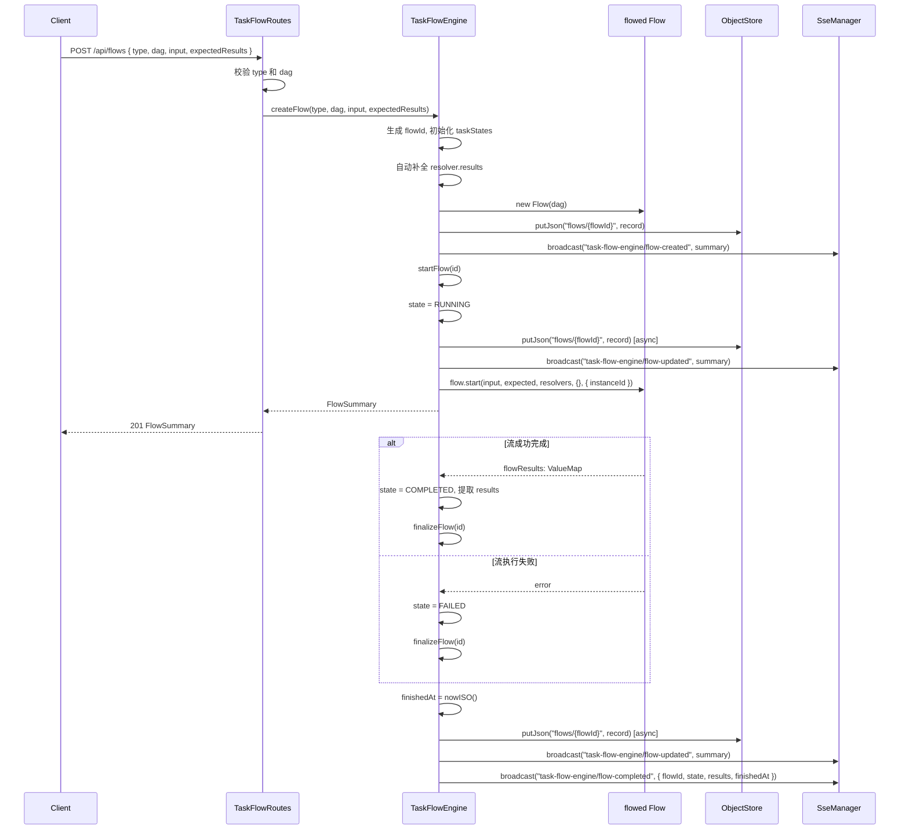
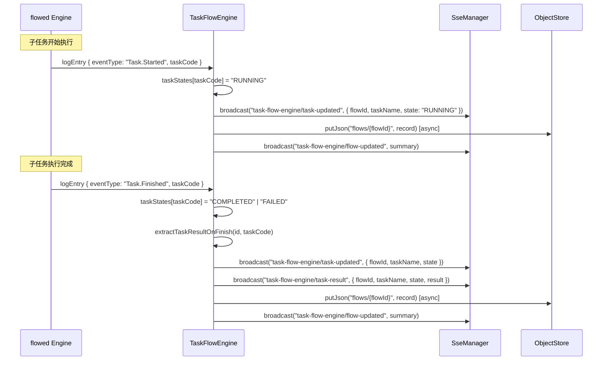
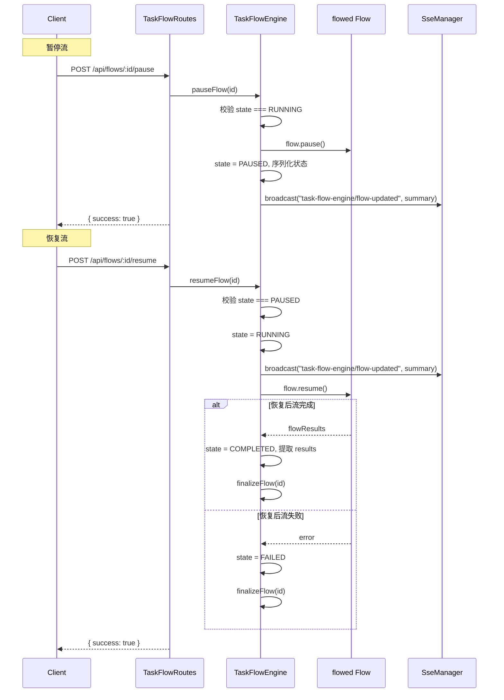
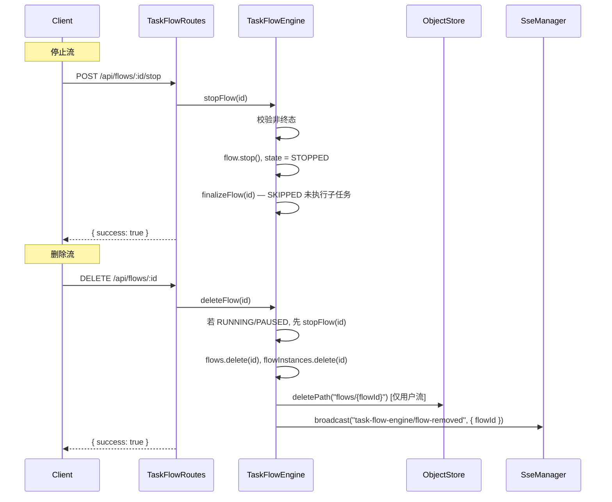
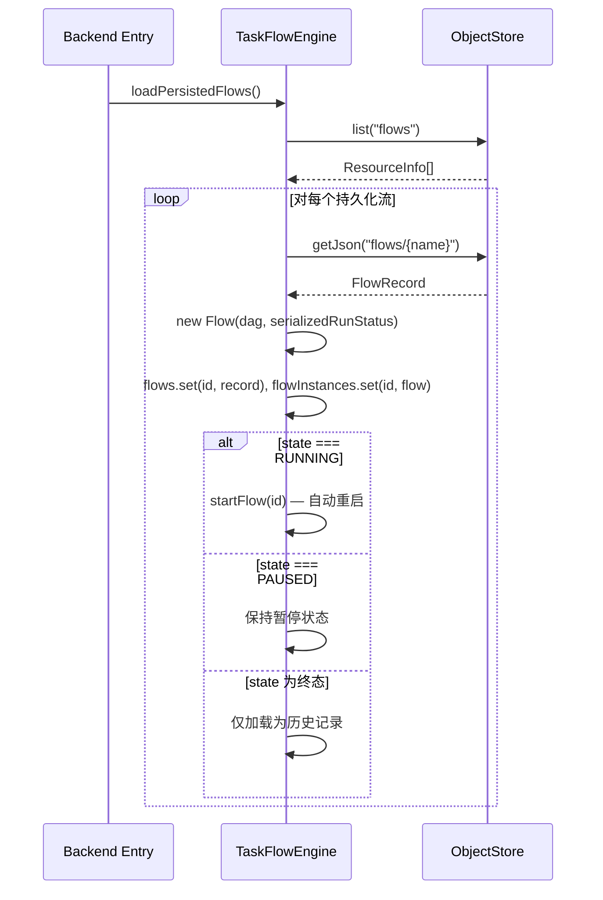
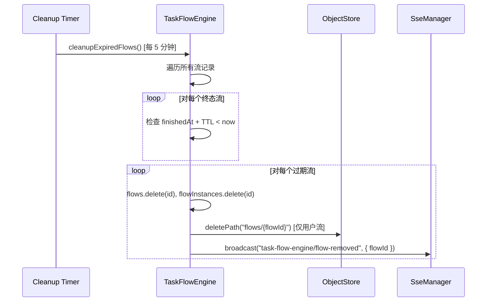
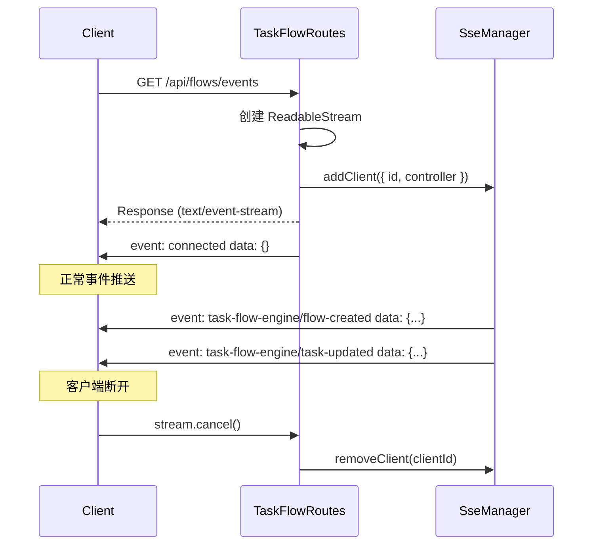

# 任务流引擎服务 — 软件设计文档

> 本文档承接《任务流引擎服务需求规格说明书》，对需求中涉及的技术实现进行设计细化。

---

## 1. 概述

本文档描述任务流引擎服务的内部架构、模块划分、核心类设计、与现有后端服务的集成方式，以及关键流程的时序设计。该服务将 playground 原型中验证过的任务流引擎能力正式集成到 `src/backend` 中，作为内建模块运行，不作为外部依赖。

---

## 2. 设计约束

- 任务流引擎代码直接位于 `src/backend/src/services/taskFlowEngine/` 目录下，作为后端服务的内建模块。
- 所有持久化操作通过 `ObjectStore` 服务完成，禁止绕过对象存储直接操作文件系统。
- 所有 SSE 事件通过 `SseManager` 广播，禁止直接操作 SSE 客户端。
- 所有解析器通过 `ResolverRegistry` 注册和查找，禁止硬编码解析器映射。
- 模块内部使用 TypeScript + ES6 模块语法。
- 所有日志和注释使用英文。

---

## 3. 架构设计

### 3.1 模块架构

```
┌──────────────────────────────────────────────────────────────────┐
│                     Backend (Hono)                               │
│                                                                  │
│  ┌──────────────────┐    ┌────────────────────────────────────┐  │
│  │  taskFlowRoutes   │    │      TaskFlowEngine               │  │
│  │  (routes层)       │───▶│      (核心引擎服务)                │  │
│  │                   │    │                                    │  │
│  │  - REST API       │    │  - Flow 生命周期管理               │  │
│  │  - SSE endpoint   │    │  - 状态机驱动                      │  │
│  └──────────────────┘    │  - 结果提取                        │  │
│                          │  - TTL 清理                         │  │
│                          │  - 持久化与恢复                     │  │
│                          └──────────┬─────────────────────────┘  │
│                                     │                            │
│                    ┌────────────────┼──────────────────┐         │
│                    ▼                ▼                  ▼         │
│           ┌──────────────┐ ┌──────────────┐ ┌──────────────┐   │
│           │ ObjectStore  │ │  SseManager  │ │  Resolver    │   │
│           │ (持久化)     │ │  (事件推送)  │ │  Registry    │   │
│           └──────────────┘ └──────────────┘ │  (解析器)    │   │
│                                             └──────┬───────┘   │
│                                                    │            │
│                                           ┌────────▼────────┐  │
│                                           │  Task Resolvers │  │
│                                           │  (业务实现)     │  │
│                                           │  - SshCommand   │  │
│                                           │  - GetRobotInfo │  │
│                                           │  - ...          │  │
│                                           └─────────────────┘  │
└──────────────────────────────────────────────────────────────────┘
```

### 3.2 文件结构

```
src/backend/src/
├── index.ts                              # 后端入口（需修改：注册任务流路由和初始化引擎）
├── errors/
│   └── appErrors.ts                      # 应用错误（需修改：添加任务流相关错误）
├── objectStore/
│   └── store.ts                          # 底层对象存储（不变）
├── routes/
│   ├── artifactRoutes.ts                 # 制品路由（不变）
│   ├── objectStoreRoutes.ts              # 对象存储路由（不变）
│   └── taskFlowRoutes.ts                 # 任务流 REST API 路由（新增）
├── services/
│   ├── artifactService.ts                # 制品服务（不变）
│   ├── checksumService.ts                # 校验和服务（不变）
│   ├── objectStore.ts                    # 对象存储服务（不变）
│   └── taskFlowEngine/
│       ├── index.ts                      # 模块导出（需修改：扩展导出）
│       ├── taskFlowEngine.ts             # 核心引擎（需修改：增强功能）
│       ├── resolverRegistry.ts           # 解析器注册表（不变）
│       └── sseManager.ts                # SSE 管理器（不变）
└── tasks/
    ├── index.ts                          # 任务导出（需修改：注册新解析器）
    ├── getRobotBasicInfoTask.ts          # 机器人信息采集任务（不变）
    └── sshCommandTask.ts                 # SSH 命令执行任务（不变）
```

---

## 4. 核心类设计

### 4.1 TaskFlowEngine（增强版）

在现有 `TaskFlowEngine` 基础上增强以下能力：

```
class TaskFlowEngine {
  - flows: Map<string, FlowRecord>
  - flowInstances: Map<string, Flow>
  - sseManager: SseManager
  - resolverRegistry: ResolverRegistry
  - objectStore: ObjectStore
  - loggerInstalled: boolean
  - completedFlowTtlMs: number
  - cleanupIntervalMs: number
  - cleanupTimer?: ReturnType<typeof setInterval>

  + constructor(objectStore, sseManager, resolverRegistry, options?: TaskFlowEngineOptions)
  + createFlow(type, dag, input?, expectedResults?): Promise<FlowSummary>
  + pauseFlow(id): Promise<void>
  + resumeFlow(id): Promise<void>
  + stopFlow(id): Promise<void>
  + deleteFlow(id): Promise<void>
  + getFlow(id): FlowSummary | undefined
  + listFlows(filterType?): FlowSummary[]
  + batchPause(ids): Promise<void>
  + batchResume(ids): Promise<void>
  + batchStop(ids): Promise<void>
  + batchDelete(ids): Promise<void>
  + loadPersistedFlows(): Promise<void>
  + destroy(): void

  - ensureLogger(): void
  - startFlow(id): void
  - finalizeFlow(id): void
  - extractTaskResults(id, flowResults): void
  - extractTaskResultOnFinish(id, taskCode): void
  - saveFlow(record): Promise<void>
  - handleLogEntry(entry): void
  - summarize(record): FlowSummary
  - startCleanupTimer(): void
  - cleanupExpiredFlows(): void
}
```

**与现有实现的差异**：

| 能力 | 现有实现 | 增强后 |
|------|---------|--------|
| 流级别输入参数 | `flow.start({}, [], ...)` | `flow.start(input, expected, ...)` |
| 期望输出 | 传空数组 `[]` | 合并 `provides` + `expectedResults` |
| 子任务结果提取 | 无 | `extractTaskResults()` + `extractTaskResultOnFinish()` |
| 流完成结果 | 无 | `FlowRecord.results` |
| `finishedAt` | 无 | 终态时记录 |
| TTL 清理 | 无 | `startCleanupTimer()` + `cleanupExpiredFlows()` |
| `destroy()` | 无 | 清理定时器 |
| `deleteFlow()` | 无 | 支持主动删除 |
| `batchDelete()` | 无 | 支持批量删除 |
| `flow-completed` 事件 | 无 | 流进入终态时广播 |
| `task-result` 事件 | 无 | 子任务完成时广播 |

### 4.2 TaskFlowEngineOptions

```typescript
interface TaskFlowEngineOptions {
  completedFlowTtlMs?: number;   // 默认: 30 * 60 * 1000 (30 分钟)
  cleanupIntervalMs?: number;    // 默认: 5 * 60 * 1000 (5 分钟)
}
```

### 4.3 FlowRecord（增强版）

```typescript
interface FlowRecord {
  id: string;
  type: FlowType;
  input?: ValueMap;
  expectedResults?: string[];
  dag: FlowSpec;
  state: FlowState;
  taskStates: Record<string, TaskState>;
  taskResults?: Record<string, ValueMap>;
  results?: ValueMap;
  serializedRunStatus?: SerializedFlowRunStatus;
  createdAt: string;
  finishedAt?: string;
}
```

**与现有实现的差异**：

| 字段 | 现有实现 | 增强后 |
|------|---------|--------|
| `input` | 无 | 新增：流级别输入参数 |
| `expectedResults` | 无 | 新增：期望输出列表 |
| `taskResults` | 无 | 新增：子任务执行结果 |
| `results` | 无 | 新增：流级别输出结果 |
| `finishedAt` | 无 | 新增：终态时间戳 |

### 4.4 FlowSummary（增强版）

```typescript
interface FlowSummary {
  id: string;
  type: FlowType;
  state: FlowState;
  taskStates: Record<string, TaskState>;
  taskResults?: Record<string, ValueMap>;
  results?: ValueMap;
  input?: ValueMap;
  expectedResults?: string[];
  createdAt: string;
  finishedAt?: string;
}
```

### 4.5 ResolverRegistry（不变）

现有实现已满足需求，无需修改。

### 4.6 SseManager（不变）

现有实现已满足需求，无需修改。

### 4.7 TaskFlowRoutes（新增）

```
function createTaskFlowRoutes(
  engine: TaskFlowEngine,
  sseManager: SseManager
): Hono
```

路由层负责：
- HTTP 请求参数解析与校验
- 调用引擎方法
- 格式化响应
- SSE 客户端连接管理

---

## 5. 关键流程时序设计

### 5.1 创建并启动任务流



### 5.2 子任务执行与结果提取



### 5.3 暂停与恢复任务流



### 5.4 停止与删除任务流



### 5.5 重启恢复



### 5.6 TTL 自动清理



### 5.7 SSE 客户端连接



---

## 6. 路由设计

### 6.1 createTaskFlowRoutes

```typescript
function createTaskFlowRoutes(engine: TaskFlowEngine, sseManager: SseManager): Hono
```

路由挂载点：`app.route("/api/flows", createTaskFlowRoutes(engine, sseManager))`

### 6.2 路由详细设计

| 路由 | 方法 | 处理逻辑 |
|------|------|---------|
| `/` | POST | 解析 `{ type, dag, input, expectedResults }`，校验必填字段，调用 `engine.createFlow()`，返回 201 + FlowSummary |
| `/` | GET | 读取 `?type=` 查询参数，调用 `engine.listFlows(type)`，返回 FlowSummary[] |
| `/:id` | GET | 调用 `engine.getFlow(id)`，不存在返回 404，否则返回 FlowSummary |
| `/:id/pause` | POST | 调用 `engine.pauseFlow(id)`，捕获异常返回 404 |
| `/:id/resume` | POST | 调用 `engine.resumeFlow(id)`，捕获异常返回 404 |
| `/:id/stop` | POST | 调用 `engine.stopFlow(id)`，捕获异常返回 404 |
| `/:id` | DELETE | 调用 `engine.deleteFlow(id)`，捕获异常返回 404 |
| `/batch/pause` | POST | 解析 `{ ids }`，校验数组，调用 `engine.batchPause(ids)` |
| `/batch/resume` | POST | 解析 `{ ids }`，校验数组，调用 `engine.batchResume(ids)` |
| `/batch/stop` | POST | 解析 `{ ids }`，校验数组，调用 `engine.batchStop(ids)` |
| `/batch/delete` | POST | 解析 `{ ids }`，校验数组，调用 `engine.batchDelete(ids)` |
| `/events` | GET | 创建 SSE ReadableStream，注册客户端到 SseManager，返回 text/event-stream 响应 |

### 6.3 SSE 端点实现

```typescript
app.get("/events", (c) => {
  let clientId = "";
  const stream = new ReadableStream({
    start(controller) {
      clientId = randomUUID();
      sseManager.addClient({ id: clientId, controller });
      const encoder = new TextEncoder();
      controller.enqueue(encoder.encode("event: connected\ndata: {}\n\n"));
    },
    cancel() {
      sseManager.removeClient(clientId);
    },
  });

  return new Response(stream, {
    headers: {
      "Content-Type": "text/event-stream",
      "Cache-Control": "no-cache",
      Connection: "keep-alive",
    },
  });
});
```

---

## 7. 后端入口集成设计

### 7.1 index.ts 修改

在现有后端入口 `src/backend/src/index.ts` 中增加任务流引擎的初始化与路由注册：

```typescript
import { TaskFlowEngine, ResolverRegistry, SseManager } from "./services/taskFlowEngine/index.js";
import { SshCommandTask, GetRobotBasicInfoTask } from "./tasks/index.js";
import { createTaskFlowRoutes } from "./routes/taskFlowRoutes.js";

const sseManager = new SseManager();
const resolverRegistry = new ResolverRegistry();
resolverRegistry.register("SshCommandTask", new SshCommandTask());
resolverRegistry.register("GetRobotBasicInfoTask", new GetRobotBasicInfoTask());

const taskFlowEngine = new TaskFlowEngine(objectStore, sseManager, resolverRegistry);
await taskFlowEngine.loadPersistedFlows();

app.route("/api/flows", createTaskFlowRoutes(taskFlowEngine, sseManager));
```

### 7.2 优雅关闭

```typescript
process.on("SIGINT", () => {
  taskFlowEngine.destroy();
  process.exit(0);
});

process.on("SIGTERM", () => {
  taskFlowEngine.destroy();
  process.exit(0);
});
```

---

## 8. 子任务结果提取设计

### 8.1 流完成时批量提取

当 `flow.start()` 或 `flow.resume()` 的 Promise resolve 时，引擎返回 `flowResults: ValueMap`。系统根据 DAG 中每个子任务的 `resolver.results` 映射，从 `flowResults` 中提取各子任务的输出：

```typescript
private extractTaskResults(id: string, flowResults: ValueMap): void {
  const record = this.flows.get(id);
  if (!record) return;

  if (!record.taskResults) {
    record.taskResults = {};
  }

  const tasks = (record.dag as Record<string, unknown>).tasks as
    | Record<string, { resolver?: { results?: Record<string, string> } }>
    | undefined;

  if (!tasks) return;

  for (const [taskCode, taskSpec] of Object.entries(tasks)) {
    const resultMapping = taskSpec?.resolver?.results;
    if (!resultMapping) continue;

    const taskResult: ValueMap = {};
    for (const [resolverKey, flowKey] of Object.entries(resultMapping)) {
      if (flowResults[flowKey] !== undefined) {
        taskResult[resolverKey] = flowResults[flowKey];
      }
    }
    if (Object.keys(taskResult).length > 0) {
      record.taskResults[taskCode] = taskResult;
    }
  }
}
```

### 8.2 子任务完成时实时提取

当 `flowed` 日志报告 `Task.Finished` 事件时，系统从引擎的序列化状态中提取已完成子任务的结果：

```typescript
private extractTaskResultOnFinish(id: string, taskCode: string): void {
  const record = this.flows.get(id);
  if (!record) return;

  if (!record.taskResults) {
    record.taskResults = {};
  }

  const flow = this.flowInstances.get(id);
  if (!flow) return;

  try {
    const serializableState = flow.getSerializableState();
    const flowResults = serializableState?.results as ValueMap | undefined;

    const tasks = (record.dag as Record<string, unknown>).tasks as
      | Record<string, { resolver?: { results?: Record<string, string> } }>
      | undefined;

    const resultMapping = tasks?.[taskCode]?.resolver?.results;
    if (resultMapping && flowResults) {
      const taskResult: ValueMap = {};
      for (const [resolverKey, flowKey] of Object.entries(resultMapping)) {
        if (flowResults[flowKey] !== undefined) {
          taskResult[resolverKey] = flowResults[flowKey];
        }
      }
      if (Object.keys(taskResult).length > 0) {
        record.taskResults[taskCode] = taskResult;
      }
    }
  } catch {
    // ignore extraction errors
  }
}
```

---

## 9. 期望输出计算设计

创建流时，系统需要计算传递给 `flowed` 引擎的期望输出列表。该列表由所有子任务的 `provides` 和调用方指定的 `expectedResults` 合并去重得到：

```typescript
private computeExpectedResults(record: FlowRecord): string[] {
  const allProvides: string[] = [];
  const tasks = (record.dag as Record<string, unknown>).tasks as
    | Record<string, { provides?: string[] }>
    | undefined;

  if (tasks) {
    for (const taskSpec of Object.values(tasks)) {
      if (taskSpec.provides) {
        allProvides.push(...taskSpec.provides);
      }
    }
  }

  return [...new Set([...allProvides, ...(record.expectedResults ?? [])])];
}
```

---

## 10. TTL 清理设计

### 10.1 配置参数

```typescript
const DEFAULT_TTL_MS = 30 * 60 * 1000;       // 30 分钟
const DEFAULT_CLEANUP_INTERVAL_MS = 5 * 60 * 1000;  // 5 分钟
```

### 10.2 清理逻辑

```typescript
private cleanupExpiredFlows(): void {
  const now = Date.now();
  const expiredIds: string[] = [];

  for (const [id, record] of this.flows) {
    if (
      (record.state === "COMPLETED" || record.state === "FAILED" || record.state === "STOPPED") &&
      record.finishedAt
    ) {
      const finishedMs = new Date(record.finishedAt).getTime();
      if (now - finishedMs > this.completedFlowTtlMs) {
        expiredIds.push(id);
      }
    }
  }

  for (const id of expiredIds) {
    const record = this.flows.get(id);
    this.flows.delete(id);
    this.flowInstances.delete(id);
    if (record?.type === "user") {
      this.objectStore.deletePath(`flows/${id}`).catch(() => {});
    }
    this.sseManager.broadcast("task-flow-engine/flow-removed", { flowId: id });
  }
}
```

### 10.3 生命周期管理

```typescript
private startCleanupTimer(): void {
  this.cleanupTimer = setInterval(() => this.cleanupExpiredFlows(), this.cleanupIntervalMs);
}

destroy(): void {
  if (this.cleanupTimer) {
    clearInterval(this.cleanupTimer);
    this.cleanupTimer = undefined;
  }
}
```

---

## 11. 错误处理策略

| 异常场景 | 处理方式 |
|---------|---------|
| 流不存在 | 抛出 `Error("Flow not found")`，路由层捕获返回 404 |
| 流状态不允许操作 | 静默忽略（幂等），如暂停非 RUNNING 流 |
| 解析器未注册 | 创建流时校验，返回 400 + 错误信息 |
| 对象存储写入失败 | `catch(() => {})` 静默处理，不阻塞主流程 |
| SSE 客户端断开 | `SseManager` 自动从集合中移除断开的客户端 |
| 引擎序列化状态获取失败 | `try/catch` 静默忽略，使用上次已知状态 |
| 流执行异常 | 状态转为 `FAILED`，未执行子任务转为 `SKIPPED` |
| 重启恢复反序列化失败 | 跳过该流记录，记录错误日志 |

---

## 12. 与 playground 原型的差异

| 差异项 | playground 原型 | 后端集成版 | 原因 |
|--------|---------------|-----------|------|
| SSE 管理 | 内嵌在 TaskFlowEngine 中 | 独立 SseManager 类 | 依赖注入，解耦关注点 |
| 解析器管理 | 硬编码 mockResolvers | 独立 ResolverRegistry 类 | 支持动态注册，可扩展 |
| 对象存储 | 直接导入 store 模块 | 依赖注入 ObjectStore 服务 | 与后端统一存储层 |
| Mock 解析器 | MockTask1/2/3 | 不包含 | 后端使用真实业务解析器 |
| 前端 | 内嵌 vanilla HTML | 不包含 | 前端由独立 React 应用提供 |
| 静态文件服务 | serveStatic 中间件 | 不包含 | 后端仅提供 API |
| 流创建参数 | `createFlow(type, dag, input?, expectedResults?)` | 同左 | 保持一致 |
| TTL 清理 bug | `cleanupExpiredFlows` 中先 delete 再 get | 修正：先获取 record 再 delete | 修复 playground 中的逻辑错误 |

> **注意**：playground `cleanupExpiredFlows` 方法中存在一个 bug：先执行 `this.flows.delete(id)` 再执行 `const record = this.flows.get(id)`，此时 get 返回 undefined，导致用户流的持久化数据无法被清理。后端集成版将修正此问题。

---

## 13. 已确定的设计决策

| 设计项 | 决策 | 说明 |
|--------|------|------|
| 1. 代码位置 | `src/backend/src/services/taskFlowEngine/` | 内建模块，非外部依赖 |
| 2. 依赖注入 | 构造函数注入 ObjectStore、SseManager、ResolverRegistry | 便于测试与替换，与后端架构一致 |
| 3. 路由层 | 独立 `taskFlowRoutes.ts` | 与现有路由层风格一致 |
| 4. SSE 客户端管理 | 路由层管理连接，SseManager 管理广播 | 职责分离 |
| 5. 持久化路径 | `flows/{flowId}` | 与 playground 保持一致 |
| 6. 期望输出计算 | 合并 provides + expectedResults 并去重 | 确保所有数据槽都被引擎追踪 |
| 7. 子任务结果提取时机 | 流完成时批量提取 + 子任务完成时实时提取 | 双重保障，确保结果完整 |
| 8. TTL 清理 | 定时器 + 可配置参数 | 防止内存与存储无限增长 |
| 9. 解析器注册 | 启动时在 index.ts 中注册 | 集中管理，便于维护 |
| 10. 流 ID 生成 | UUID v4 | 系统生成，全局唯一 |
