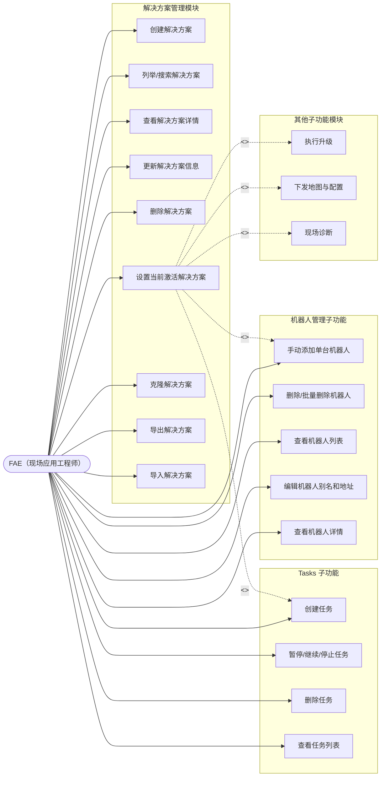

# 解决方案管理模块 — 需求规格说明书

## 1. 概述

解决方案管理模块是 RobotOps Studio 的顶层组织单元。**所有子功能**（机器人管理、BSP/OS 升级、地图下发、程序配置、现场诊断、日志等）**必须且只能从属于某一个解决方案**。任何功能都不允许在解决方案范围之外独立运行。

本模块提供解决方案的完整生命周期管理（增删改查），并定义解决方案与其子资源之间的归属契约。所有解决方案数据均通过 `playground/object_store` RESTful 对象存储服务进行持久化。

---

## 2. 术语定义

| 术语 | 定义 |
|------|------|
| **解决方案（Solution）** | 一个具名容器，代表一个可部署的上下文（例如客户现场、项目阶段、机群分组）。它承载所有配置、设备定义、升级包和操作历史。 |
| **当前激活解决方案（Active Solution）** | 当前应用会话中被选中的唯一解决方案。所有界面视图和操作方法均限定在此解决方案范围内。 |
| **解决方案 ID** | 唯一且 URL 安全的标识符，在对象存储中作为目录名使用。格式：`^[a-zA-Z0-9_-][a-zA-Z0-9_.-]*$`。 |
| **解决方案元数据（Solution Meta）** | 一个 JSON 文档，包含解决方案的显示名称、描述、时间戳、版本号、标签和用户自定义元数据。 |
| **子资源（Child Resource）** | 存储在解决方案目录下的任何实体（机器人、地图配置引用、升级包引用、程序配置、诊断会话、操作日志等）。 |
| **制品（Artifact）** | 由制品管理模块独立维护的全局共享大文件。本模块不直接管理制品，仅通过引用使用。详见《制品管理模块需求规格说明书》。 |
| **制品引用（Artifact Reference）** | 解决方案子资源中对全局制品的指针。引用的创建、解除由本模块触发，制品的生命周期由制品管理模块负责。 |
| **已打开解决方案（Opened Solution）** | 用户通过解决方案界面访问过的解决方案，由后端在内存中维护其状态，包括解决方案元数据及对应的机器人列表缓存。 |

---

## 3. 设计原则

1. **强制归属**：对子资源的所有增删改查操作都必须包含有效的解决方案 ID。脱离父解决方案的子资源不可访问。
2. **单一激活上下文**：应用同一时间只维护一个当前激活的解决方案。切换解决方案会触发完整的上下文重载。
3. **后端服务层**：后端提供专用的解决方案 API（`/api/solutions/...`）和机器人 API（`/api/solutions/:solutionId/robots/...`），内部调用对象存储服务进行数据持久化。前端不再直接调用通用对象存储 API 来操作解决方案和机器人数据。
4. **内存状态管理**：后端在内存中维护所有用户打开过的解决方案列表及每个解决方案对应的机器人列表缓存，以提升频繁访问场景下的响应速度。
5. **原子生命周期**：创建解决方案时自动预置目录骨架；删除解决方案时递归清除所有子数据。
6. **可移植性**：解决方案支持导出为单一 ZIP 归档，便于在不同 FAE 工作站之间分享和迁移。
7. **全局复用**：制品作为全局共享资源独立存储，多个解决方案可引用同一制品，避免重复上传和冗余存储。

---

## 4. 对象存储映射

### 4.1 目录布局

```
v1/
├── solutions/
│   ├── {solution-id-1}/
│   │   ├── meta.json
│   │   ├── robots/
│   │   │   └── {robot-id}.json
│   │   ├── upgrade-packages/
│   │   │   └── {package-id}.json      # JSON 引用文件，指向 v1/artifacts/{artifactId}
│   │   ├── maps/
│   │   │   └── {map-id}.json          # JSON 引用文件，指向 v1/artifacts/{artifactId}
│   │   ├── configs/
│   │   │   └── {config-id}.json
│   │   ├── diagnostics/
│   │   │   └── {session-id}.json
│   │   └── logs/
│   │       └── {log-id}.json
│   └── {solution-id-2}/
│       └── ...
└── artifacts/
    ├── {artifact-id-1}.bin
    ├── {artifact-id-2}.zip
    └── ...
```

### 4.2 路径规则

| 实体 | 对象存储路径 | Content-Type |
|------|-------------|--------------|
| 解决方案元数据 | `v1/solutions/{solutionId}/meta` | `application/json` |
| 机器人定义 | `v1/solutions/{solutionId}/robots/{robotId}` | `application/json` |
| 升级包引用 | `v1/solutions/{solutionId}/upgrade-packages/{pkgId}` | `application/json` |
| 地图引用 | `v1/solutions/{solutionId}/maps/{mapId}` | `application/json` |
| 程序配置 | `v1/solutions/{solutionId}/configs/{configId}` | `application/json` |
| 诊断会话 | `v1/solutions/{solutionId}/diagnostics/{sessionId}` | `application/json` |
| 操作日志条目 | `v1/solutions/{solutionId}/logs/{logId}` | `application/json` |
| 制品（固件、地图文件等） | `v1/artifacts/{artifactId}` | 根据实际文件类型推断 |

### 4.3 目录骨架预创建

创建解决方案时，必须自动创建以下空目录：

- `v1/solutions/{solutionId}/robots`
- `v1/solutions/{solutionId}/upgrade-packages`
- `v1/solutions/{solutionId}/maps`
- `v1/solutions/{solutionId}/configs`
- `v1/solutions/{solutionId}/diagnostics`
- `v1/solutions/{solutionId}/logs`

> **说明**：制品目录 `v1/artifacts/` 为全局命名空间，不隶属于任何解决方案，无需在创建解决方案时预创建。

> **理由**：预先创建目录可确保列表 API 始终返回可预测的结构，并消除懒初始化带来的竞态条件。

---

## 5. 数据模型

### 5.1 解决方案元数据 Schema

```json
{
  "$schema": "http://json-schema.org/draft-07/schema#",
  "type": "object",
  "required": ["id", "name", "createdAt", "updatedAt", "version"],
  "properties": {
    "id": { "type": "string", "pattern": "^[a-zA-Z0-9_-][a-zA-Z0-9_.-]*$" },
    "name": { "type": "string", "minLength": 1, "maxLength": 128 },
    "description": { "type": "string", "maxLength": 1024 },
    "createdAt": { "type": "string", "format": "date-time" },
    "updatedAt": { "type": "string", "format": "date-time" },
    "version": { "type": "string", "pattern": "^\\d+\\.\\d+\\.\\d+$" },
    "tags": {
      "type": "array",
      "items": { "type": "string", "maxLength": 64 },
      "maxItems": 32
    },
    "metadata": {
      "type": "object",
      "additionalProperties": true
    }
  }
}
```

### 5.2 Task 存储数据 Schema（TaskFlowEngine 持久化）

TaskFlowEngine 持久化的 `user` 类型任务（Flow）数据 Schema：

```json
{
  "$schema": "http://json-schema.org/draft-07/schema#",
  "type": "object",
  "required": ["id", "type", "dag", "state", "taskStates", "createdAt"],
  "properties": {
    "id": { "type": "string", "format": "uuid" },
    "type": { "type": "string", "enum": ["internal", "user"] },
    "input": {
      "type": "object",
      "description": "任务输入参数。其中 solutionId / robotIds / taskName / artifactId 等元数据也存储于此"
    },
    "expectedResults": { "type": "array", "items": { "type": "string" } },
    "dag": { "type": "object", "description": "Flowed DAG 规范" },
    "state": { "type": "string", "enum": ["PENDING", "RUNNING", "PAUSED", "COMPLETED", "FAILED", "STOPPED"] },
    "taskStates": { "type": "object", "additionalProperties": { "type": "string", "enum": ["PENDING", "RUNNING", "COMPLETED", "FAILED", "SKIPPED"] } },
    "taskResults": { "type": "object" },
    "results": { "type": "object" },
    "serializedRunStatus": { "type": "object", "description": "Flowed 运行时序列化状态，用于恢复" },
    "createdAt": { "type": "string", "format": "date-time" },
    "startedAt": { "type": "string", "format": "date-time", "description": "任务开始执行时间" },
    "finishedAt": { "type": "string", "format": "date-time" }
  }
}
```

> **设计说明**：`solutionId`、`robotIds`、`taskName` 等业务元数据不扩展为 `FlowRecord` 的顶层字段，而是通过 `input` ValueMap 传递。`TaskFlowEngine` 保持为通用执行引擎，不感知业务层 solution/robot 概念。业务过滤和展示由上层服务或前端基于 `input` 中的元数据完成。

**任务输入参数示例**：

- **升级 BUP**：
  ```json
  {
    "solutionId": "customer-a-site-3f2a",
    "robotIds": ["robot-001", "robot-002"],
    "taskName": "Upgrade BUP",
    "artifactId": "artifact-bup-001"
  }
  ```
- **升级 Movebase**：
  ```json
  {
    "solutionId": "customer-a-site-3f2a",
    "robotIds": ["robot-003"],
    "taskName": "Upgrade Movebase",
    "artifactId": "artifact-movebase-001"
  }
  ```

### 5.3 机器人存储数据 Schema

对象存储中仅持久化以下字段：

```json
{
  "$schema": "http://json-schema.org/draft-07/schema#",
  "type": "object",
  "required": ["id", "address", "addressType", "alias", "port", "createdAt", "updatedAt"],
  "properties": {
    "id": { "type": "string", "pattern": "^[a-zA-Z0-9_-][a-zA-Z0-9_.-]*$" },
    "address": { "type": "string", "minLength": 1, "description": "IP address or mDNS hostname (without port; port is stored separately)" },
    "addressType": { "type": "string", "enum": ["ip", "mdns"] },
    "alias": { "type": "string", "maxLength": 128, "description": "User-editable robot alias" },
    "port": { "type": "integer", "minimum": 1, "maximum": 65535, "default": 22, "description": "SSH connection port" },
    "createdAt": { "type": "string", "format": "date-time" },
    "updatedAt": { "type": "string", "format": "date-time" }
  }
}
```

### 5.3.1 机器人动态信息

以下字段不在对象存储中持久化，而是由前端动态生成（当前阶段使用基于地址的确定性随机模拟，后续替换为真实通信协议）：

- `model`、`robotSN`、`thingsId`、`vendorId`、`productId`
- `mainboardSN`、`mainboardId`、`mainSOMSN`
- `megaCosmOSVersion`、`movebaseVersion`、`ggrVersion`
- `mcuFirmwareVersions`、`actuatorFirmwareVersions`、`sensorFirmwareVersions`
- `mainControlHardwareVersion`、`mcuHardwareVersions`、`actuatorHardwareVersions`、`sensorHardwareVersions`
- `hardwareDeviceTree`

### 5.3.2 机器人完整定义 Schema（前端展示用）

前端将存储数据与动态信息合并后，展示为完整的 `RobotDefinition` 对象，包含上述所有字段。

### 5.4 示例

**解决方案元数据示例**：

```json
{
  "id": "customer-a-site-3f2a",
  "name": "Customer A — Site Alpha",
  "description": "Building 3, Floor 2 initial deployment, 12 robots.",
  "createdAt": "2026-05-27T07:30:54.000Z",
  "updatedAt": "2026-05-27T07:30:54.000Z",
  "version": "1.0.0",
  "tags": ["customer-a", "building-3", "fa-john-doe"],
  "metadata": {
    "location": "Shanghai Pudong",
    "contactPhone": "+86-xxx-xxxx-xxxx"
  }
}
```

**机器人存储数据示例**：

```json
{
  "id": "robot-001",
  "address": "192.168.1.101",
  "addressType": "ip",
  "alias": "AGV-01",
  "port": 22,
  "createdAt": "2026-05-27T08:00:00.000Z",
  "updatedAt": "2026-05-27T08:00:00.000Z"
}
```

---

## 6. 功能需求

### 6.1 创建解决方案

**FR-SOL-001**：系统应允许用户创建新的解决方案。

- 输入：`name`（必填）、`description`（可选）、`tags`（可选）、`metadata`（可选）。
- 若未提供 `id`，系统自动生成唯一 ID，规则为 `{slugified-name}-{nanoid(6)}`。
- 系统设置 `createdAt` 和 `updatedAt` 为当前 UTC 时间戳。
- 系统初始化 `version` 为 `"1.0.0"`。
- 系统在 `v1/solutions/{id}/` 下创建目录骨架。
- 系统通过 `POST /api/solutions` 写入元数据。
- 重复 ID 必须被拒绝并返回明确错误。

**FR-SOL-002**：解决方案 ID 必须在任何存储操作之前通过对象存储安全名称正则验证。

### 6.2 列举解决方案

**FR-SOL-003**：系统应列举所有已存在的解决方案。

- 系统查询 `GET /api/solutions`。
- 返回值包含 `items`（解决方案元数据列表）和 `corruptedIds`（损坏的解决方案 ID 列表）。
- 列表视图展示：`id`、`name`、`description`（截断）、`updatedAt`、`tags`。
- 列表按 `updatedAt` 降序排列（最近修改排在最前）。
- `meta.json` 不可读或缺失的解决方案应显示损坏警告标记，但仍出现在列表中。

**FR-SOL-004**：系统应支持按 `name`（子串匹配）和 `tags`（任意标签精确匹配）过滤解决方案。

### 6.3 读取解决方案

**FR-SOL-005**：系统应能获取单个解决方案的完整元数据。

- 系统读取 `GET /api/solutions/{id}`。
- 成功时返回完整 JSON 对象。
- 解决方案不存在时返回 `SOLUTION_NOT_FOUND` 错误。

### 6.4 更新解决方案

**FR-SOL-006**：系统应允许更新解决方案的可变字段。

- 可变字段：`name`、`description`、`tags`、`metadata`。
- 不可变字段：`id`、`createdAt`。
- 系统更新 `updatedAt` 为当前 UTC 时间戳。
- 系统每次更新元数据时自动递增 patch 版本号（例如 `1.0.0` -> `1.0.1`）。
- 更新通过 `PUT /api/solutions/{id}` 执行。

**FR-SOL-007**：系统应支持在不改变 `id` 的前提下重命名解决方案的显示名称。

### 6.5 删除解决方案

**FR-SOL-008**：系统应允许删除解决方案。

- 删除操作具有破坏性，需要用户显式确认（弹窗对话框）。
- 系统通过 `DELETE /api/solutions/{id}` 递归删除。
- 若被删除的解决方案是当前激活解决方案，应用应切换至"无激活解决方案"状态，并将用户重定向到解决方案选择页面。
- 删除失败（例如部分 I/O 错误）时，应记录日志并向用户报告。

### 6.6 设置当前激活解决方案

**FR-SOL-009**：系统应允许选择一个解决方案作为当前激活解决方案。

- 每个应用实例同一时间只能激活一个解决方案。
- 切换当前激活解决方案会清空子资源的内存缓存，并触发完整 UI 上下文重载。
- 系统通过 `POST /api/solutions/{id}/open` 在后端内存中标记该解决方案为已打开状态，并缓存其机器人列表。
- 系统通过 `POST /api/solutions/{id}/close` 关闭解决方案，释放内存缓存。
- 系统通过 `GET /api/solutions/opened` 获取所有已打开的解决方案列表。
- 尝试将不存在的解决方案设为激活状态时应被拒绝。

**FR-SOL-010**：应用应在全局标题栏 / 标题条中醒目显示当前激活解决方案的名称。

**FR-SOL-010a**：系统应维护"最近使用解决方案"快捷访问列表。

- 列表记录用户最近访问过的解决方案（包括打开、激活、编辑等操作），上限为 10 个。
- 列表按最近访问时间排序，最新的排在最前。
- 列表持久化到本地应用设置，跨会话保留。
- 解决方案被删除时，自动从最近使用列表中移除。
- 在最近使用列表中点击某解决方案，直接触发激活流程（同 FR-SOL-009）。

### 6.7 克隆解决方案

**FR-SOL-011**：系统应支持克隆已有解决方案。

- 输入：源 `id`、新 `name`。
- 系统将所有子资源递归复制到新的解决方案目录，并使用自动生成的全新 `id`。
- 克隆后的元数据获得新的 `createdAt`、`updatedAt`，版本重置为 `"1.0.0"`。
- 克隆操作在用户体验层面是原子的：若中途失败，不应残留不完整的新解决方案。
- 克隆通过 `POST /api/solutions/{id}/clone` 执行。

### 6.8 导出解决方案

**FR-SOL-012**：系统应支持将解决方案导出为可移植归档。

- 归档格式为 ZIP。
- 归档包含完整的 `v1/solutions/{id}/` 目录树。
- 归档文件名为 `{id}-v{version}-{timestamp}.zip`。
- 导出在本地执行；本阶段不要求上传到云端。
- 导出通过 `POST /api/solutions/{id}/export` 执行。

### 6.9 导入解决方案

**FR-SOL-013**：系统应支持从 ZIP 归档导入解决方案。

- 系统验证归档结构：顶层必须包含且仅包含一个匹配有效解决方案 ID 的目录，或包含一个 `meta.json`。
- 若归档中包含有效的 `meta.json`，系统分配新的自动生成 `id` 以避免冲突。
- 若相同 `id` 的解决方案已存在，用户必须选择：覆盖、重命名或取消。
- 导入完成后，新解决方案应出现在列表中。
- 导入通过 `POST /api/solutions/import` 执行。

### 6.10 与制品管理模块的交互

> 制品的完整生命周期管理（上传、列举、查看、删除、校验和去重、引用计数维护）由独立的**制品管理模块**负责。本节仅定义解决方案模块与制品模块之间的交互边界。

**FR-SOL-014**：系统应支持在解决方案子资源中引用全局制品。

- 引用发生在解决方案子资源中（例如 `upgrade-packages/{pkgId}.json` 或 `maps/{mapId}.json`）。
- 引用格式为一个 JSON 对象，至少包含 `artifactId` 和 `purpose` 字段。详见《制品管理模块需求规格说明书》第 5.2 节。
- **关键用例**：用户必须先通过制品管理模块完成制品的上传，才能在解决方案配置流程中通过制品选择器选择并引用该制品。
- 创建引用时，本模块调用制品管理模块接口，原子性递增对应制品的 `refCount`。
- 删除引用时，本模块调用制品管理模块接口，原子性递减对应制品的 `refCount`。
- 禁止引用不存在的 `artifactId`。

**FR-SOL-015**：系统应在删除解决方案时自动清理制品引用。

- 删除解决方案前，系统遍历该解决方案下所有子资源中的制品引用。
- 对每个被引用的制品，调用制品管理模块接口递减 `refCount`。
- 递减完成后，再执行解决方案目录的递归删除。
- 本模块**不**直接删除制品文件，制品的物理删除由制品管理模块根据 `refCount` 规则决定。

**FR-SOL-016**：系统应在克隆解决方案时自动复制制品引用。

- 克隆操作复制源解决方案的所有子资源（含引用文件）。
- 复制完成后，系统对克隆出的每个制品引用，调用制品管理模块接口递增对应制品的 `refCount`。

**FR-SOL-017**：系统应在导入解决方案时校验制品引用有效性。

- 导入过程中，若发现引用指向不存在的 `artifactId`，系统应提示用户：引用失效，需重新上传对应制品或重新选择。
- 对有效的引用，递增对应制品的 `refCount`。

### 6.11 任务管理（Tasks 子界面）

> 任务管理为解决方案的子功能，所有操作必须在当前激活解决方案的上下文中执行。后端通过 `TaskFlowEngine` 提供任务生命周期管理（创建、列举、暂停、继续、停止、删除）。任务数据通过对象存储服务进行持久化，支持服务端意外重启后的任务恢复。

**FR-SOL-028**：系统应支持在当前激活解决方案下创建任务。

- 任务类型为 `user`，仅显示 `user` 类型任务，不显示 `internal` 类型任务。
- 创建任务时，用户选择目标机器人（单个或多个，必须属于当前解决方案已添加的机器人）。
- 创建任务时，用户选择任务类型：当前支持 **Upgrade BUP** 和 **Upgrade Movebase**。
- 不同任务类型需要不同的输入参数：
  - **Upgrade BUP**：用户需选择一个已在 Artifacts Manage 模块中添加的资源文件（`artifactId`）。
  - **Upgrade Movebase**：用户需选择一个已在 Artifacts Manage 模块中添加的资源文件（`artifactId`）。
- 系统通过 `POST /api/solutions/{solutionId}/tasks` 创建任务，后端组装 DAG 并调用 `TaskFlowEngine.createFlow("user", dag, input)`。
- `input` 中必须包含以下元数据字段：
  - `solutionId`：当前解决方案 ID。
  - `robotIds`：所选机器人 ID 数组。
  - `taskName`：任务显示名称（如 `Upgrade BUP`）。
  - `artifactId`：所选制品 ID（任务业务参数）。
- 创建成功后，任务出现在当前解决方案的 Tasks 列表中。

**FR-SOL-029**：系统应展示当前解决方案下正在执行的 tasks 列表。

- 系统通过 `GET /api/solutions/{solutionId}/tasks` 获取任务列表，后端调用 `TaskFlowEngine.listFlows("user", { solutionId })`，利用 `filterParams` 对 `input.solutionId` 做字符串精确匹配过滤。
- 列表仅展示 `type = "user"` 且 `input.solutionId` 匹配当前解决方案的任务。
- `robotIds` 不过滤，由前端从 `input.robotIds` 读取并关联当前解决方案的机器人缓存解析别名。
- 列表展示字段（核心信息）：
  - `robotAliases`：关联机器人的别名列表（前端从 `input.robotIds` 关联当前解决方案机器人缓存解析）。
  - `taskName`：任务显示名称（前端从 `input.taskName` 读取）。
  - `state`：任务执行状态（PENDING / RUNNING / PAUSED / COMPLETED / FAILED / STOPPED）。
  - `resultSummary`：任务执行结果汇总（前端基于 `taskStates` 计算，例如 `"2 completed, 1 failed"` 或 `"In progress"`）。
  - `elapsedTime`：任务已执行时长（前端从 `startedAt` 到当前时间或 `finishedAt` 计算）。
- 搜索、排序、分页均由前端完成：前端获取当前解决方案的全量 `user` 任务列表后，在内存中按 `robotAliases`、`taskName` 子串搜索，按 `createdAt`、`state`、`taskName`、`elapsedTime` 排序，并按 10/25/50 条每页进行内存分页。因单解决方案下并行 `user` 任务量有限，此方案可简化后端实现。
- 后端 `TaskFlowEngine.listFlows()` 扩展支持可选的分页参数接口（见 FR-SOL-032），当前阶段前端不传 `pagination`，由后端返回全量数组。
- 空状态时提示用户创建任务。

**FR-SOL-030**：系统应支持对任务进行暂停、继续、停止和删除操作。

> **设计说明**：Stop（停止）与 Delete（删除）是独立操作。Stop 仅终止任务执行并将状态置为 `STOPPED`，任务记录仍保留在列表中供审计和故障排查；Delete 才从内存和对象存储中永久移除任务记录。

- 单条任务行操作按钮：
  - Pause：调用 `TaskFlowEngine.pauseFlow(id)`，将任务状态变为 `PAUSED`。
  - Resume：调用 `TaskFlowEngine.resumeFlow(id)`，将任务状态从 `PAUSED` 恢复为 `RUNNING`。
  - Stop：调用 `TaskFlowEngine.stopFlow(id)`，将任务状态变为 `STOPPED`，记录保留。
  - Delete：调用 `TaskFlowEngine.deleteFlow(id)`，从内存和对象存储中移除任务。删除前需弹窗确认。
- 批量操作：表格头部提供复选框，支持多选任务；选中后工具栏显示批量操作按钮（Batch Pause / Batch Resume / Batch Stop / Batch Delete）。
  - 仅对当前选中且状态允许执行对应操作的任务生效（例如 Batch Pause 仅作用于 RUNNING 状态的任务）。
  - Batch Delete 需弹窗确认，展示待删除任务数量。
- 状态与可用操作映射：
  - `RUNNING`：Pause、Stop、Delete。
  - `PAUSED`：Resume、Stop、Delete。
  - `PENDING`：Stop、Delete。
  - `COMPLETED` / `FAILED` / `STOPPED`：仅 Delete。
- 操作成功后，前端通过 SSE 接收 `task-flow-engine/flow-updated` 事件刷新列表。

**FR-SOL-031**：系统应支持任务持久化存储和服务端重启恢复。

- `user` 类型任务在创建、状态变更、完成时自动持久化到对象存储 `flows/{flowId}`。
- 服务端启动时调用 `TaskFlowEngine.loadPersistedFlows()` 恢复所有 `user` 类型任务。
- 恢复时，对于状态为 `RUNNING` 或 `PAUSED` 的任务，必须恢复其执行状态：
  - `RUNNING`：重新启动 Flow 执行。
  - `PAUSED`：恢复 Flow 实例和内存状态，保持 `PAUSED` 状态，等待用户手动 Resume。
- 恢复后，任务的 `solutionId` 和 `robotIds` 必须完整保留，以便正确关联到对应解决方案。

**FR-SOL-032**：TaskFlowEngine 接口增强需求。

- `FlowRecord` 和 `FlowSummary` 扩展字段：
  - `startedAt?: string`：任务开始执行时间（ISO 8601）。在 `startFlow()` 被调用时自动赋值。
- `listFlows` 方法增强：
  - 保持现有 `filterType` 和 `filterParams`（基于 `input[key]` 精确匹配）过滤能力，`solutionId` 通过 `filterParams` 过滤即可满足需求。
  - 新增可选分页参数：`listFlows(filterType?, filterParams?, pagination?: { page: number; pageSize: number }): { items: FlowSummary[]; total: number }`。若未传 `pagination`，返回全量数组以保持向后兼容。
- `createFlow` 方法签名保持不变。`solutionId`、`robotIds`、`taskName` 等业务元数据通过 `input` ValueMap 传递，由调用方组装。
- `loadPersistedFlows` 恢复 `PAUSED` 状态任务：当前实现已满足。恢复时通过 `new Flow(dag, serializedRunStatus)` 重建 Flow 实例并放入内存，保持 `PAUSED` 状态，等待用户后续调用 `resumeFlow()`。

### 6.12 机器人管理（Robots 子界面）

> 机器人管理为解决方案的子功能，所有操作必须在当前激活解决方案的上下文中执行。后端提供专用的机器人 API（`/api/solutions/:solutionId/robots/...`），内部调用对象存储服务进行数据持久化，并在内存中缓存每个解决方案的机器人列表。机器人动态信息通过 mem_store 缓存层管理，支持 TTL 自动淘汰、定时刷新和 SSE 实时推送。

**FR-SOL-018**：系统应支持手动添加单台机器人到当前解决方案。

- 输入：`address`（格式为 `<IP>:<port>` 或 `<mDNS>:<port>`，其中 port 可选，默认 22；必填）、`alias`（可选，默认与 address 的主机部分相同）。
- 系统自动从输入的 address 中解析出主机部分和端口号，并自动推断 `addressType`（IP 或 mDNS）。
- 系统生成唯一 `robotId`，规则为 `robot-{nanoid(6)}`。
- 系统通过 `POST /api/solutions/{solutionId}/robots` 持久化机器人存储数据，后端内部调用对象存储服务写入 `v1/solutions/{solutionId}/robots/{robotId}`。
- 系统在内存中更新该解决方案的机器人列表缓存。
- 后端在 mem_store 中创建缓存条目（key 为 `robot:{solutionId}/{robotId}`），配置 TTL=5 分钟、cron 刷新间隔=3 分钟，自动通过 DAG（SSH 连接）获取机器人动态信息。
- 同一解决方案下不允许添加地址（host + port 组合）重复的机器人。

**FR-SOL-019**：系统应支持批量删除当前解决方案中的机器人。

- 删除操作需要用户确认（弹窗对话框）。
- 批量删除时，系统展示待删除机器人数量并要求确认。
- 删除通过 `DELETE /api/solutions/{solutionId}/robots/{robotId}` 执行，后端内部调用对象存储服务删除，同时更新内存缓存和删除 mem_store 缓存条目。

**FR-SOL-020**：系统应展示当前解决方案中已添加的机器人基础信息列表。

- 系统通过 `GET /api/solutions/{solutionId}/robots/info` 获取机器人列表及动态信息（`RobotWithBasicInfo`），后端优先返回内存缓存，首次访问时从对象存储加载并缓存。机器人动态信息从 mem_store 缓存中获取，缓存未就绪时返回 `basicInfo: null`。
- 列表展示字段（核心信息）：`address`（格式为 `<host>:<port>`，如 `192.168.1.101:22` 或 `robot.local:22`）、`alias`（别名，用户可编辑）、`model`、`robotSN`、`thingsId`、`megaCosmOSVersion`。
- 列表支持按 `alias`、`address`、`model`、`robotSN` 进行子串搜索过滤。
- 列表支持按字段排序。
- 列表支持批量选择（复选框），以便执行批量删除。
- 空状态时提示用户添加机器人。

**FR-SOL-022**：系统应支持编辑机器人别名和地址。

- 用户在列表中可直接编辑 `alias` 字段（内联编辑或弹窗编辑）。
- 用户在详情对话框中可编辑 `alias` 和 `address` 字段（address 格式为 `<host>:<port>`，port 可选，默认 22）。
- 编辑后通过 `PUT /api/solutions/{solutionId}/robots/{robotId}` 更新，后端内部调用对象存储服务更新存储数据，同时更新内存缓存。若地址发生变更，后端删除旧的 mem_store 缓存条目并以新地址创建新条目。

**FR-SOL-023**：系统应支持点击机器人后弹出详情对话框，展示完整机器人信息。

- 对话框分区域展示：
  - **基础信息**：`alias`（可编辑）、`address`（可编辑，格式为 `<host>:<port>`，port 可选，默认 22）、`model`（只读）、`robotSN`（只读）、`thingsId`（只读）、`vendorId`（只读）、`productId`（只读）、`mainboardSN`（只读）、`mainboardId`（只读）、`mainSOMSN`（只读）。
  - **其他信息**：`hardwareDeviceTree`（硬件设备树表格）。
  - **软件版本信息**：`megaCosmOSVersion`、`movebaseVersion`、`ggrVersion`、`mcuFirmwareVersions`、`actuatorFirmwareVersions`、`sensorFirmwareVersions`（均为只读）。
  - **硬件版本信息**：`mainControlHardwareVersion`、`mcuHardwareVersions`、`actuatorHardwareVersions`、`sensorHardwareVersions`（均为只读）。
- 对话框提供"保存"按钮，保存 `alias` 和 `address` 的修改（address 中包含端口信息）。
- 对话框提供"关闭"按钮。

**FR-SOL-024**：机器人信息获取策略。

- 对象存储中仅持久化 `id`、`address`、`addressType`、`alias`、`port`、`createdAt`、`updatedAt`。
- 机器人动态信息（model、robotSn、thingsId 等）由后端通过 SSH 协议从机器人实时获取，存入 mem_store 缓存层。
- mem_store 缓存 key 格式为 `robot:{solutionId}/{robotId}`，TTL=5 分钟，cron 自动刷新间隔=3 分钟。
- 缓存 miss 时（首次访问或 TTL 过期），mem_store 自动触发 DAG（SSH 连接 + 命令执行）刷新缓存。
- 前端首次通过 `GET /api/solutions/:solutionId/robots/info` 获取全量数据，之后通过统一 SSE 端点 `GET /api/sse` 接收所有机器人 `memstore/entry-current`（连接时初始推送）、`memstore/entry-updated`（运行时更新）、`memstore/entry-deleted`（缓存删除）事件。前端按 key 过滤需要关心的机器人事件。
- 当后端 SSH 获取失败或缓存尚未就绪时，前端使用 `generateMockRobotInfo()` 生成兜底数据。`enrichRobotFromBackend` 函数优先使用后端返回的 basicInfo，缺失字段用 mock 数据补充。
- 服务重启后 mem_store 为空，首次访问自动触发 DAG 回填，无需手动恢复。
- 模拟数据应具有一致性：同一台机器人（相同地址）始终返回相同的信息。

**FR-SOL-025**：后端内存状态管理。

- 后端 `SolutionService` 在内存中维护所有用户打开过的解决方案列表（`OpenedSolutionEntry`），包含 `id`、`name`、`openedAt`。
- 后端 `RobotService` 在内存中维护每个已打开解决方案的机器人列表缓存（`solutionRobots`），键为 `solutionId`，值为 `Map<robotId, StoredRobotData>`。
- 机器人动态信息通过后端 mem_store 缓存层管理，每个机器人对应一个 mem_store 条目，key 为 `robot:{solutionId}/{robotId}`，配置 TTL=5 分钟、cron 刷新间隔=3 分钟。
- 对机器人的增删改操作同步更新内存缓存和 mem_store，确保后续读取操作优先命中缓存。
- 创建机器人时，`RobotService.create()` 在 mem_store 中创建对应的缓存条目并启动 DAG 定时刷新。
- 删除机器人时，`RobotService.remove()` 同步删除 mem_store 中的缓存条目。
- 更新机器人地址时，旧的 mem_store 条目被删除，以新地址创建新条目。
- 删除解决方案时，通过 `SolutionService.onSolutionRemove()` 回调通知 `RobotService.removeSolutionCache()`，使用 `deleteByPrefix("robot:{solutionId}/")` 批量清理该解决方案下所有机器人的缓存条目。
- 关闭解决方案时（`POST /api/solutions/{id}/close`），通过 `SolutionService.onSolutionClose()` 回调同样清理 mem_store 缓存。

**FR-SOL-026**：MemStore 缓存层。

- 后端内置 mem_store 模块，提供带 TTL 的内存键值缓存、DAG 驱动的自动刷新、SSE 实时推送能力。
- mem_store 采用 LRU 淘汰策略，最大容量 1000 个条目。
- 缓存支持按 key 前缀批量删除（`deleteByPrefix`），用于解决方案删除/关闭时的级联清理。
- 缓存值格式为 `{ info: RobotBasicInfo, fetchedAt: string }`，其中 `fetchedAt` 为 ISO 8601 时间戳。
- mem_store DAG 执行器通过 `registerDagExecutor` 注册，当前实现为 `fetch-robot-info` 类型，通过 SSH 连接机器人获取 `RobotBasicInfo`。
- 缓存更新时自动通过 SSE 向订阅该 key 的前端客户端推送 `{ key, value, type: "update" }` 事件。

**FR-SOL-027**：MemStore REST API 与 SSE。

- 后端提供 mem_store 只读 RESTful API（`/api/memstore/...`），前端可通过此 API 读取缓存的机器人动态信息。
- 后端提供统一 SSE 订阅端点（`GET /api/sse`），由共享 `SseManager` 管理（详见 `documents/requirements/sse-manager.md`）。所有模块的事件（含 `memstore/*`、`task-flow-engine/*` 等）通过该端点广播，按事件名命名空间区分。
- 由于 mem_store key 格式 `robot:{solutionId}/{robotId}` 包含 `/` 字符，所有 mem_store REST API 均使用 query parameter 传递 key（如 `?key=robot:my-solution/robot-abc123`）。
- SSE 连接维护心跳（每 30 秒发送 `ping` 事件），连接断开时自动清理资源。

---

## 7. 子资源归属契约

### 7.1 寻址规则

所有子资源 API 必须接受 `solutionId` 参数（显式传入或从当前激活解决方案隐式获取）。对象存储路径始终遵循：

```
v1/solutions/{solutionId}/{feature-namespace}/{resourceId}
```

### 7.2 功能命名空间注册表

| 功能 | 命名空间 | 存储格式 | 归属 |
|------|---------|---------|------|
| 机器人管理 | `robots` | `application/json` | 解决方案 |
| 任务流 | `flows` | `application/json`（TaskFlowEngine 持久化） | **全局**（按 `solutionId` 逻辑归属） |
| BSP / OS 升级包 | `upgrade-packages` | `application/json`（引用文件，指向全局制品） | 解决方案 |
| 地图下发 | `maps` | `application/json`（引用文件，指向全局制品） | 解决方案 |
| 程序配置 | `configs` | `application/json` | 解决方案 |
| 诊断会话 | `diagnostics` | `application/json` | 解决方案 |
| 操作日志 | `logs` | `application/json` | 解决方案 |
| 制品 | `artifacts` | 根据实际文件类型推断 | **全局**（不从属于任何解决方案） |

### 7.3 生命周期耦合

- **创建**：子资源只能在父解决方案存在时创建。全局制品独立创建，不依赖于任何解决方案。
- **读取**：子资源在当前激活解决方案的上下文中被读取。全局制品可在任意上下文中读取。
- **更新**：子资源更新**不会**修改父解决方案的 `updatedAt` 或版本号（除非子模块显式设计为触发更新）。全局制品元数据中的 `refCount` 由引用/解除引用操作自动维护。
- **删除**：删除子资源不会影响父解决方案。若子资源包含对全局制品的引用，删除时递减对应制品的 `refCount`。
- **级联**：删除父解决方案会递归删除该解决方案下的所有子资源（引用文件），并自动递减相关全局制品的 `refCount`，但**不会**删除全局制品本身。

---

## 8. 用例模型

### 8.1 用例图



### 8.2 用例说明

| 用例编号 | 用例名称 | 参与者 | 前置条件 | 后置条件 | 主事件流 |
|---------|---------|--------|---------|---------|---------|
| UC-SOL-01 | 创建解决方案 | FAE | 无 | 新解决方案出现在列表中，目录骨架已创建 | 1. FAE 输入名称、描述等信息；2. 系统验证输入并生成 ID；3. 系统创建目录骨架并写入 meta；4. 系统设为当前激活解决方案 |
| UC-SOL-02 | 列举/搜索解决方案 | FAE | 无 | 展示过滤后的解决方案列表 | 1. FAE 打开解决方案选择器；2. 系统加载全部 meta；3. FAE 可输入关键词或选择标签过滤；4. 系统返回排序后的列表 |
| UC-SOL-03 | 查看解决方案详情 | FAE | 解决方案已存在 | 展示完整元数据 | 1. FAE 在列表中选择某解决方案；2. 系统读取 meta.json；3. 系统展示完整信息 |
| UC-SOL-04 | 更新解决方案信息 | FAE | 解决方案已存在 | 元数据已更新，版本号递增 | 1. FAE 编辑可变字段；2. 系统校验；3. 系统更新 meta 并刷新 updatedAt 与 version |
| UC-SOL-05 | 删除解决方案 | FAE | 解决方案已存在 | 解决方案及其所有子资源被移除 | 1. FAE 发起删除；2. 系统要求两步确认；3. 系统递归删除目录；4. 若该方案为激活状态，系统清空激活上下文并重定向 |
| UC-SOL-06 | 设置当前激活解决方案 | FAE | 解决方案已存在 | 该方案成为唯一激活上下文，UI 重载 | 1. FAE 选择要激活的方案；2. 系统验证存在性；3. 系统清空旧缓存；4. 系统持久化激活 ID 并重载界面 |
| UC-SOL-07 | 克隆解决方案 | FAE | 源解决方案已存在 | 新解决方案包含源方案全部数据副本 | 1. FAE 选择源方案并指定新名称；2. 系统生成新 ID；3. 系统递归复制所有子资源；4. 系统写入新 meta |
| UC-SOL-08 | 导出解决方案 | FAE | 解决方案已存在 | 本地生成 ZIP 归档文件 | 1. FAE 选择导出；2. 系统流式打包目录树；3. 系统保存为 `{id}-v{version}-{timestamp}.zip` |
| UC-SOL-09 | 导入解决方案 | FAE | 无 | 新解决方案出现在列表中 | 1. FAE 选择 ZIP 文件；2. 系统验证归档结构；3. 若 ID 冲突，提示用户选择覆盖/重命名/取消；4. 系统解压并写入对象存储 |
| UC-ROB-01 | 手动添加单台机器人 | FAE | 当前存在激活解决方案 | 新机器人出现在当前解决方案的机器人列表中 | 1. FAE 输入地址（格式为 `<IP>:<port>` 或 `<mDNS>:<port>`，port 可选默认 22）及别名；2. 前端解析地址并生成 robotId；3. 前端写入对象存储；4. 前端生成动态机器人信息 |
| UC-ROB-02 | 删除/批量删除机器人 | FAE | 机器人已存在于当前解决方案 | 指定机器人从列表和存储中移除 | 1. FAE 选择要删除的机器人（单台或批量）；2. 系统展示确认对话框；3. 前端执行 DELETE 操作；4. 前端刷新列表 |
| UC-ROB-03 | 查看机器人列表 | FAE | 当前存在激活解决方案 | 展示当前解决方案下所有机器人的核心基础信息 | 1. FAE 打开 Robots 子界面；2. 前端从对象存储读取所有机器人存储数据；3. 前端生成动态信息并合并展示 |
| UC-ROB-04 | 编辑机器人别名和地址 | FAE | 机器人已存在 | 机器人别名和/或地址已更新 | 1. FAE 编辑别名或地址；2. 前端保存并更新对象存储 |
| UC-ROB-05 | 查看机器人详情 | FAE | 机器人已存在 | 展示完整信息 | 1. FAE 点击某机器人行；2. 系统弹出详情对话框；3. 系统分标签页展示基础信息、其他信息、软件版本、硬件版本 |
| UC-TASK-01 | 创建任务 | FAE | 当前存在激活解决方案，且已添加机器人 | 新任务出现在 Tasks 列表中并开始执行 | 1. FAE 进入 Tasks 子界面；2. 点击 Create Task；3. 选择目标机器人（单个或多个）；4. 选择任务类型（Upgrade BUP / Upgrade Movebase）；5. 选择对应的 Artifact 资源文件；6. 系统创建任务并启动执行 |
| UC-TASK-02 | 暂停/继续/停止任务 | FAE | 任务正在执行或已暂停 | 任务状态变更 | 1. FAE 在 Tasks 列表中找到目标任务；2. 点击 Pause / Resume / Stop 按钮；3. 系统调用 TaskFlowEngine 对应接口；4. 列表状态实时更新 |
| UC-TASK-03 | 删除任务 | FAE | 任务已存在 | 任务从列表和存储中移除 | 1. FAE 选择要删除的任务；2. 系统展示确认对话框；3. FAE 确认删除；4. 系统调用 TaskFlowEngine.deleteFlow；5. 列表刷新 |
| UC-TASK-04 | 查看任务列表 | FAE | 当前存在激活解决方案 | 展示当前解决方案下所有 user 类型任务 | 1. FAE 打开 Tasks 子界面；2. 系统加载任务列表（按 solutionId 过滤）；3. 前端展示任务关键信息并支持搜索、排序、分页 |

### 8.3 参与者说明

| 参与者 | 描述 | 关联用例 |
|--------|------|---------|
| FAE（现场应用工程师） | 主要用户，负责在现场连接机器人、确认状态、升级与配置 | UC-SOL-01 ~ UC-SOL-09, UC-ROB-01 ~ UC-ROB-06, UC-TASK-01 ~ UC-TASK-04 |

---

## 9. 校验与约束

| 约束项 | 规则 | 错误行为 |
|--------|------|---------|
| 解决方案 ID | 必须匹配 `^[a-zA-Z0-9_-][a-zA-Z0-9_.-]*$` | 拒绝并返回 `INVALID_ID` |
| 解决方案名称 | 1–128 个字符，非空 | 拒绝并返回 `INVALID_NAME` |
| 解决方案描述 | 最多 1024 个字符 | 截断或拒绝 |
| 标签 | 最多 32 个标签，每个最多 64 个字符 | 拒绝超额 |
| 最大解决方案数 | 每工作站软限制 1000 个 | 警告，不阻塞 |
| 最大总存储 | 受本地磁盘限制 | 按解决方案报告用量 |
| 名称重复 | 显示名称允许重复；ID 必须唯一 | 允许重复名称，给予警告 |
| 无激活解决方案 | 子资源 API 需要激活上下文或显式 `solutionId` | 拒绝并返回 `NO_ACTIVE_SOLUTION` |
| 机器人 ID | 必须匹配 `^[a-zA-Z0-9_-][a-zA-Z0-9_.-]*$` | 拒绝并返回 `INVALID_ROBOT_ID` |
| 机器人地址 | 非空字符串，格式为 `<host>:<port>` 或 `<host>`（port 可选，默认 22），host 部分最大 256 个字符 | 拒绝并返回 `INVALID_ROBOT_ADDRESS` |
| 机器人端口 | 从 address 中解析，1–65535 整数，默认 22 | 拒绝并返回 `INVALID_ROBOT_PORT` |
| 机器人别名 | 最大 128 个字符 | 截断或拒绝 |
| 任务类型 | 必须为当前系统支持的任务类型（Upgrade BUP / Upgrade Movebase） | 拒绝并返回 `INVALID_TASK_TYPE` |
| 任务目标机器人 | 必须全部属于当前解决方案已添加的机器人 | 拒绝并返回 `ROBOT_NOT_IN_SOLUTION` |
| 任务 Artifact | 引用的 `artifactId` 必须在 Artifacts Manage 模块中存在 | 拒绝并返回 `ARTIFACT_NOT_FOUND` |
| 每页任务数 | 可选 10 / 25 / 50，默认 10 | 非法值时回退到默认值 |

---

## 10. 错误处理

| 错误码 | 触发条件 | 用户提示 |
|--------|---------|---------|
| `SOLUTION_NOT_FOUND` | 对不存在的 ID 执行读取/更新/删除 | "解决方案 '{id}' 不存在。" |
| `SOLUTION_ALREADY_EXISTS` | 使用重复 ID 创建 | "ID 为 '{id}' 的解决方案已存在。" |
| `INVALID_SOLUTION_ID` | ID 违反安全名称正则 | "解决方案 ID 包含非法字符。" |
| `NO_ACTIVE_SOLUTION` | 未设置激活上下文时调用子资源 API | "未选择激活解决方案。请先选择或创建一个解决方案。" |
| `SOLUTION_CORRUPTED` | `meta.json` 缺失或不可读 | "解决方案 '{id}' 的元数据已损坏。" |
| `IMPORT_INVALID_ARCHIVE` | ZIP 不包含有效的解决方案结构 | "所选文件不是有效的解决方案归档。" |
| `IMPORT_ID_COLLISION` | 导入目标 ID 已存在且用户选择取消 | "因 ID 冲突，导入已取消。" |
| `DELETE_ACTIVE_SOLUTION` | 尝试删除当前激活的解决方案 | 警告并要求额外确认；删除后清空激活上下文。 |
| `ARTIFACT_NOT_FOUND` | 引用或操作不存在的制品 | "制品 '{artifactId}' 不存在。" |
| `ARTIFACT_REFERENCED` | 尝试删除 `refCount > 0` 的制品 | "该制品正被 {refCount} 个解决方案引用，请先解除引用。" |
| `ARTIFACT_DUPLICATE_CHECKSUM` | 上传的制品校验和与已有文件相同 | 返回已有制品元数据，提示用户可直接引用。 |
| `INVALID_ARTIFACT_ID` | 制品 ID 违反安全名称正则 | "制品 ID 包含非法字符。" |
| `ROBOT_NOT_FOUND` | 对不存在的 robotId 执行读取/更新/删除 | "Robot '{robotId}' does not exist."（前端处理） |
| `INVALID_ROBOT_ADDRESS` | 地址为空、格式不合法（未通过 `<host>:<port>` 或 `<host>` 解析）或 host 部分超过 256 字符 | "Robot address format invalid. Expected <IP>:<port> or <mDNS>:<port> (port defaults to 22)."（前端验证） |
| `INVALID_ROBOT_PORT` | 端口不在 1–65535 范围内 | "Robot port must be between 1 and 65535."（前端验证） |
| `ROBOT_ADDRESS_EXISTS` | 同一解决方案下已存在相同地址（host + port 组合） | "A robot with this address already exists in the current solution."（前端校验） |
| `OBJECT_NOT_FOUND` | 对不存在的路径执行 GET/PUT/DELETE | "Object '{path}' not found."（通用对象存储错误） |
| `MEMSTORE_KEY_NOT_FOUND` | 读取 mem_store 中不存在的 key 或已过期的缓存条目 | 返回 404；前端应视为缓存未就绪，使用 mock 兜底数据。 |
| `MEMSTORE_REFRESH_FAILED` | mem_store DAG 刷新失败（SSH 连接超时、命令执行失败等） | 后端记录错误日志，缓存保持旧值或为空；前端继续使用 mock 兜底数据。 |
| `TASK_NOT_FOUND` | 对不存在的 taskId 执行读取/暂停/继续/停止/删除 | "Task '{taskId}' does not exist." |
| `INVALID_TASK_TYPE` | 创建任务时指定了不支持的任务类型 | "Unsupported task type '{taskType}'." |
| `ROBOT_NOT_IN_SOLUTION` | 创建任务时选择的机器人不属于当前解决方案 | "One or more selected robots are not in the current solution." |
| `TASK_FLOW_ENGINE_ERROR` | TaskFlowEngine 内部错误（DAG 解析失败、Resolver 未注册等） | 后端记录错误日志，前端提示任务创建或执行失败。 |

---

## 11. UI/UX 需求

**UI-SOL-001**：未设置当前激活解决方案时，应用着陆页应为解决方案选择器。

**UI-SOL-002**：解决方案选择器以卡片或列表行展示解决方案，包含：名称、描述预览、最后修改时间、标签、操作按钮（打开、导出、克隆、删除）。

**UI-SOL-003**：全局标题栏显示当前激活解决方案名称，并提供“切换解决方案”按钮。

**UI-SOL-004**：删除解决方案需要弹窗确认，确认后立即执行删除。

**UI-SOL-005**：创建或导入解决方案后，自动将其设为当前激活解决方案。

**UI-SOL-006**：导出或克隆解决方案过程中，应显示进度指示器。

**UI-ROB-001**：打开解决方案后，左侧导航栏应包含 "Robots" 和 "Tasks" 入口，分别点击进入对应子界面。

**UI-ROB-002**：Robots 子界面以数据表格形式展示机器人列表，列包括：`alias`、`address`、`model`、`robotSN`、`thingsId`、`megaCosmOSVersion`、操作按钮（查看详情、删除）。

**UI-ROB-003**：表格上方应提供搜索框（按 alias/address/model/SN 过滤）、"Add Robot" 按钮。

**UI-ROB-003a**：Robots 子界面应包含面包屑导航，显示 "Solutions > {Solution Name} > Robots"。

**UI-ROB-003b**：添加机器人后，成功提示应在 5 秒后自动消失。

**UI-ROB-004**：表格每行提供复选框，支持批量选择；选中后工具栏显示 "Batch Delete" 按钮。

**UI-ROB-005**：`alias` 列支持内联编辑（点击后变为输入框，失焦或回车保存）。

**UI-ROB-006**：点击机器人行或 "View Details" 按钮，弹出模态框展示完整信息，模态框内使用标签页（Tabs）组织：基础信息、其他信息、软件版本、硬件版本。

**UI-ROB-007**：基础信息标签页中，`alias` 和 `address` 以输入框展示（可编辑，address 格式为 `<host>:<port>`，port 可选，默认 22），其余字段均为只读展示；提供 "Save" 按钮保存修改。

**UI-ROB-008**：添加机器人弹窗应支持单台添加（输入 address + alias）。address 输入框格式为 `<IP>:<port>` 或 `<mDNS>:<port>`，port 可选，默认 22。打开弹窗时，系统应默认生成一个别名（如 Robot-1、Robot-2）。

**UI-ROB-009**：空状态时展示提示插图和 "Add your first robot" 按钮。

**UI-TASK-001**：打开解决方案后，左侧导航栏的 "Tasks" 入口点击进入 Tasks 子界面。

**UI-TASK-002**：Tasks 子界面以数据表格形式展示任务列表，列包括：复选框（批量选择）、`robotAliases`（关联机器人别名，前端从 `input.robotIds` 关联当前解决方案机器人缓存解析，多个时以逗号分隔或折叠显示）、`taskName`（任务名称，前端从 `input.taskName` 读取）、`state`（状态标签，带颜色区分）、`resultSummary`（结果汇总，前端基于 `taskStates` 实时计算，例如 `"2 completed, 1 failed"` 或 `"In progress"`）、`elapsedTime`（已执行时长，前端基于 `startedAt` 到当前时间或 `finishedAt` 计算，格式为 `HH:MM:SS`）、操作按钮（Pause / Resume / Stop / Delete）。

**UI-TASK-003**：表格上方应提供搜索框（按 robotAliases / taskName 前端子串过滤）、"Create Task" 按钮、分页控制器（每页 10/25/50 条，前端内存分页）。当用户通过行首复选框选中一个或多个任务后，表格上方显示批量操作工具栏，提供 Batch Pause、Batch Resume、Batch Stop、Batch Delete 按钮，并展示已选任务数量。

**UI-TASK-003a**：Tasks 子界面应包含面包屑导航，显示 "Solutions > {Solution Name} > Tasks"。

**UI-TASK-004**：状态列使用颜色标签区分：RUNNING（蓝色）、PAUSED（黄色）、COMPLETED（绿色）、FAILED（红色）、STOPPED（灰色）、PENDING（浅灰）。

**UI-TASK-005**：Create Task 流程使用分步模态框（Step Modal）：
- Step 1 — 选择机器人：展示当前解决方案下的机器人列表（带复选框），支持搜索，至少选择一个机器人；列表头部提供 "Select All" 复选框，可一键全选/取消全选当前过滤后的所有机器人。
- Step 2 — 选择任务类型：展示可选任务类型列表（Upgrade BUP、Upgrade Movebase 等），单选；列表上方提供搜索框，支持按任务类型名称子串过滤。
- Step 3 — 配置参数：根据所选任务类型**动态渲染**对应的参数输入界面。参数表单不可硬编码，必须由任务类型定义驱动。当前两种任务示例：
  - Upgrade BUP：提供 Artifact 选择器（调用 Artifacts Manage 模块接口列出可用资源文件，用户单选确认）。
  - Upgrade Movebase：提供 Artifact 选择器（同上）。
  - 未来新增任务类型时，Step 3 应自动渲染该类型对应的参数表单，无需修改前端代码。
- Step 4 — 确认并创建：展示摘要（目标机器人、任务类型、参数），提供 "Create" 和 "Back" 按钮。

**UI-TASK-006**：Artifact 选择器以内嵌列表或弹窗形式展示，列包括：文件名、类型、大小、创建时间，支持搜索和单选。

**UI-TASK-007**：单条任务操作按钮根据状态动态显示：
- RUNNING：Pause、Stop、Delete。
- PAUSED：Resume、Stop、Delete。
- PENDING：Stop、Delete。
- COMPLETED / FAILED / STOPPED：仅 Delete。

**UI-TASK-008**：删除任务需要弹窗确认，确认后执行删除。

**UI-TASK-009**：空状态时展示提示插图和 "Create your first task" 按钮。

**UI-TASK-010**：任务列表支持 SSE 实时更新，状态变化时无需手动刷新页面。

---

## 12. 非功能需求

**NF-SOL-001**：列举 1000 个解决方案在标准 SSD 上必须在 2 秒内完成。

**NF-SOL-002**：导出 1 GB 的解决方案归档时必须流式写入磁盘，不得将整个归档加载到内存。

**NF-SOL-003**：模块必须容忍对象存储的临时不可用，具备重试机制（最多 3 次，指数退避）。

**NF-SOL-004**：涉及长时间 I/O 的操作（导出、导入、克隆）必须支持取消。

**NF-ROB-001**：机器人列表加载应在 1 秒内完成（假设单个解决方案下机器人数量不超过 500 台）。mem_store 缓存命中时直接返回，未命中时异步触发 DAG 刷新，不阻塞列表加载。

**NF-ROB-002**：别名内联编辑保存应在 300 毫秒内完成。

**NF-ROB-003**：批量添加机器人时，系统应逐条处理并实时反馈进度，避免界面卡顿。

**NF-ROB-004**：机器人动态信息缓存刷新应在 10 秒内完成（单台机器人 SSH 命令执行超时）。刷新失败不阻塞前端，前端继续使用 mock 兜底数据。

**NF-ROB-005**：mem_store SSE 事件从后端缓存更新到前端接收的延迟应小于 500 毫秒。

**NF-ROB-006**：mem_store LRU 容量上限 1000 个条目。超出时按 LRU 策略淘汰最久未访问的条目，淘汰后首次访问自动回填。

**NF-TASK-001**：任务列表加载应在 1 秒内完成（假设单个解决方案下任务数量不超过 500 条）。

**NF-TASK-002**：任务创建应在 2 秒内完成（包含 DAG 验证和对象存储写入）。

**NF-TASK-003**：暂停、继续、停止操作应在 500 毫秒内完成并反馈到 UI。

**NF-TASK-004**：SSE 事件从后端状态变更到前端列表更新的延迟应小于 500 毫秒。

**NF-TASK-005**：服务端重启后，`user` 类型任务的恢复应在启动后 10 秒内完成，恢复期间前端应显示加载状态。

**NF-TASK-006**：任务持久化写入对象存储不得阻塞任务执行流程，必须异步完成。

---

## 13. 迁移与版本管理

**MIG-SOL-001**：`meta.json` Schema 包含 `version` 字段。未来的 Schema 变更必须保持向后兼容，或提供显式迁移路径。

**MIG-SOL-002**：若未来模块引入新的子命名空间，应通过懒创建或迁移脚本建立目录；预创建骨架目录是推荐做法。

**MIG-ROB-001**：机器人定义 Schema 的扩展应通过 `metadata` 字段或新增可选字段实现，保持向后兼容。
