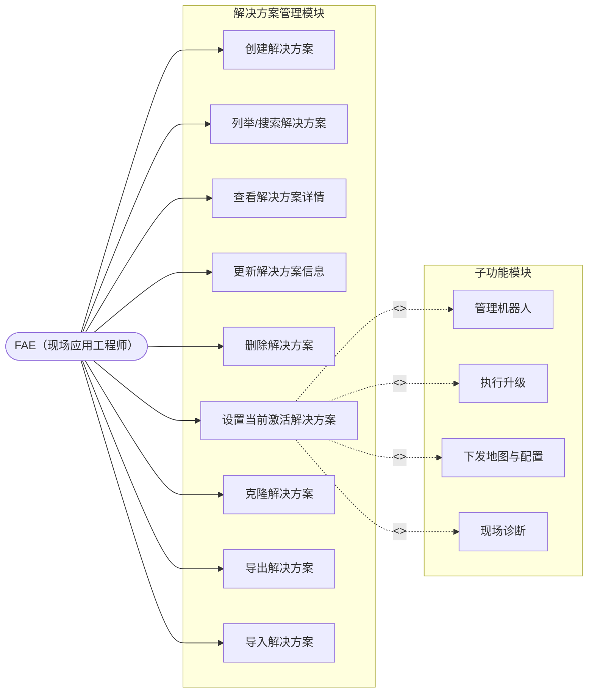

# 解决方案管理模块 — 需求规格说明书

## 1. 概述

解决方案管理模块是 RobotOps Studio 的顶层组织单元。**所有子功能**（机器人管理、BSP/OS 升级、地图下发、程序配置、现场诊断、日志等）**必须且只能从属于某一个解决方案**。任何功能都不允许在解决方案范围之外独立运行。

本模块提供解决方案的完整生命周期管理（增删改查），并定义解决方案与其子资源之间的归属契约。所有解决方案数据均通过 `playground/object_store` RESTful 对象存储服务进行持久化。

---

## 2. 术语定义

| 术语 | 定义 |
|------|------|
| **解决方案（Solution）** | 一个具名容器，代表一个可部署的上下文（例如客户现场、项目阶段、机群分组）。它承载所有配置、设备定义、升级包和操作历史。 |
| **当前激活解决方案（Active Solution）** | 当前应用会话中被选中的唯一解决方案。所有界面视图和操作方法均限定在此解决方案范围内。 |
| **解决方案 ID** | 唯一且 URL 安全的标识符，在对象存储中作为目录名使用。格式：`^[a-zA-Z0-9_-][a-zA-Z0-9_.-]*$`。 |
| **解决方案元数据（Solution Meta）** | 一个 JSON 文档，包含解决方案的显示名称、描述、时间戳、版本号、标签和用户自定义元数据。 |
| **子资源（Child Resource）** | 存储在解决方案目录下的任何实体（机器人、地图配置引用、升级包引用、程序配置、诊断会话、操作日志等）。 |
| **制品（Artifact）** | 由制品管理模块独立维护的全局共享大文件。本模块不直接管理制品，仅通过引用使用。详见《制品管理模块需求规格说明书》。 |
| **制品引用（Artifact Reference）** | 解决方案子资源中对全局制品的指针。引用的创建、解除由本模块触发，制品的生命周期由制品管理模块负责。 |

---

## 3. 设计原则

1. **强制归属**：对子资源的所有增删改查操作都必须包含有效的解决方案 ID。脱离父解决方案的子资源不可访问。
2. **单一激活上下文**：应用同一时间只维护一个当前激活的解决方案。切换解决方案会触发完整的上下文重载。
3. **存储透明**：模块对外暴露语义化 API，内部统一映射为 `object_store` 路径。
4. **原子生命周期**：创建解决方案时自动预置目录骨架；删除解决方案时递归清除所有子数据。
5. **可移植性**：解决方案支持导出为单一 ZIP 归档，便于在不同 FAE 工作站之间分享和迁移。
6. **全局复用**：制品作为全局共享资源独立存储，多个解决方案可引用同一制品，避免重复上传和冗余存储。

---

## 4. 对象存储映射

### 4.1 目录布局

```
v1/
├── solutions/
│   ├── {solution-id-1}/
│   │   ├── meta.json
│   │   ├── robots/
│   │   │   └── {robot-id}.json
│   │   ├── upgrade-packages/
│   │   │   └── {package-id}.json      # JSON 引用文件，指向 v1/artifacts/{artifactId}
│   │   ├── maps/
│   │   │   └── {map-id}.json          # JSON 引用文件，指向 v1/artifacts/{artifactId}
│   │   ├── configs/
│   │   │   └── {config-id}.json
│   │   ├── diagnostics/
│   │   │   └── {session-id}.json
│   │   └── logs/
│   │       └── {log-id}.json
│   └── {solution-id-2}/
│       └── ...
└── artifacts/
    ├── {artifact-id-1}.bin
    ├── {artifact-id-2}.zip
    └── ...
```

### 4.2 路径规则

| 实体 | 对象存储路径 | Content-Type |
|------|-------------|--------------|
| 解决方案元数据 | `v1/solutions/{solutionId}/meta` | `application/json` |
| 机器人定义 | `v1/solutions/{solutionId}/robots/{robotId}` | `application/json` |
| 升级包引用 | `v1/solutions/{solutionId}/upgrade-packages/{pkgId}` | `application/json` |
| 地图引用 | `v1/solutions/{solutionId}/maps/{mapId}` | `application/json` |
| 程序配置 | `v1/solutions/{solutionId}/configs/{configId}` | `application/json` |
| 诊断会话 | `v1/solutions/{solutionId}/diagnostics/{sessionId}` | `application/json` |
| 操作日志条目 | `v1/solutions/{solutionId}/logs/{logId}` | `application/json` |
| 制品（固件、地图文件等） | `v1/artifacts/{artifactId}` | 根据实际文件类型推断 |

### 4.3 目录骨架预创建

创建解决方案时，必须自动创建以下空目录：

- `v1/solutions/{solutionId}/robots`
- `v1/solutions/{solutionId}/upgrade-packages`
- `v1/solutions/{solutionId}/maps`
- `v1/solutions/{solutionId}/configs`
- `v1/solutions/{solutionId}/diagnostics`
- `v1/solutions/{solutionId}/logs`

> **说明**：制品目录 `v1/artifacts/` 为全局命名空间，不隶属于任何解决方案，无需在创建解决方案时预创建。

> **理由**：预先创建目录可确保列表 API 始终返回可预测的结构，并消除懒初始化带来的竞态条件。

---

## 5. 数据模型

### 5.1 解决方案元数据 Schema

```json
{
  "$schema": "http://json-schema.org/draft-07/schema#",
  "type": "object",
  "required": ["id", "name", "createdAt", "updatedAt", "version"],
  "properties": {
    "id": { "type": "string", "pattern": "^[a-zA-Z0-9_-][a-zA-Z0-9_.-]*$" },
    "name": { "type": "string", "minLength": 1, "maxLength": 128 },
    "description": { "type": "string", "maxLength": 1024 },
    "createdAt": { "type": "string", "format": "date-time" },
    "updatedAt": { "type": "string", "format": "date-time" },
    "version": { "type": "string", "pattern": "^\\d+\\.\\d+\\.\\d+$" },
    "tags": {
      "type": "array",
      "items": { "type": "string", "maxLength": 64 },
      "maxItems": 32
    },
    "metadata": {
      "type": "object",
      "additionalProperties": true
    }
  }
}
```

### 5.2 示例

**解决方案元数据示例**：

```json
{
  "id": "customer-a-site-3f2a",
  "name": "客户 A — 现场 Alpha",
  "description": "3 号楼 2 层初次部署，共 12 台机器人。",
  "createdAt": "2026-05-27T07:30:54.000Z",
  "updatedAt": "2026-05-27T07:30:54.000Z",
  "version": "1.0.0",
  "tags": ["customer-a", "building-3", "fa-john-doe"],
  "metadata": {
    "location": "上海浦东",
    "contactPhone": "+86-xxx-xxxx-xxxx"
  }
}
```

---

## 6. 功能需求

### 6.1 创建解决方案

**FR-SOL-001**：系统应允许用户创建新的解决方案。

- 输入：`name`（必填）、`description`（可选）、`tags`（可选）、`metadata`（可选）。
- 若未提供 `id`，系统自动生成唯一 ID，规则为 `{slugified-name}-{nanoid(6)}`。
- 系统设置 `createdAt` 和 `updatedAt` 为当前 UTC 时间戳。
- 系统初始化 `version` 为 `"1.0.0"`。
- 系统在 `v1/solutions/{id}/` 下创建目录骨架。
- 系统通过 `PUT /api/obs/v1/solutions/{id}/meta` 写入 `meta.json`。
- 重复 ID 必须被拒绝并返回明确错误。

**FR-SOL-002**：解决方案 ID 必须在任何存储操作之前通过对象存储安全名称正则验证。

### 6.2 列举解决方案

**FR-SOL-003**：系统应列举所有已存在的解决方案。

- 系统查询 `GET /api/obs/solutions`。
- 对每个子目录，系统读取其 `meta.json`。
- 列表视图展示：`id`、`name`、`description`（截断）、`updatedAt`、`tags`。
- 列表按 `updatedAt` 降序排列（最近修改排在最前）。
- `meta.json` 不可读或缺失的解决方案应显示损坏警告标记，但仍出现在列表中。

**FR-SOL-004**：系统应支持按 `name`（子串匹配）和 `tags`（任意标签精确匹配）过滤解决方案。

### 6.3 读取解决方案

**FR-SOL-005**：系统应能获取单个解决方案的完整元数据。

- 系统读取 `GET /api/obs/v1/solutions/{id}/meta`。
- 成功时返回完整 JSON 对象。
- 解决方案不存在时返回 `NOT_FOUND` 错误。

### 6.4 更新解决方案

**FR-SOL-006**：系统应允许更新解决方案的可变字段。

- 可变字段：`name`、`description`、`tags`、`metadata`。
- 不可变字段：`id`、`createdAt`。
- 系统更新 `updatedAt` 为当前 UTC 时间戳。
- 系统每次更新元数据时自动递增 patch 版本号（例如 `1.0.0` -> `1.0.1`）。
- 更新通过 `PUT /api/obs/v1/solutions/{id}/meta` 执行。

**FR-SOL-007**：系统应支持在不改变 `id` 的前提下重命名解决方案的显示名称。

### 6.5 删除解决方案

**FR-SOL-008**：系统应允许删除解决方案。

- 删除操作具有破坏性，需要用户显式确认。
- 系统通过 `DELETE /api/obs/v1/solutions/{id}` 递归删除。
- 若被删除的解决方案是当前激活解决方案，应用应切换至“无激活解决方案”状态，并将用户重定向到解决方案选择页面。
- 删除失败（例如部分 I/O 错误）时，应记录日志并向用户报告。

### 6.6 设置当前激活解决方案

**FR-SOL-009**：系统应允许选择一个解决方案作为当前激活解决方案。

- 每个应用实例同一时间只能激活一个解决方案。
- 切换当前激活解决方案会清空子资源的内存缓存，并触发完整 UI 上下文重载。
- 当前激活解决方案 ID 持久化到本地应用设置，以便下次启动时恢复。
- 尝试将不存在的解决方案设为激活状态时应被拒绝。

**FR-SOL-010**：应用应在全局标题栏 / 标题条中醒目显示当前激活解决方案的名称。

**FR-SOL-010a**：系统应维护"最近使用解决方案"快捷访问列表。

- 列表记录用户最近访问过的解决方案（包括打开、激活、编辑等操作），上限为 10 个。
- 列表按最近访问时间排序，最新的排在最前。
- 列表持久化到本地应用设置，跨会话保留。
- 解决方案被删除时，自动从最近使用列表中移除。
- 在最近使用列表中点击某解决方案，直接触发激活流程（同 FR-SOL-009）。

### 6.7 克隆解决方案

**FR-SOL-011**：系统应支持克隆已有解决方案。

- 输入：源 `id`、新 `name`。
- 系统将所有子资源递归复制到新的解决方案目录，并使用自动生成的全新 `id`。
- 克隆后的元数据获得新的 `createdAt`、`updatedAt`，版本重置为 `"1.0.0"`。
- 克隆操作在用户体验层面是原子的：若中途失败，不应残留不完整的新解决方案。

### 6.8 导出解决方案

**FR-SOL-012**：系统应支持将解决方案导出为可移植归档。

- 归档格式为 ZIP。
- 归档包含完整的 `v1/solutions/{id}/` 目录树。
- 归档文件名为 `{id}-v{version}-{timestamp}.zip`。
- 导出在本地执行；本阶段不要求上传到云端。

### 6.9 导入解决方案

**FR-SOL-013**：系统应支持从 ZIP 归档导入解决方案。

- 系统验证归档结构：顶层必须包含且仅包含一个匹配有效解决方案 ID 的目录，或包含一个 `meta.json`。
- 若归档中包含有效的 `meta.json`，系统分配新的自动生成 `id` 以避免冲突。
- 若相同 `id` 的解决方案已存在，用户必须选择：覆盖、重命名或取消。
- 导入完成后，新解决方案应出现在列表中。

### 6.10 与制品管理模块的交互

> 制品的完整生命周期管理（上传、列举、查看、删除、校验和去重、引用计数维护）由独立的**制品管理模块**负责。本节仅定义解决方案模块与制品模块之间的交互边界。

**FR-SOL-014**：系统应支持在解决方案子资源中引用全局制品。

- 引用发生在解决方案子资源中（例如 `upgrade-packages/{pkgId}.json` 或 `maps/{mapId}.json`）。
- 引用格式为一个 JSON 对象，至少包含 `artifactId` 和 `purpose` 字段。详见《制品管理模块需求规格说明书》第 5.2 节。
- **关键用例**：用户必须先通过制品管理模块完成制品的上传，才能在解决方案配置流程中通过制品选择器选择并引用该制品。
- 创建引用时，本模块调用制品管理模块接口，原子性递增对应制品的 `refCount`。
- 删除引用时，本模块调用制品管理模块接口，原子性递减对应制品的 `refCount`。
- 禁止引用不存在的 `artifactId`。

**FR-SOL-015**：系统应在删除解决方案时自动清理制品引用。

- 删除解决方案前，系统遍历该解决方案下所有子资源中的制品引用。
- 对每个被引用的制品，调用制品管理模块接口递减 `refCount`。
- 递减完成后，再执行解决方案目录的递归删除。
- 本模块**不**直接删除制品文件，制品的物理删除由制品管理模块根据 `refCount` 规则决定。

**FR-SOL-016**：系统应在克隆解决方案时自动复制制品引用。

- 克隆操作复制源解决方案的所有子资源（含引用文件）。
- 复制完成后，系统对克隆出的每个制品引用，调用制品管理模块接口递增对应制品的 `refCount`。

**FR-SOL-017**：系统应在导入解决方案时校验制品引用有效性。

- 导入过程中，若发现引用指向不存在的 `artifactId`，系统应提示用户：引用失效，需重新上传对应制品或重新选择。
- 对有效的引用，递增对应制品的 `refCount`。

---

## 7. 子资源归属契约

### 7.1 寻址规则

所有子资源 API 必须接受 `solutionId` 参数（显式传入或从当前激活解决方案隐式获取）。对象存储路径始终遵循：

```
v1/solutions/{solutionId}/{feature-namespace}/{resourceId}
```

### 7.2 功能命名空间注册表

| 功能 | 命名空间 | 存储格式 | 归属 |
|------|---------|---------|------|
| 机器人管理 | `robots` | `application/json` | 解决方案 |
| BSP / OS 升级包 | `upgrade-packages` | `application/json`（引用文件，指向全局制品） | 解决方案 |
| 地图下发 | `maps` | `application/json`（引用文件，指向全局制品） | 解决方案 |
| 程序配置 | `configs` | `application/json` | 解决方案 |
| 诊断会话 | `diagnostics` | `application/json` | 解决方案 |
| 操作日志 | `logs` | `application/json` | 解决方案 |
| 制品 | `artifacts` | 根据实际文件类型推断 | **全局**（不从属于任何解决方案） |

### 7.3 生命周期耦合

- **创建**：子资源只能在父解决方案存在时创建。全局制品独立创建，不依赖于任何解决方案。
- **读取**：子资源在当前激活解决方案的上下文中被读取。全局制品可在任意上下文中读取。
- **更新**：子资源更新**不会**修改父解决方案的 `updatedAt` 或版本号（除非子模块显式设计为触发更新）。全局制品元数据中的 `refCount` 由引用/解除引用操作自动维护。
- **删除**：删除子资源不会影响父解决方案。若子资源包含对全局制品的引用，删除时递减对应制品的 `refCount`。
- **级联**：删除父解决方案会递归删除该解决方案下的所有子资源（引用文件），并自动递减相关全局制品的 `refCount`，但**不会**删除全局制品本身。

---

## 8. 用例模型

### 8.1 用例图



### 8.2 用例说明

| 用例编号 | 用例名称 | 参与者 | 前置条件 | 后置条件 | 主事件流 |
|---------|---------|--------|---------|---------|---------|
| UC-SOL-01 | 创建解决方案 | FAE | 无 | 新解决方案出现在列表中，目录骨架已创建 | 1. FAE 输入名称、描述等信息；2. 系统验证输入并生成 ID；3. 系统创建目录骨架并写入 meta；4. 系统设为当前激活解决方案 |
| UC-SOL-02 | 列举/搜索解决方案 | FAE | 无 | 展示过滤后的解决方案列表 | 1. FAE 打开解决方案选择器；2. 系统加载全部 meta；3. FAE 可输入关键词或选择标签过滤；4. 系统返回排序后的列表 |
| UC-SOL-03 | 查看解决方案详情 | FAE | 解决方案已存在 | 展示完整元数据 | 1. FAE 在列表中选择某解决方案；2. 系统读取 meta.json；3. 系统展示完整信息 |
| UC-SOL-04 | 更新解决方案信息 | FAE | 解决方案已存在 | 元数据已更新，版本号递增 | 1. FAE 编辑可变字段；2. 系统校验；3. 系统更新 meta 并刷新 updatedAt 与 version |
| UC-SOL-05 | 删除解决方案 | FAE | 解决方案已存在 | 解决方案及其所有子资源被移除 | 1. FAE 发起删除；2. 系统要求两步确认；3. 系统递归删除目录；4. 若该方案为激活状态，系统清空激活上下文并重定向 |
| UC-SOL-06 | 设置当前激活解决方案 | FAE | 解决方案已存在 | 该方案成为唯一激活上下文，UI 重载 | 1. FAE 选择要激活的方案；2. 系统验证存在性；3. 系统清空旧缓存；4. 系统持久化激活 ID 并重载界面 |
| UC-SOL-07 | 克隆解决方案 | FAE | 源解决方案已存在 | 新解决方案包含源方案全部数据副本 | 1. FAE 选择源方案并指定新名称；2. 系统生成新 ID；3. 系统递归复制所有子资源；4. 系统写入新 meta |
| UC-SOL-08 | 导出解决方案 | FAE | 解决方案已存在 | 本地生成 ZIP 归档文件 | 1. FAE 选择导出；2. 系统流式打包目录树；3. 系统保存为 `{id}-v{version}-{timestamp}.zip` |
| UC-SOL-09 | 导入解决方案 | FAE | 无 | 新解决方案出现在列表中 | 1. FAE 选择 ZIP 文件；2. 系统验证归档结构；3. 若 ID 冲突，提示用户选择覆盖/重命名/取消；4. 系统解压并写入对象存储 |

### 8.3 参与者说明

| 参与者 | 描述 | 关联用例 |
|--------|------|---------|
| FAE（现场应用工程师） | 主要用户，负责在现场连接机器人、执行升级、下发配置和诊断 | UC-SOL-01 ~ UC-SOL-09 |

---

## 9. 校验与约束

| 约束项 | 规则 | 错误行为 |
|--------|------|---------|
| 解决方案 ID | 必须匹配 `^[a-zA-Z0-9_-][a-zA-Z0-9_.-]*$` | 拒绝并返回 `INVALID_ID` |
| 解决方案名称 | 1–128 个字符，非空 | 拒绝并返回 `INVALID_NAME` |
| 解决方案描述 | 最多 1024 个字符 | 截断或拒绝 |
| 标签 | 最多 32 个标签，每个最多 64 个字符 | 拒绝超额 |
| 最大解决方案数 | 每工作站软限制 1000 个 | 警告，不阻塞 |
| 最大总存储 | 受本地磁盘限制 | 按解决方案报告用量 |
| 名称重复 | 显示名称允许重复；ID 必须唯一 | 允许重复名称，给予警告 |
| 无激活解决方案 | 子资源 API 需要激活上下文或显式 `solutionId` | 拒绝并返回 `NO_ACTIVE_SOLUTION` |

---

## 10. 错误处理

| 错误码 | 触发条件 | 用户提示 |
|--------|---------|---------|
| `SOLUTION_NOT_FOUND` | 对不存在的 ID 执行读取/更新/删除 | "解决方案 '{id}' 不存在。" |
| `SOLUTION_ALREADY_EXISTS` | 使用重复 ID 创建 | "ID 为 '{id}' 的解决方案已存在。" |
| `INVALID_SOLUTION_ID` | ID 违反安全名称正则 | "解决方案 ID 包含非法字符。" |
| `NO_ACTIVE_SOLUTION` | 未设置激活上下文时调用子资源 API | "未选择激活解决方案。请先选择或创建一个解决方案。" |
| `SOLUTION_CORRUPTED` | `meta.json` 缺失或不可读 | "解决方案 '{id}' 的元数据已损坏。" |
| `IMPORT_INVALID_ARCHIVE` | ZIP 不包含有效的解决方案结构 | "所选文件不是有效的解决方案归档。" |
| `IMPORT_ID_COLLISION` | 导入目标 ID 已存在且用户选择取消 | "因 ID 冲突，导入已取消。" |
| `DELETE_ACTIVE_SOLUTION` | 尝试删除当前激活的解决方案 | 警告并要求额外确认；删除后清空激活上下文。 |
| `ARTIFACT_NOT_FOUND` | 引用或操作不存在的制品 | "制品 '{artifactId}' 不存在。" |
| `ARTIFACT_REFERENCED` | 尝试删除 `refCount > 0` 的制品 | "该制品正被 {refCount} 个解决方案引用，请先解除引用。" |
| `ARTIFACT_DUPLICATE_CHECKSUM` | 上传的制品校验和与已有文件相同 | 返回已有制品元数据，提示用户可直接引用。 |
| `INVALID_ARTIFACT_ID` | 制品 ID 违反安全名称正则 | "制品 ID 包含非法字符。" |

---

## 11. UI/UX 需求

**UI-SOL-001**：未设置当前激活解决方案时，应用着陆页应为解决方案选择器。

**UI-SOL-002**：解决方案选择器以卡片或列表行展示解决方案，包含：名称、描述预览、最后修改时间、标签、操作按钮（打开、导出、克隆、删除）。

**UI-SOL-003**：全局标题栏显示当前激活解决方案名称，并提供“切换解决方案”按钮。

**UI-SOL-004**：删除解决方案需要两步确认：弹窗对话框 + 输入解决方案名称。

**UI-SOL-005**：创建或导入解决方案后，自动将其设为当前激活解决方案。

**UI-SOL-006**：导出或克隆解决方案过程中，应显示进度指示器。

---

## 12. 非功能需求

**NF-SOL-001**：列举 1000 个解决方案在标准 SSD 上必须在 2 秒内完成。

**NF-SOL-002**：导出 1 GB 的解决方案归档时必须流式写入磁盘，不得将整个归档加载到内存。

**NF-SOL-003**：模块必须容忍对象存储的临时不可用，具备重试机制（最多 3 次，指数退避）。

**NF-SOL-004**：涉及长时间 I/O 的操作（导出、导入、克隆）必须支持取消。

---

## 13. 迁移与版本管理

**MIG-SOL-001**：`meta.json` Schema 包含 `version` 字段。未来的 Schema 变更必须保持向后兼容，或提供显式迁移路径。

**MIG-SOL-002**：若未来模块引入新的子命名空间，应通过懒创建或迁移脚本建立目录；预创建骨架目录是推荐做法。


