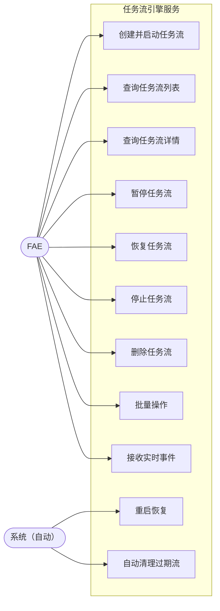

# 任务流引擎服务 — 需求规格说明书

## 1. 概述

任务流引擎服务是 RobotOps Studio 后端的核心执行引擎，负责管理和执行基于 DAG（有向无环图）的任务流。该服务将 playground 原型中验证过的任务流引擎能力正式集成到后端服务中，作为 `src/backend` 的内建模块运行（非外部依赖），为前端提供任务流的创建、执行、监控和控制能力。

任务流引擎基于 `flowed` 库实现 DAG 调度，支持任务间数据传递、流级别输入输出参数、暂停/恢复/停止控制、SSE 实时事件推送、持久化与重启恢复、以及已结束流自动清理等核心能力。

**关键用例**：FAE 通过前端界面创建任务流（如机器人信息采集、BSP 升级等），引擎按 DAG 依赖关系自动调度各子任务执行，并通过 SSE 实时推送执行进度与结果。

---

## 2. 术语定义

| 术语 | 定义 |
|------|------|
| **任务流（Flow）** | 一个由 DAG 定义的多步骤执行单元，包含若干子任务及其依赖关系。 |
| **子任务（Sub-Task）** | 任务流中的单个执行节点，由解析器（Resolver）执行具体逻辑。 |
| **DAG** | 有向无环图，定义子任务之间的执行顺序与数据依赖关系。 |
| **解析器（Resolver）** | 实现具体业务逻辑的任务执行器，如 SSH 命令执行、文件传输等。 |
| **解析器注册表（Resolver Registry）** | 管理所有已注册解析器的注册中心，按名称查找解析器类。 |
| **流级别输入参数（Flow Input）** | 创建任务流时传入的全局参数，所有子任务均可引用。 |
| **流级别输出参数（Expected Results）** | 任务流完成后期望返回的数据槽名称列表。 |
| **数据槽（Data Slot）** | 任务流执行过程中的命名数据容器，用于子任务间数据传递。 |
| **requires / provides** | 子任务声明数据依赖与数据产出的机制。子任务仅在所有 requires 满足后才开始执行。 |
| **内部流（Internal Flow）** | 系统内部模块（如 MemStore）使用的任务流。与 user 流走完全相同的 Flow 执行引擎（SSE 事件、状态机、子任务调度），仅不持久化到对象存储，重启后丢失。 |
| **用户流（User Flow）** | 用户主动创建的任务流，持久化到对象存储，支持重启恢复。 |
| **SSE** | Server-Sent Events，服务端向客户端推送实时事件的标准协议。 |
| **TTL** | Time-To-Live，已结束任务流的保留时长，超时后自动清理。 |
| **异常处理 DAG（ErrorDag）** | 主 DAG 执行失败时触发的异常处理 DAG，用于执行回滚、补偿、告警等操作。可选字段。 |
| **错误上下文（ErrorContext）** | 主 DAG 失败时自动生成的上下文信息，包含失败任务代码、错误消息、已完成任务列表等，自动注入到 errorDag 中。 |
| **执行阶段（Phase）** | 标识当前流处于哪个 DAG 的执行阶段，取值为 `main`（主 DAG 执行中）或 `error`（异常处理 DAG 执行中）。 |

---

## 3. 设计原则

1. **内建集成**：任务流引擎代码直接位于 `src/backend/src/services/taskFlowEngine/` 目录下，作为后端服务的内建模块，不作为外部依赖引入。
2. **依赖注入**：引擎通过构造函数接收 `ObjectStore`、`SseManager`、`ResolverRegistry` 等依赖，而非直接导入具体实现，便于测试与替换。
3. **业务无关**：引擎模块不包含任何业务逻辑（如解决方案、机器人等概念），仅提供通用的任务流执行、查询、控制能力。业务参数通过 `input`（参数列表）以 key-value 形式传入，引擎本身不解析或依赖参数的具体语义。
4. **不由引擎实现单例**：引擎不实现单例模式，不暴露全局实例访问函数。由引擎的创建者（后端入口模块）负责管理引擎实例的单例生命周期。
5. **DAG 驱动**：任务执行顺序完全由 DAG 定义驱动，引擎不预设任何执行流程，所有流程由调用方通过 DAG 描述。
6. **数据流显式化**：子任务间通过 `requires`/`provides` 机制显式声明数据依赖，引擎保证依赖满足后才执行下游任务。
7. **实时可观测**：所有状态变更均通过 SSE 实时推送，前端无需轮询即可获取最新状态。
8. **持久化与恢复**：用户流持久化到对象存储，后端重启后自动恢复未完成的流。
9. **自动清理**：已结束的任务流在 TTL 到期后自动清理，防止内存与存储无限增长。

---

## 4. 状态机定义

### 4.1 任务流状态机

```
        ┌─────────────┐
        │   PENDING   │◄────────────────────────┐
        └──────┬──────┘                         │
               │ start()                        │
               ▼                                │
        ┌─────────────┐   pause()      ┌───────┴───────┐
        │   RUNNING   │───────────────►│    PAUSED     │
        └──────┬──────┘                └───────┬───────┘
               │ resume()                      │
      ┌────────┼────────┐                      │
      ▼        ▼        ▼                      │
┌─────────┐ ┌───────┐ ┌─────────┐              │
│COMPLETED│ │FAILED │ │ STOPPED │──────────────┘
└─────────┘ └───────┘ └─────────┘   stop()
```

| 状态 | 含义 |
|------|------|
| `PENDING` | 任务流已创建，等待启动。 |
| `RUNNING` | 至少一个子任务正在执行。 |
| `PAUSED` | 暂停请求已发出，引擎在下一个任务边界停止。正在执行的任务会完成当前操作。 |
| `COMPLETED` | 所有子任务成功完成。 |
| `FAILED` | 至少一个子任务执行失败。 |
| `STOPPED` | 用户主动停止，不再继续执行。 |

### 4.2 子任务状态机

```
        ┌─────────────┐
        │   PENDING   │
        └──────┬──────┘
               │ all requires satisfied
               ▼
        ┌─────────────┐
        │   RUNNING   │
        └──────┬──────┘
      ┌────────┼────────┐
      ▼        ▼        ▼
┌─────────┐ ┌───────┐ ┌─────────┐
│COMPLETED│ │FAILED │ │ SKIPPED │
└─────────┘ └───────┘ └─────────┘
```

| 状态 | 含义 |
|------|------|
| `PENDING` | 等待上游依赖满足（所有 `requires` 对应的数据槽已填充）。 |
| `RUNNING` | 正在执行。 |
| `COMPLETED` | 执行成功，输出值已发布到流级别数据槽。 |
| `FAILED` | 执行抛出错误。 |
| `SKIPPED` | 因上游任务失败或流被停止而跳过。 |

---

## 5. 数据模型

### 5.1 流记录 Schema（FlowRecord）

```json
{
  "$schema": "http://json-schema.org/draft-07/schema#",
  "type": "object",
  "required": ["id", "type", "dag", "state", "taskStates", "createdAt"],
  "properties": {
    "id": { "type": "string", "description": "UUID 格式的流唯一标识" },
    "type": { "type": "string", "enum": ["internal", "user"], "description": "流类型" },
    "input": { "type": "object", "description": "流级别输入参数" },
    "expectedResults": {
      "type": "array",
      "items": { "type": "string" },
      "description": "期望返回的流级别数据槽名称列表"
    },
    "dag": { "type": "object", "description": "flowed FlowSpec 格式的 DAG 定义" },
    "state": { "type": "string", "enum": ["PENDING", "RUNNING", "PAUSED", "COMPLETED", "FAILED", "STOPPED"] },
    "taskStates": {
      "type": "object",
      "additionalProperties": { "type": "string", "enum": ["PENDING", "RUNNING", "COMPLETED", "FAILED", "SKIPPED"] },
      "description": "当前阶段子任务代码到状态的映射"
    },
    "taskResults": {
      "type": "object",
      "additionalProperties": { "type": "object" },
      "description": "当前阶段子任务代码到执行结果的映射"
    },
    "results": { "type": "object", "description": "流级别输出结果" },
    "serializedRunStatus": { "type": "object", "description": "flowed 引擎序列化状态，用于重启恢复" },
    "createdAt": { "type": "string", "format": "date-time" },
    "finishedAt": { "type": "string", "format": "date-time", "description": "流进入终态的时间" },
    "errorDag": { "type": "object", "description": "异常处理 DAG 定义，可选" },
    "phase": { "type": "string", "enum": ["main", "error"], "description": "当前执行阶段", "default": "main" },
    "errorContext": { "type": "object", "description": "触发 errorDag 的错误上下文，包含 failedTaskCode、errorMessage 等" },
    "mainTaskStates": { "type": "object", "description": "主 DAG 阶段子任务状态快照（进入 error 阶段时备份）" },
    "errorTaskStates": { "type": "object", "description": "errorDAG 阶段子任务状态快照（error 阶段完成时备份）" },
    "serializedErrorRunStatus": { "type": "object", "description": "errorDAG 引擎序列化状态，用于重启恢复" }
  }
}
```

### 5.2 流摘要 Schema（FlowSummary）

API 返回的流摘要信息，包含完整的状态与结果数据：

```json
{
  "type": "object",
  "required": ["id", "type", "state", "taskStates", "createdAt"],
  "properties": {
    "id": { "type": "string" },
    "type": { "type": "string", "enum": ["internal", "user"] },
    "state": { "type": "string" },
    "taskStates": { "type": "object" },
    "taskResults": { "type": "object" },
    "results": { "type": "object" },
    "input": { "type": "object" },
    "expectedResults": { "type": "array" },
    "createdAt": { "type": "string" },
    "finishedAt": { "type": "string" },
    "errorDag": { "type": "object", "description": "异常处理 DAG 定义（仅当创建时提供）" },
    "phase": { "type": "string", "enum": ["main", "error"], "description": "当前执行阶段" }
  }
}
```

### 5.3 流创建请求 Schema

```json
{
  "type": "object",
  "required": ["type", "dag"],
  "properties": {
    "type": { "type": "string", "enum": ["internal", "user"] },
    "input": { "type": "object", "description": "流级别输入参数，传递给所有子任务" },
    "expectedResults": {
      "type": "array",
      "items": { "type": "string" },
      "description": "期望返回的数据槽名称列表"
    },
    "dag": {
      "type": "object",
      "required": ["tasks"],
      "properties": {
        "tasks": {
          "type": "object",
          "additionalProperties": {
            "type": "object",
            "properties": {
              "requires": { "type": "array", "items": { "type": "string" } },
              "provides": { "type": "array", "items": { "type": "string" } },
              "resolver": {
                "type": "object",
                "required": ["name"],
                "properties": {
                  "name": { "type": "string", "description": "已注册的解析器类名" },
                  "params": {
                    "type": "object",
                    "description": "解析器参数映射，支持数据槽引用和静态值"
                  },
                  "results": {
                    "type": "object",
                    "description": "解析器返回值键到数据槽名称的映射"
                  }
                }
              }
            }
          }
        }
      }
    },
    "errorDag": {
      "type": "object",
      "description": "异常处理 DAG，格式与 dag 一致。当主 DAG 任一子任务失败时触发。可选。",
      "required": ["tasks"],
      "properties": {
        "tasks": {
          "type": "object",
          "additionalProperties": {
            "type": "object",
            "properties": {
              "requires": { "type": "array", "items": { "type": "string" } },
              "provides": { "type": "array", "items": { "type": "string" } },
              "resolver": {
                "type": "object",
                "required": ["name"],
                "properties": {
                  "name": { "type": "string" },
                  "params": { "type": "object" },
                  "results": { "type": "object" }
                }
              }
            }
          }
        }
      }
    }
  }
}
```

### 5.4 持久化存储路径

| 实体 | 对象存储路径 | Content-Type |
|------|-------------|--------------|
| 用户流记录 | `flows/{flowId}` | `application/json` |

> 内部流不持久化，仅在内存中维护。

---

## 6. 功能需求

### 6.1 创建并启动任务流

**FR-TFE-001**：系统应支持创建并启动一个新的任务流。

- 调用方提供流类型（`internal` 或 `user`）、DAG 定义、可选的流级别输入参数和期望输出列表。
- 系统生成唯一 `flowId`（UUID v4）。
- 系统初始化所有子任务状态为 `PENDING`。
- 系统创建 `FlowRecord` 并持久化（仅用户流）。
- 系统通过 SSE 广播 `task-flow-engine/flow-created` 事件。
- 系统自动启动任务流，将状态转为 `RUNNING`。
- 系统将流级别输入参数传递给 `flowed` 引擎的 `Flow.start()` 方法。
- 系统将所有子任务的 `provides` 与 `expectedResults` 合并后作为期望输出传递给引擎。
- 返回 `FlowSummary`。

**FR-TFE-002**：系统应支持流级别输入参数（参数列表）传递。

- 调用方在创建流时提供 `input` 对象（key-value 参数列表）。
- `input`（参数列表）在创建时设置，此后为只读，不可修改。
- `input` 中的值作为流级别数据上下文，所有子任务可通过 `resolver.params` 引用。
- 若未提供 `input`，默认为空对象 `{}`。
- 典型用法：获取机器人基础信息的任务流需设置 `{ solutionId, robotId }` 作为参数列表。

**FR-TFE-003**：系统应支持子任务参数映射。

- 每个子任务通过 `resolver.params` 定义参数映射，支持两种模式：
  - **数据槽引用**（字符串值）：将解析器参数映射到同名的流级别数据槽。
  - **静态值**（`{ "value": ... }` 格式）：提供不依赖流级别数据的常量值。

**FR-TFE-004**：系统应支持子任务间数据传递。

- 子任务通过 `provides` 声明产出数据槽名称。
- 下游子任务通过 `requires` 声明依赖的数据槽名称。
- 引擎保证子任务仅在所有 `requires` 满足后才开始执行。
- 子任务通过 `resolver.results` 将返回值键映射到数据槽名称。

**FR-TFE-005**：系统应支持流级别输出参数。

- 调用方在创建流时提供 `expectedResults` 列表。
- 流成功完成后，系统从流级别数据槽中提取对应名称的值作为 `results`。
- `results` 存储在 `FlowRecord.results` 中，可通过 `GET /api/flows/:id` 随时查询。

### 6.1a 异常处理 DAG（ErrorDag）

**FR-TFE-024**：系统应支持可选的异常处理 DAG（errorDag）。

- 调用方在创建流时提供 `errorDag` 字段，与 `dag` 并列。
- 当主 DAG 中任一子任务失败时，引擎自动停止主 DAG 的剩余任务，切换到 errorDag 执行。
- errorDag 的执行使用与主 DAG 相同的 `flowed` 引擎实例，共享相同的 SSE 事件通道。
- 若未提供 `errorDag`，行为与当前一致（主 DAG 失败后直接进入 FAILED 终态）。

**FR-TFE-025**：系统应在进入 errorDag 时自动生成并注入错误上下文（ErrorContext）。

- ErrorContext 包含以下字段，以数据槽的形式自动传递给 errorDag 的各个子任务：
  - `failedTaskCode`：失败的子任务代码。
  - `errorMessage`：错误描述信息。
  - `completedTasks`：主 DAG 中已成功完成的子任务代码列表。
  - `mainTaskStates`：主 DAG 中所有子任务的最终状态快照。
  - `mainTaskResults`：主 DAG 中已产生的子任务执行结果。
  - `mainResults`：主 DAG 中已产生的流级别输出结果。
- ErrorContext 作为额外的 input 参数注入到 errorDag 中，errorDag 子任务可通过 `resolver.params` 引用这些字段。

**FR-TFE-026**：系统应正确管理执行阶段（phase）。

- 创建流时，`phase` 初始化为 `"main"`。
- 主 DAG 执行失败且存在 errorDag 时，`phase` 切换为 `"error"`。
- 无论 errorDag 执行成功或失败，`phase` 保持为 `"error"`，最终流状态为 `FAILED`（整体目标未达成）。
- `FlowRecord.taskStates` 始终反映当前阶段的任务状态；切换阶段时，引擎自动备份主阶段的任务状态。

**FR-TFE-027**：系统应校验 errorDag 中引用的解析器是否已注册。

- 创建流时，同时校验 `dag` 和 `errorDag` 中引用的解析器名称。
- 若 errorDag 引用了未注册的解析器，拒绝创建并返回 `RESOLVER_NOT_FOUND` 错误。

**FR-TFE-028**：系统应通过 SSE 推送异常处理阶段的开始与完成事件。

- `task-flow-engine/error-handling-started`：进入 errorDag 执行时广播，携带 `flowId` 和 `errorContext`。
- `task-flow-engine/error-handling-completed`：errorDag 执行完成时广播，携带 `flowId` 和 `state`。

**FR-TFE-029**：系统应在控制操作（pause/resume/stop）中正确处理 error 阶段。

- 暂停/恢复操作针对当前活跃的 DAG 实例（主 DAG 或 errorDAG）。
- 停止操作终止当前活跃的 DAG 实例，流整体进入 STOPPED 终态。
- 删除操作移除整个流记录（含主 DAG 和 errorDAG 的执行结果）。

**FR-TFE-030**：系统应持久化 errorDag 的执行状态并支持重启恢复。

- 用户流在切换阶段和 errorDag 状态变更时持久化 `errorContext`、`errorTaskStates` 等字段。
- 重启恢复时，若 `phase === "error"` 且 `state === "RUNNING"`，重新启动 errorDag 的执行。

**FR-TFE-006**：系统应支持列举所有任务流。

- 返回 `FlowSummary[]`，按 `createdAt` 降序排列。
- 支持按流类型（`internal` / `user`）过滤。
- 支持按参数列表（`input`）过滤。调用方可传入部分或全部参数进行过滤匹配。例如：按 `solutionId` 过滤返回该解决方案下所有任务流，或按 `solutionId` + `robotId` 过滤返回指定机器人的任务流。匹配方式为精确匹配（AND 逻辑），仅返回所有过滤条件均满足的任务流。

**FR-TFE-007**：系统应支持查询单个任务流详情。

- 返回完整的 `FlowSummary`，包含 `taskResults`、`results`、`input`、`expectedResults`、`finishedAt` 等字段。
- 若流不存在，返回 404 错误。

### 6.3 控制任务流

**FR-TFE-008**：系统应支持暂停正在运行的任务流。

- 仅 `RUNNING` 状态的流可暂停。
- 暂停后流状态转为 `PAUSED`，正在执行的子任务会完成当前操作。
- 暂停时序列化引擎状态用于持久化。

**FR-TFE-009**：系统应支持恢复已暂停的任务流。

- 仅 `PAUSED` 状态的流可恢复。
- 恢复后流状态转为 `RUNNING`，引擎继续执行后续子任务。
- 恢复后若流完成，自动进入终态。

**FR-TFE-010**：系统应支持停止任务流。

- `RUNNING` 或 `PAUSED` 状态的流可停止。
- 停止后流状态转为 `STOPPED`，所有未执行的子任务状态转为 `SKIPPED`。
- 已处于终态（`COMPLETED`、`FAILED`、`STOPPED`）的流不可重复停止。

**FR-TFE-011**：系统应支持删除任务流记录。

- 仅终态（`COMPLETED`、`FAILED`、`STOPPED`）的流可删除。
- 若流仍为 `RUNNING` 或 `PAUSED`，系统先自动停止再删除。
- 删除操作移除内存中的流记录与对象存储中的持久化数据。
- 删除后通过 SSE 广播 `task-flow-engine/flow-removed` 事件。

**FR-TFE-012**：系统应支持批量暂停、恢复、停止、删除操作。

- 批量操作接受 `ids: string[]` 参数。
- 每个操作独立执行，单个失败不影响其他操作。

### 6.4 实时事件推送

**FR-TFE-013**：系统应通过 SSE 端点实时推送任务流状态变更事件。

- SSE 端点路径：统一为 `GET /api/sse`（由共享的 `SseManager` 提供，详见 `documents/requirements/sse-manager.md`）。旧端点 `GET /api/flows/events` 已废弃。
- 所有事件名称以 `task-flow-engine/` 为前缀。
- 每条事件数据自动包含服务端 `timestamp`（ISO 8601 格式）。
- TaskFlowEngine 实现 `ISseManagerEventHandler`，并向 `SseManager` 注册自身，以便在新客户端连接时通过 `onClientConnected` 推送 `task-flow-engine/flow-current` 事件（每个内存中的活跃 flow 一次）。

**FR-TFE-014**：系统应推送以下事件类型：

| 事件名称 | 触发时机 | 数据字段 |
|---------|---------|---------|
| `task-flow-engine/flow-created` | 流创建并启动 | `{ flowId, type, state, taskStates, input, expectedResults, createdAt, timestamp }` |
| `task-flow-engine/flow-updated` | 流状态或子任务状态变更 | `{ flowId, type, state, taskStates, createdAt, timestamp }` |
| `task-flow-engine/task-updated` | 子任务状态变更 | `{ flowId, taskName, state, timestamp }` |
| `task-flow-engine/task-result` | 子任务完成并产生结果 | `{ flowId, taskName, state, result, timestamp }` |
| `task-flow-engine/flow-completed` | 流进入终态并包含结果 | `{ flowId, state, results, finishedAt, timestamp }` |
| `task-flow-engine/flow-removed` | 流被删除或 TTL 清理 | `{ flowId, timestamp }` |
| `task-flow-engine/error-handling-started` | 进入 errorDag 执行阶段 | `{ flowId, errorContext: ErrorContext, timestamp }` |
| `task-flow-engine/error-handling-completed` | errorDag 执行完成（无论成功或失败） | `{ flowId, state, timestamp }` |

### 6.5 子任务结果提取

**FR-TFE-015**：系统应在子任务完成时提取并存储子任务执行结果。

- 子任务完成时，系统根据 `resolver.results` 映射从流级别数据中提取该子任务的输出。
- 提取结果存储在 `FlowRecord.taskResults[taskCode]` 中。
- 子任务完成时通过 SSE 广播 `task-flow-engine/task-result` 事件，携带子任务结果。

**FR-TFE-016**：系统应在流完成时提取并存储流级别输出结果。

- 流成功完成时，系统从 `flowed` 引擎返回值中提取 `expectedResults` 对应的数据。
- 提取结果存储在 `FlowRecord.results` 中。
- 流完成时通过 SSE 广播 `task-flow-engine/flow-completed` 事件，携带完整结果。

### 6.6 持久化与重启恢复

**FR-TFE-017**：系统应对用户流进行持久化。

- 用户流的状态变更（创建、启动、暂停、完成、失败、停止）时，系统将 `FlowRecord` 序列化到对象存储 `flows/{flowId}`。
- 内部流不持久化。
- 持久化内容包括引擎序列化状态（`serializedRunStatus`），用于重启恢复。

**FR-TFE-018**：系统应在后端启动时恢复持久化的用户流。

- 启动时扫描对象存储 `flows/` 目录。
- 反序列化每个持久化的流记录。
- 根据 `Flow` 构造函数和 `serializedRunStatus` 重建引擎实例。
- ~~若流状态为 `RUNNING`，自动重新启动执行。~~ **已变更**：若流状态为 `RUNNING`，加载后状态重置为 `PENDING`，**不自动启动执行**，等待用户手动触发重做。
- 若流状态为 `PAUSED`，保持暂停状态。
- 若流状态为终态，仅加载为历史记录，不重新执行。
- 正在执行的子任务在崩溃后从头重新执行（引擎在任务边界捕获状态，不支持任务内断点续传）。

**FR-TFE-031**：系统应支持重做（Retry）已结束或中断的任务流。

- 对已处于终态（`COMPLETED`、`FAILED`、`STOPPED`）或 `PENDING`（含后端重启后未自动启动的原 `RUNNING` 流）的用户流，提供重做能力。
- 重做时，系统**重置当前流**的状态：将所有子任务状态重置为 `PENDING`，清除 `taskResults`、`results`、`finishedAt`、`errorContext` 等字段，并将 `phase` 重置为 `main`。
- 重置后，系统基于原流的 `dag` 重新创建引擎实例并启动执行，流 `id` 保持不变。
- `RUNNING` 或 `PAUSED` 状态的流不允许重做。
- 通过 `POST /api/flows/:id/retry` 触发，返回重置后流的 `FlowSummary`。

### 6.7 已结束流自动清理

**FR-TFE-019**：系统应支持 TTL 自动清理已结束的任务流。

- 默认 TTL 为 30 分钟（可配置），从流进入终态（`finishedAt`）开始计算。
- 默认清理检查间隔为 5 分钟（可配置）。
- 清理时移除内存中的流记录与对象存储中的持久化数据。
- 清理后通过 SSE 广播 `task-flow-engine/flow-removed` 事件。

**FR-TFE-020**：系统应支持通过 `DELETE /api/flows/:id` 主动删除已结束的流，无需等待 TTL 到期。

### 6.8 解析器注册与管理

**FR-TFE-021**：系统应提供解析器注册表，支持按名称注册和查找解析器类。

- 解析器类必须实现 `flowed.ITaskResolver` 接口。
- 系统启动时注册所有内置解析器（如 `SshCommandTask`、`GetRobotBasicInfoTask`）。
- 后续可扩展注册更多解析器。

**FR-TFE-022**：系统应在创建流时校验 DAG 中引用的解析器是否已注册。

- 若引用了未注册的解析器名称，返回错误提示。

### 6.9 引擎生命周期管理

**FR-TFE-023**：系统应支持引擎的优雅关闭。

- 提供 `destroy()` 方法，停止 TTL 清理定时器。
- 在后端进程关闭时调用，防止资源泄漏。

---

## 7. API 规格

### 7.1 REST API

TaskFlowEngine 的 HTTP API 与内部调用接口一一对应，行为一致。每个 HTTP 端点均有对应的引擎内部方法。

| 方法 | 端点 | 请求体 / 查询参数 | 描述 | 对应内部方法 |
|------|------|-------------------|------|------------|
| `POST` | `/api/flows` | `{ type, input?, expectedResults?, dag, errorDag? }` | 创建并启动新任务流。`errorDag` 为可选的异常处理 DAG | `createFlow()` |
| `GET` | `/api/flows` | `?type=internal\|user`（可选）<br>`?solutionId=xxx&robotId=yyy`（可选，参数列表过滤） | 列举任务流（含子任务状态） | `listFlows()` |
| `GET` | `/api/flows/:id` | — | 查询单个任务流详情（含结果） | `getFlow()` |
| `POST` | `/api/flows/:id/pause` | — | 暂停单个任务流 | `pauseFlow()` |
| `POST` | `/api/flows/:id/resume` | — | 恢复已暂停的任务流 | `resumeFlow()` |
| `POST` | `/api/flows/:id/stop` | — | 停止任务流，记录保留 | `stopFlow()` |
| `DELETE` | `/api/flows/:id` | — | 删除任务流记录（须为终态） | `deleteFlow()` |
| `POST` | `/api/flows/batch/pause` | `{ ids: string[] }` | 批量暂停 | `batchPause()` |
| `POST` | `/api/flows/batch/resume` | `{ ids: string[] }` | 批量恢复 | `batchResume()` |
| `POST` | `/api/flows/batch/stop` | `{ ids: string[] }` | 批量停止 | `batchStop()` |
| `POST` | `/api/flows/batch/delete` | `{ ids: string[] }` | 批量删除 | `batchDelete()` |
| `POST` | `/api/flows/:id/retry` | — | 重做任务流（基于原配置创建新流） | `retryFlow()` |
| `GET` | `/api/sse` | — | 统一 SSE 实时事件端点（含 `task-flow-engine/*` 事件，由共享 `SseManager` 提供） | — |

### 7.2 Stop 与 Delete 的区别

- **Stop**（`POST /api/flows/:id/stop`）：终止正在执行或暂停的流，流记录保留，状态转为 `STOPPED`，结果仍可通过 `GET /api/flows/:id` 查询。
- **Delete**（`DELETE /api/flows/:id`）：彻底移除流记录。流必须处于终态才可删除。若流仍在运行或暂停，系统先自动停止再删除。

---

## 8. 用例模型

### 8.1 用例图



### 8.2 用例说明

| 用例编号 | 用例名称 | 参与者 | 前置条件 | 后置条件 | 主事件流 |
|---------|---------|--------|---------|---------|---------|
| UC-TFE-01 | 创建并启动任务流 | FAE | 无 | 任务流创建并开始执行 | 1. FAE 提供 DAG、类型、输入参数；2. 系统生成 flowId 并初始化；3. 系统持久化（用户流）；4. 系统启动执行；5. 系统广播 SSE 事件；6. 返回 FlowSummary |
| UC-TFE-02 | 查询任务流列表 | FAE | 无 | 展示任务流列表 | 1. FAE 请求列表（可选类型过滤、参数列表过滤）；2. 系统返回按时间降序排列的 FlowSummary[] |
| UC-TFE-03 | 查询任务流详情 | FAE | 流已存在 | 展示完整流信息与结果 | 1. FAE 指定 flowId；2. 系统返回完整 FlowSummary（含 results） |
| UC-TFE-04 | 暂停任务流 | FAE | 流处于 RUNNING 状态 | 流暂停 | 1. FAE 请求暂停；2. 系统调用引擎 pause()；3. 状态转为 PAUSED；4. 广播 SSE 事件 |
| UC-TFE-05 | 恢复任务流 | FAE | 流处于 PAUSED 状态 | 流继续执行 | 1. FAE 请求恢复；2. 系统调用引擎 resume()；3. 状态转为 RUNNING；4. 广播 SSE 事件 |
| UC-TFE-06 | 停止任务流 | FAE | 流处于 RUNNING 或 PAUSED 状态 | 流停止，记录保留 | 1. FAE 请求停止；2. 系统调用引擎 stop()；3. 状态转为 STOPPED；4. 未执行子任务转为 SKIPPED |
| UC-TFE-07 | 删除任务流 | FAE | 流处于终态 | 流记录被移除 | 1. FAE 请求删除；2. 系统移除内存与持久化数据；3. 广播 flow-removed 事件 |
| UC-TFE-08 | 批量操作 | FAE | 无 | 批量执行控制操作 | 1. FAE 提供 ids 数组；2. 系统对每个 id 独立执行操作；3. 返回操作结果 |
| UC-TFE-09 | 接收实时事件 | FAE | SSE 连接已建立 | 前端实时更新 | 1. FAE 建立 SSE 连接；2. 系统在状态变更时推送事件；3. 前端根据事件更新 UI |
| UC-TFE-10 | 重启恢复 | 系统 | 后端重启 | 持久化流恢复为可用状态 | 1. 系统扫描 flows/ 目录；2. 反序列化流记录；3. 重建引擎实例；4. RUNNING 流重置为 PENDING，不自动重启，等待用户手动重做 |
| UC-TFE-11 | 自动清理过期流 | 系统 | 有已结束的流 | 过期流被清理 | 1. 定时器触发；2. 检查 finishedAt + TTL；3. 移除过期流；4. 广播 flow-removed 事件 |
| UC-TFE-12 | 重做任务流 | FAE | 流处于终态或 PENDING（重启后） | 基于原配置创建并启动新流 | 1. FAE 选择已结束/中断的流并点击重做；2. 系统读取原流配置；3. 系统创建并启动新流；4. 广播 SSE 事件；5. 返回新流 FlowSummary |

---

## 9. 与其他模块的交互契约

### 9.1 与对象存储模块的交互

| 场景 | 任务流引擎行为 |
|------|--------------|
| 持久化用户流 | 调用 `ObjectStore.putJson("flows/{flowId}", record)` |
| 加载持久化流 | 调用 `ObjectStore.list("flows")` + `ObjectStore.getJson("flows/{name}")` |
| 删除流记录 | 调用 `ObjectStore.deletePath("flows/{flowId}")` |

### 9.2 与解析器模块的交互

| 场景 | 任务流引擎行为 |
|------|--------------|
| 启动流执行 | 调用 `ResolverRegistry.getAll()` 获取所有已注册解析器，传递给 `flowed` 引擎 |
| 校验解析器 | 创建流时检查 DAG 中引用的解析器名称是否在注册表中存在 |

### 9.3 与 SSE 管理模块的交互

| 场景 | 任务流引擎行为 |
|------|--------------|
| 状态变更通知 | 调用 `SseManager.broadcast(event, data)` 广播事件 |
| 客户端连接管理 | 由路由层通过 `SseManager.addClient()` / `SseManager.removeClient()` 管理 |

---

## 10. 校验与约束

| 约束项 | 规则 | 错误行为 |
|--------|------|---------|
| 流类型 | 必须为 `internal` 或 `user` | 拒绝并返回 400 |
| DAG | 必须包含 `tasks` 字段且非空 | 拒绝并返回 400 |
| 解析器名称 | 必须在注册表中存在（dag 和 errorDag 中的所有解析器） | 拒绝并返回 400 |
| 暂停操作 | 流必须为 `RUNNING` 状态 | 忽略（幂等） |
| 恢复操作 | 流必须为 `PAUSED` 状态 | 忽略（幂等） |
| 停止操作 | 流必须为 `RUNNING` 或 `PAUSED` 状态 | 忽略（幂等） |
| 删除操作 | 流必须为终态或先自动停止 | 运行中流先停止再删除 |
| 流 ID | UUID v4 格式 | 系统生成，不接受外部指定 |
| TTL | 正整数，默认 30 分钟 | 非法值使用默认值 |

---

## 11. 错误处理

| 错误码 | HTTP 状态码 | 触发条件 | 用户提示 |
|--------|-----------|---------|---------|
| `MISSING_TYPE_OR_DAG` | 400 | 创建流时缺少 type 或 dag | "Missing type or dag" |
| `INVALID_TYPE` | 400 | type 不是 internal 或 user | "Invalid type, must be internal or user" |
| `INVALID_IDS` | 400 | 批量操作时 ids 不是数组 | "ids must be an array" |
| `FLOW_NOT_FOUND` | 404 | 操作不存在的流 | "Flow not found" |
| `RESOLVER_NOT_FOUND` | 400 | DAG 引用了未注册的解析器 | "Resolver '{name}' is not registered" |
| `INTERNAL_ERROR` | 500 | 未预期的服务端错误 | "An unexpected error occurred." |

---

## 12. 非功能需求

**NF-TFE-001**：SSE 事件推送延迟应低于 100 毫秒（从状态变更到事件写入 SSE 流）。

**NF-TFE-002**：单个后端实例应支持同时运行至少 50 个活跃任务流。

**NF-TFE-003**：重启恢复应在 5 秒内完成（100 个持久化流以内）。

**NF-TFE-004**：TTL 清理操作不应阻塞正常 API 请求。

**NF-TFE-005**：SSE 客户端断开后，引擎应自动清理对应客户端资源，不产生内存泄漏。

**NF-TFE-006**：流状态持久化操作应异步执行，不阻塞主事件循环。

---

## 13. 扩展性考虑

**EXT-TFE-001**：解析器注册表支持动态注册，未来可按需加载插件式解析器。

**EXT-TFE-002**：TTL 和清理间隔可通过构造参数配置，未来可支持从配置文件读取。

**EXT-TFE-003**：SSE 事件命名空间 `task-flow-engine/` 为模块级前缀，未来其他模块可使用各自前缀共存于同一 SSE 端点。

**EXT-TFE-004**：流级别输入参数和子任务参数映射机制支持复杂的参数化任务流模板，未来可实现任务流模板的保存与复用。
